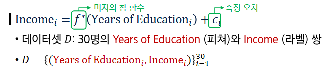
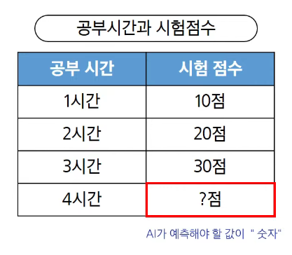

## ML (Machine Learning)

- AI 범주 내에서 데이터로부터 학습하여 목적을 달성하는 접근 방법론
- 예: 생성형 AI, 언어 모델, 이미지 분류 모델, 추천 시스템

## DL (Deep Learning)

- ML 범주 내에서 신경망 (Neural network) 함수를 사용한 학습 방법론

## AI - ML의 예

- 규칙 기반 시스템
- 휴리스틱 기반 (최적화)알고리즘

## 데이터가 왜 중요한가?

- 머신러닝은 규칙을 직접 코딩하지 않고, 데이터에서 규칙 학습
- 데이터(Feature, Label)의 분포와 관계가 머신러닝의 학습 결과를 결정

### Feature(피쳐, 특성)

- 모델이 예측에 사용하는 입력정보
- 예측, 판단의 근거/단서

  - 유튜브로 치면 각 영상의 정보, 사용자 정보

### Label(목표값)

- 모델이 예측하려는 정답
- 학습의 목표값

  - 유튜브로 치면 영상에 대한 사용자 피드백(시청 여부, 좋아요 여부)

# 1D 피쳐 기반 학습

**1D = 1차원**

- Feature가 하나일 때 머신러닝이 학습하는 가장 단순한 형태

  

- 우리가 할 일: 피쳐와 라벨의 관계를 잘 나타내는 함수 f를 찾는 일

# 모델과 가설 공간

**학습 (Learning)**

- 입력(Feature) -> 출력(Label) 관계를 찾는 과정

- 평균 관계를 하나의 함수로 표현함

- 하지만 관계를 표현 가능한 함수는 무수히 많음

**가설 공간(Hypothesis Space)**

- 관계를 표현할 수 있는 모든 후보 함수들의 모음

- 피쳐 공간과 라벨 공간위에서 정의된 함수들의 집합 

**모델 (Model)**

- 가설공간 f~에 속한 특정 함수 f

### 학습이란

- 주어진 데이터에서 정답을 가장 잘 맞추도록 모델의 규칙을 조금씩 조정해가는 과정

- 데이터 D -> 가설공간 f~ -> 선택된 모델 f

**학습에 필요한 3가지**

1. 데이터
   - 학습할 예시들 (학력-수입 쌍 30개)
  
2. 가설 공간
   - 선택할 수 있는 모든 후보 함수들의 집합

3. 선택 기준 (손실 함수)
   - 어떤 함수가 더 좋은지 판단하는 척도
   - 예측값과 실제값의 차이를 측정

# 2D 피쳐 기반 학습에서

**미지의 참 함수 f(star)는 관측 불가능**
- 2차원 Feature, 1차원 Label 상 3차원 공간에 존재하는 데이터들에 대해 Surface가 곧 f*

### 지도학습
**처음 보는 문제도 잘 푸는 AI 만들기**

- 정의: 입력(feature) + 정답(label)을 가지고 예측 규칙을 배우는 방법

- 목표: 훈련 데이터 뿐만 아니라, 처음 보는 데이터에서도 예측 성능 향상
  - 데이터: 입력(feature, x)과 정답(label, y)이 항상 쌍으로 존재
  - 데이터들은 여러 개 축적되어 있음

### 회귀(Regression)

- 예측하고 싶은 결과값이 숫자일 때 사용

- 예시) 가격, 점수, 온도

- 정의: 입력(feature)으로부터 숫자(output)을 얼마나 정확하게 측정할까?

### 오버피팅에 대한 오해

**오버피팅 != 분포 변화(distribution shift)로 인한 에러 증가**

- **분포 변화로 인한 오류:** 훈련 데이터 분포와 테스트 분포가 다름으로(환경,계절,센서 변경 등)성능이 떨어지는 현상

- **분포 변화**로 인한 에러 증가는 **모델이 과적합하지 않아도** 발생가능