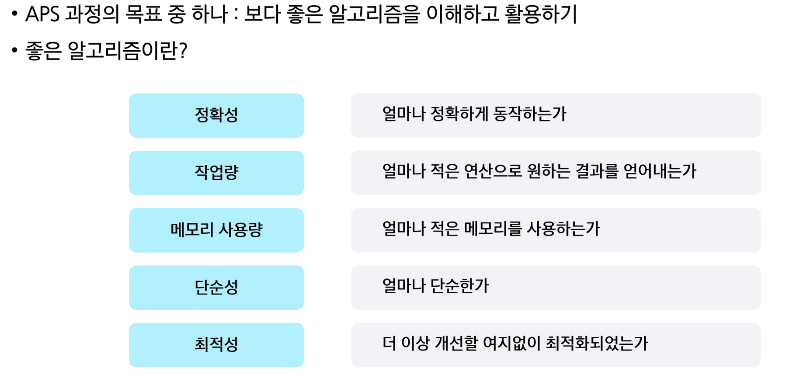
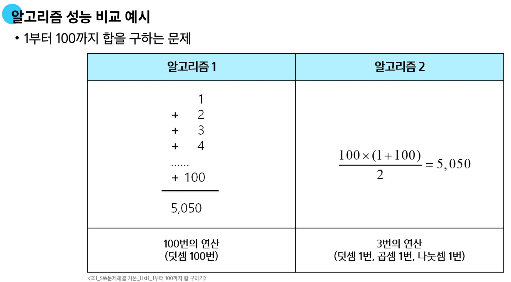
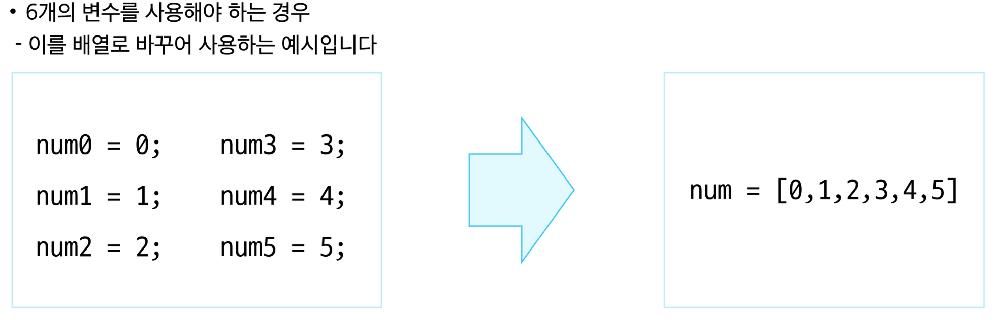
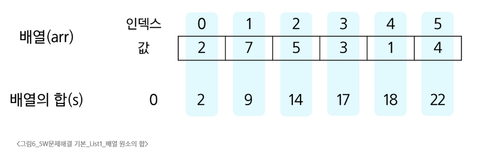
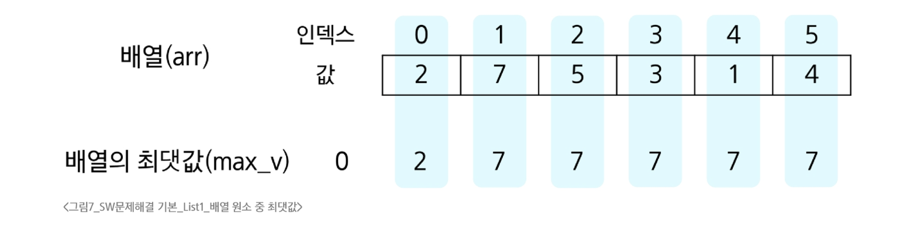
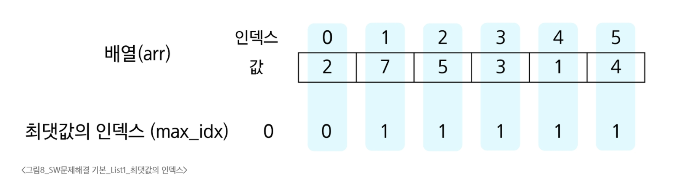
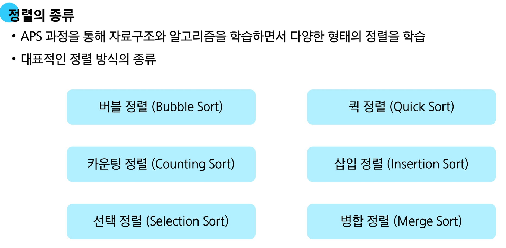

# SW문제해결 기본

### 학습 내용
- 자료구조와 알고리즘

### 학습 목표
- 논리적 사고력 향상
- 문제 해결 능력 향상
  - 최종 목표는 연습문제ㅏ 아닌 "현실 세계 문제"

### 학습 도구
- Python(PyPy), PyCharm, swexpertacademy.com(SWEA) + AI


## APS(Algorithm Problem Solving) 기본 학습
- **기초 자료 구조 이해 중심**
  - 입출력을 제외한 내장함수를 사용하지 않습니다.
  - 기본적인 내장함수의 동작원리를 이해합니다.

- **AI 활용 방법**
  - 교과서가 아닌 학습에 도움을 받는 용도로 사용한다.
  - 문제 전체를 넘기고 코드를 요구해서는 안 된다.
  - 대화를 통해 문제점을 찾도록 작은 단위로 질문해본다.

# 알고리즘

**문제를 해결하기 위한 절차나 방법**

### 알고리즘의 성능


- 주어진 문제를 해결하기 위해 여러 개의 다양한 알고리즘이 가능
  - 어떤 알고리즘을 사용해야 하는가를 고려해야 한다.

- 알고리즘의 성능 분석 필요
  - 많은 문제에서 성능 분석의 기준으로 알고리즘의 작업량을 비교한다.


### 알고리즘의 시간 복잡도

- 알고리즘의 작업량을 표혀할 때 시간 복잡도로 표현한다.

- 시간 복잡도 (Time Complexity)
  - 실제 걸리는 시간을 측정
  - 실행되는 명령문의 개수를 계산

#### 시간 복잡도 표시
- **빅-오 표기법(Big-O Nonation)**을 언급하는 경우가 많음
- 시간 복잡도 함수 중에서 가장 큰 영향력을 주는 n에 대한 항만을 표시
- 계수(Coefficient)는 생략하여 표현


# 배열

**일정한 자료형의 변수들을 하나의 이름으로 열거하여 사용하는 자료구조**

### 배열의 예시



### 배열의 필요성

- 프로그램 내에서 여러 개의 변수가 필요할 때
  - 일일히 다른 변수명을 이용하여 자료에 접근하는 것은 매우 비효율적

- 배열을 사용하면 하나의 선언을 통해서 둘 이상의 변수를 선언
  
- 단순히 다수의 변수 선언을 의미하는 것이 아님
  - 다수의 변수로는 하기 힘든 작업을 배열을 활용해 쉽게 할 수 있다.

### 1차원 배열
- 배열을 선언할 때는 프로그램에서 사용할 배열 이름이 필요하다.
```python
arr = list()
arr = [ ]
arr = [0] * 10
arr = [1, 2, 3]
```
- `arr[0] = 10` # 배열 arr의 0번 원소에 10을 저장
- `arr[idx] = 20` # 배열 arr의 idx번 원소에 20을 저장

#### 입력 받은 정수를 1차원 배열에 저장하는 법
- 첫 줄에 양수의 개수 N이 주어집니다. (5 <= N <= 1000)
- 다음 줄에 빈칸으로 구분된 N개의 양수 Ai가 주어집니다. (1 <= N <= 1000000)
```python
N = int(input())
arr = list(map(int, input().split()))
```

#### 배열 원소의 합 s 계산하기


```python
s = 0
for i in range(N): # for x in arr:
    s += arr[i]    #    s += x
```

#### 배열 원소 중 최댓값 max_v 찾기


```python
max_v = arr[0] # 첫 원소를 최대로 가정
for i in range(1, N):
    if max_v < arr[i]:
        max_v = arr[i] # arr[i]가 더 크면 max_v 갱신
```
#### 배열 원소 중 최댓값의 인덱스 max_idx 찾기


```python
max_idx = 0 # 첫 원소를 최대로 가정
for i in range(1, N):
    if arr[max_idx] < arr[i]: # 더 큰 값을 만나면
    max_idx = i               # max_idx 갱신
```

# 정렬

**2개 이상의 자료를 키(특정 기준)에 의해<br>작은 값부터 큰 값(오름차순:ascending),<br>혹은 그 반대의 순서대로(내림차순:descending) 재배열하는 알고리즘**



## 버블 정렬

**인접한 두 개의 원소를 비교하며 자리를 계속 교환하는 방식**

