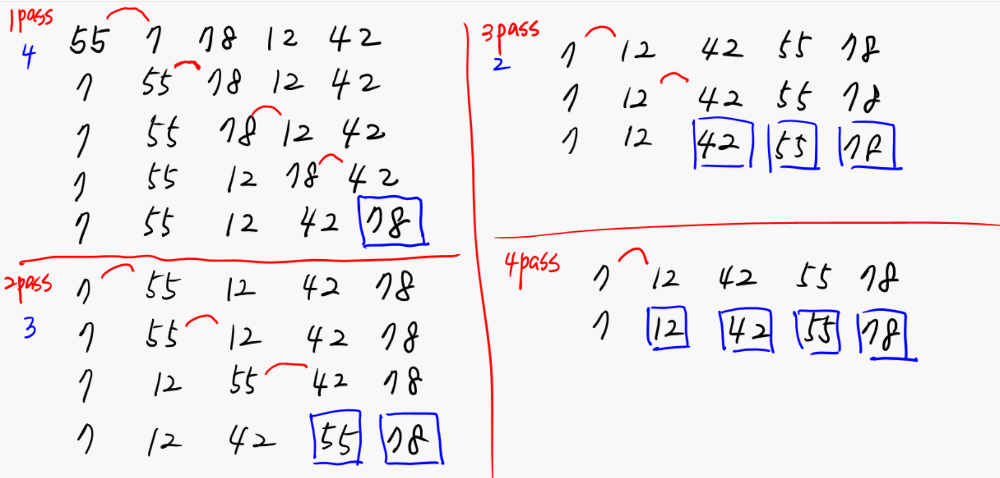
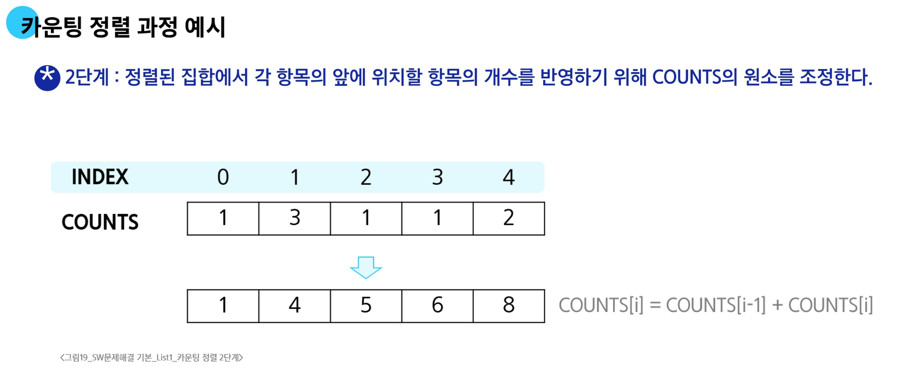

# 정렬

## 버블 정렬

### 버블 정렬 과정 예시

## 카운팅 정렬

**항목들의 순서를 결정하기 위해 집합에 각 항목이 몇 개씩 있는지 세는 작업을 하여, 선형 시간에 정렬하는 효율적인 방식**

### 카운팅 정렬 제한 사항

1. 정수나 정수로 표현할 수 있는 자료에 대해서만 적용 가능
    - 각 항목의 발생 회수를 기록하기 위해, 정수 항목으로 인덱스 되는 카운트들의 배열을 사용하기 때문
2. 카운트들을 위한 충분한 공간을 할당하려면 집합 내의 가장 큰 정수를 알아야 함

### 시간 복잡도

- `O(n + k)`: `n`은 리스트 길이, `k`는 정수의 최대값

### 카운팅 정렬 과정 예시

