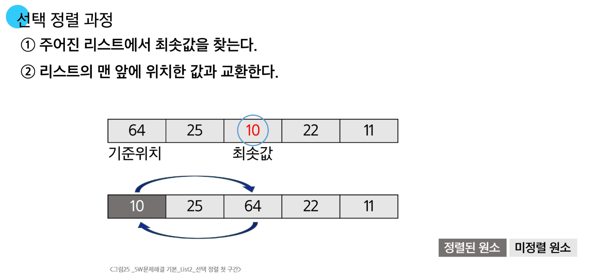

## 비트 연산자

  - `&`: 비트 단위로 AND 연산
  - `|`: 비트 단위로 OR 연산
  - `<<`: 피연산자의 비트 열을 왼쪽으로 이동
  - `>>`: 피연산자의 비트 열을 오른쪽으로 이동

### `<<` 연산자 활용

  - 1<<n : 2^n 즉,원소가 n개일 경우의 모든 부분집합의 수를 의미

### `&` 연산자 활용

  - i & (1<<j): i의 j번째 비트가 1인지 아닌지를 검사

# 검색과 정렬

### 검색 (Search)

- 저장되어 있는 자료 중에서 원하는 항목을 찾는 작업
- 목적하는 탐색 키를 가진 항목을 찾는 것

## 순차 검색

- **일렬로 되어 있는 자료를 순서대로 검색하는 방법**
  - 가장 간단하고 직관적인 검색 방법
  - 배열이나 연결 리스트 등 순차구조로 구현된 자료구조에서 원하는 항목을 찾을 때 유용
  - 알고리즘이 단순하여 구현이 쉽지만, 검색 대상의 수가 많은 경우에는 수행시간이 급격히 증가하여 비효율적

- **정렬 여부에 따라**
  - 순차 검색 대상이 정렬되어 있지 않는 경우
  - 순차 검색 대상이 정렬되어 있는 경우

## 선택 정렬

- **주어진 자료들 중 가장 작은 값의 원소부터 차례대로 선택하여 위치를 교환하는 방식(오름차순의 경우)**

### 정렬 과정

- 주어진 리스트 중에서 최솟값을 찾기
- 그 값을 리스트의 맨 앞에 위치한 값과 교환
- 맨 처음 위치를 제외한 나머지 리스트를 대상으로 위의 과정을 반복

### 시간 복잡도

- **O(n²)**

