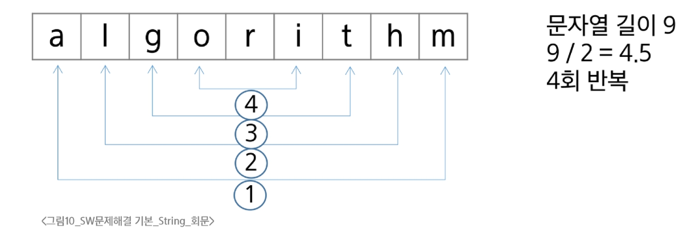
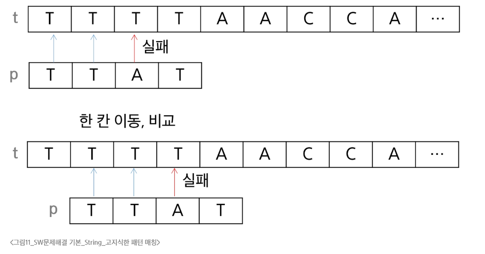

# 코드 체계

## 코드체계의 개선

- 네트워크 발전 전 미국의 각 지역별로 코드체계가 난립
- 혼동을 막기 위해 표준안을 만들기로 함
- 1967년 미국에서 ASCII라는 문자 인코딩 표준이 제정됨
- ASCII는 7-bit 인코딩으로 128문자를 표현하며, 33개의 출력 불가능한 제어 문자들과 공백을 비롯한 95개의 출력 가능한 문자들로 이루어짐

### 확장 아스키

- 표준 문자 이외의 악센트 문자, 도형 문자, 특수 문자, 특수 기호 등 부가적인 문자를 128개 추가
- 표준 아스키는 7-bit를 사용하여 문자를 표현, 확장 아스키는 1Byte 내의 8-bit를 모두 사용함으로써 추가적인 문자를 표현

### 유니코드

- 컴퓨터가 발전하며 미국 뿐만 아니라 각 나라에서 컴퓨터가 발전함
- 각 국가들은 자국의 문자를 표현하기 위해 코드체계를 만들어서 사용하게 됨
  - 우리나라도 한글 코드체계를 만들어 사용했고 조합형, 완성형 두 종류를 가지고 있었음
- 인터넷이 전 세계로 발전하면서 ASCII를 만들기 전과 같은 문제가 국가 사이에 정보를 주고 받을 때 발생
- 자국의 코드체계를 타 국가가 가지고 있지 않으면 정보를 잘못 해석할 수 밖에 없음
- 다국어 처리를 위해 유니코드를 만듦


# 문자열

**문자들이 순서대로 나열된 데이터**

### 문자열의 분류
- **Length-Controlled 문자열**
  - 문자열의 길이 정보를 함께 저장해서, 그 길이만큼 문자 데이터를 읽는 방식
  - Java, Python, 네투워크 패킷에 사용된다

- **Delimited 문자열**
  - 문자열의 끝을 나타내는 특정한 구분자(Delimiter)가 있어서, 구분자가 나올 때까지 문자열로 인식
  - C언어는 널 문자(null, '\0')를 사용한다


### 회문
- "기러기", "토마토", "스위스"와 같이 똑바로 읽어도, 거꾸로 읽어도 똑같은 문장이나 낱말
- 문자열 길이의 반만 비교하면 된다.
  
  ```
  is_palindrome(txt):
  for i : 0 -> len(txt)/2 - 1
    if txt[i] != txt[len(txt) - 1 - i]
        return False
  return True
  ```

### 문자열 비교

- `==` 연산자와 `is` 연산자
  - `==`는 값(value)이 같은지를 비교
  - `is`는 객체의 정체성(identity), 즉 같은 객체(메모리 주소)인지 비교
  - `==` 연산자는 내부적으로 특수 메서드 `__eq__()`를 호출


# 패턴 매칭

## 고지식한 패턴 검색

### 브루트 포스(고지식한 알고리즘)

- 단순한 방법
  - 본문 문자열을 처음부터 끝까지 차례대로 순회하면서 패턴 내의 문자들을 일일이 비교하는 방식
  

### KMP 알고리즘
- Knuth, Morris, Pratt 세 사람의 이름에서 유래

- 패턴의 각 위치에서 매칭에 실패했을 때 돌아갈 위치를 미리 계산
  - 불일치가 발생한 글자의 앞 부분에 어떤 문자가 있는지를 미리 알고 있게 됩니다.
  - 조건에 따라, 불일치가 발생한 앞 부분에 대하여 다시 비교하지 않을 수 있습니다.
  - 불일치가 발생했을 경우 이동할 다음 위치를 계산하는 전처리가 필요

- **시간 복잡도**
  - 패턴의 길이가 M일때 전처리에 걸리는 시간은 O(M)입니다.
  - 텍스트의 길이가 N일 때 검색은 최악의 경우 O(N)입니다.
  - 결과적으로 O(M+N)이 됩니다.
  - 만약 M이 고정된 값으로 매우 짧다면 평균적으로 θ(N)이 됩니다.

### 보이어-무어(Boyer-Moore) 알고리즘

- 상용 소프트웨어에서 채택하고 있는 알고리즘
- 실제 검색에서 매우 빠른 성능
  - 패턴 오른쪽 끝에 있는 문자가 불일치하고 이 문자가 패턴 내에 존재하지 않는 경우, 이동 거리는 패턴의 길이 만큼이 된다.