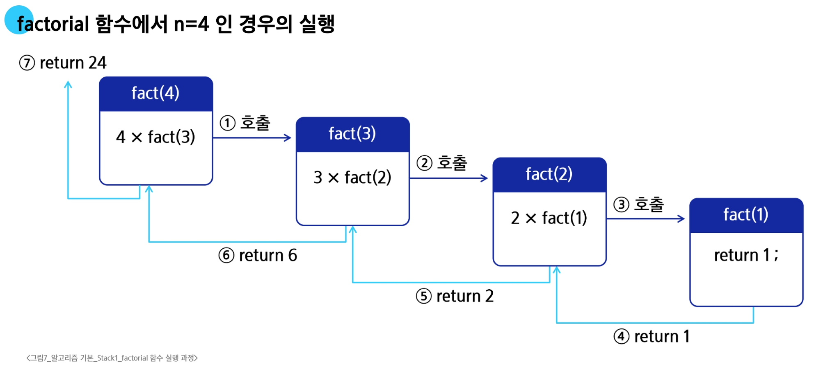
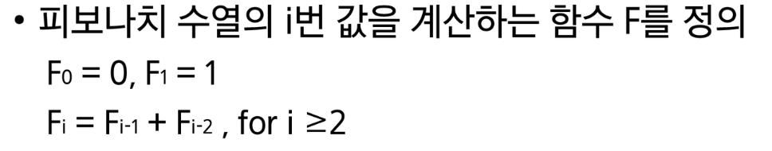
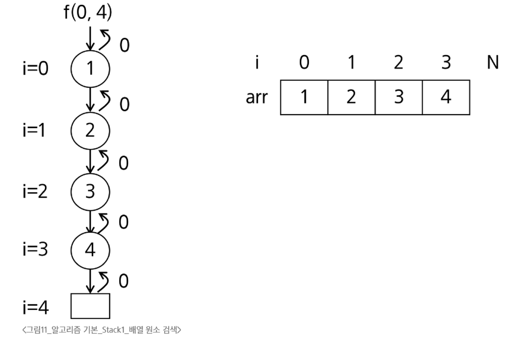
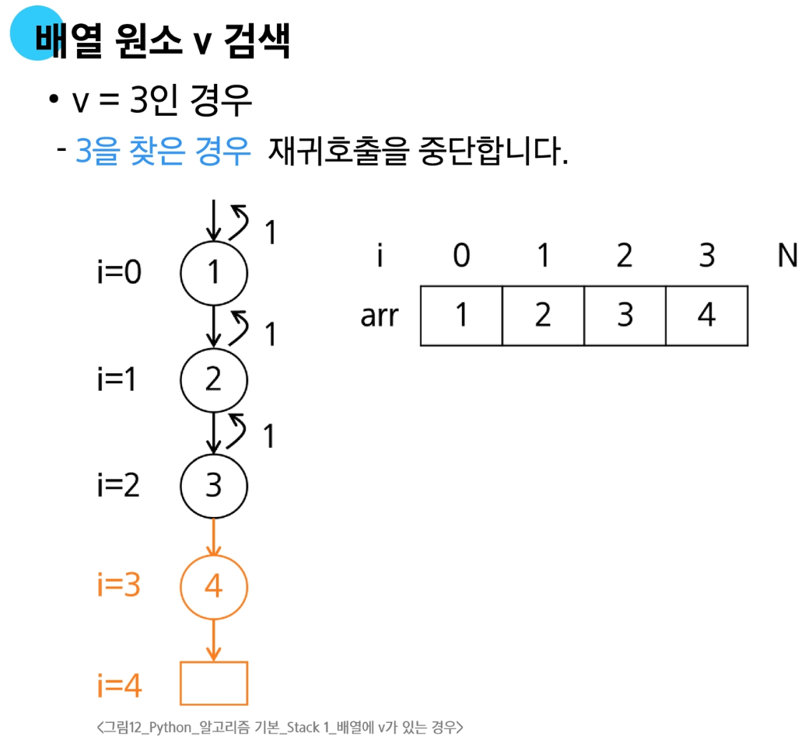

# Stack 기반 문제 해결 기법

## 재귀호출

**함수가 자신과 같은 작업을 반복해야 할 때, 자신을 다시 호출하는 구조**



### 피보나치 수열

**0과 1로 시작하고 이전 두 수의 합을 다음 항으로 하는 수열**


#### 피보나치 수열의 수학적 정의




#### 피보나치 수를 구하는 재귀함수

- 피모나치 수열의 수학적 정의에 따라 피보나치 수열의 i번 항을 반환하는 함수를 재귀함수로 구현 가능
  ```python
  def fibo(n) :
    if n < 2 :
        return n
    else:
        return fibo(n-1) + fibo(n-2)
  ```

#### 재귀함수의 기본형


#### 모든 배열 원소에 접근하는 재귀함수

```python
def f(i, N) : # 크기 N인 배열 arr[i]에 접근
    if i == N :
        return
    else:
        print(arr[i])
        f(i+1, N)
```

#### 배열 원소 검색

- 배열에 v가 있으면 1, 없으면 0을 리턴하는 함수
  - v = 5인 경우, arr에는 5가 없으므로 마지막 단계까지 호출하고 0을 리턴


```python
def f(i, N, v) : # v 찾는 값
    if i == N :
        return 0
    elif arr[i] == v :
        return 1
    else:
        return f(i+1, N, v)
```

## DFS
### 깊이 우선 탐색(DFS, Depth First Search)

**한 방향으로 가능한 한 깊게 탐색한 후, 더 이상 갈 곳이 없으면 돌아와 다른 방향으로 선택**

### DFS의 동작 원리

1. 시작 정점의 한 방향으로 갈 수 있는 경로가 있는 곳까지 탐색해 나간다.
2. 더 이상 갈 곳이 없게 되면, 가장 마지막에 만나썬 갈림길 간선이 있는 정점으로 디돌아와서<br>다른 방향의 정점으로 탐색을 반복하며 결국 모든 정점을 방문하는 탐색방법