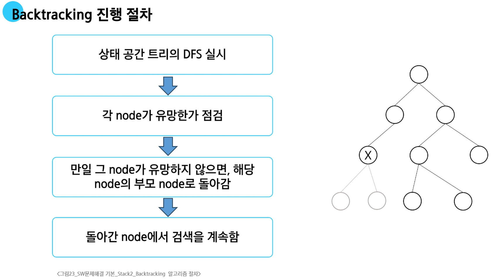

# Backtracking

- **백트래킹(Backtracking)이란?**

  - 후보해를 구성해 나가다가, 더 이상 해가 될 수 없다고 판단되면 되돌아가서(backtrack)다른 후보를 찾는 방법

- **모든 경우의 수**를 탐색하는 완전 탐색을 효율적으로 구현하는 방법
  
- 가능성이 있는 해를 추가해가며 완전한 해인지 검사
  
- 추가한 해가 가능성이 없는 경우 다른 해를 추가할 수 있는 이전 상태로 되돌아 가서 계속 탐색
  
- 최적화(optimization) 문제와 결정(decision) 문제에 적용

- **적용 예**

  - N-Queen 문제
  - 미로 찾기
  - 순열/조합
  - 부분집합
  - 스도쿠

### Backtracking과 DFS

- DFS는 그래프의 모든 노드에 대한 탐색, Backtracking은 완전 탐색 문제에 대한 접근 방법

  - Backtracking은 상태 공간 트리로 문제 해결 과정을 나타낼 수 있습니다.
  - 상태 공간 트리를 DFS로 탐색하는 것과 같습니다.
  
- **Pruning(가지치기)**

  - Backtracking은 선택한 부분 후보 해가 가능성이 없다면 더 이상 그 경로를 따라가지 않고 중지합니다.

- 경우의 수가 많은 문제의 경우

  - 예를 들어 N!인 경우의 수를 가진 문제는 모든 경우의 수를 탐색할 수 없습니다.
  - Backtracking을 적용하면 일반적으로 경우의 수가 줄어듭니다.
  - 단, **최악의 경우** 지수함수 시간(Expotential Time)을 요구하므로 처리가 불가능

## 부분집합(powerset)

- 어떤 집합의 공집합과 자기자신을 포함한 모든 부분

### Backtracking 기법으로 powerset 만들기

- 앞에서 설명한 일반적인 Backtracking 접근 방법을 이용

- N개의 원소를 가진 집합의 2^n개의 부분집합을 표현하는 배열

  - True 또는 False값을 가지는 항목들로 구성된 n개의 원소를 가진 배열을 이용

- 여기서 배열의 i번째 항목은 i번째의 원소가 부분집합의 값인지 아닌지를 나타내는 값
