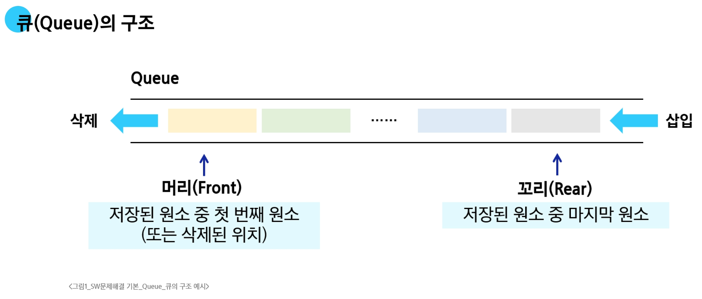
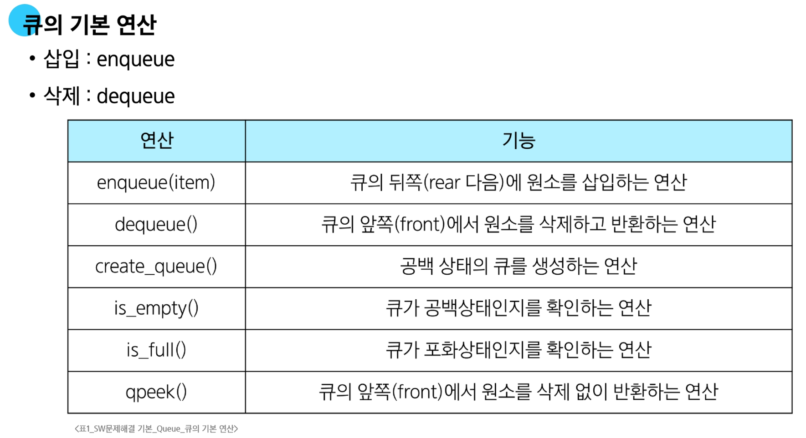
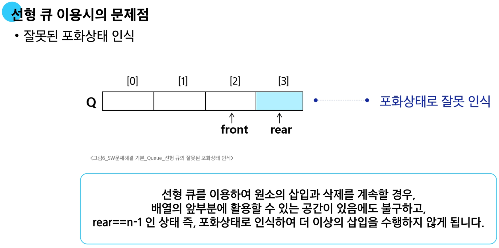
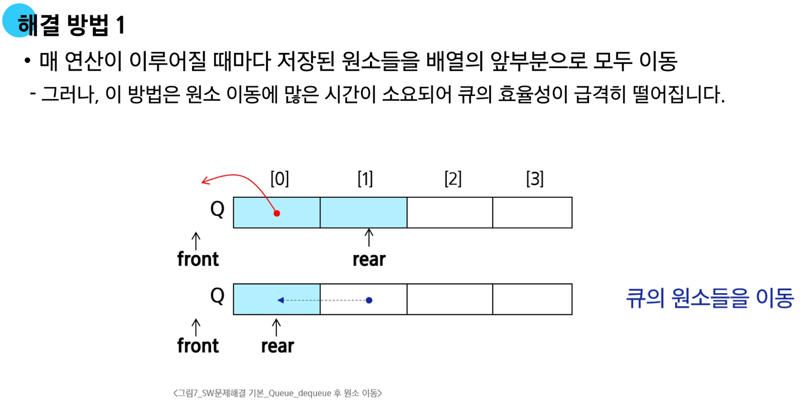
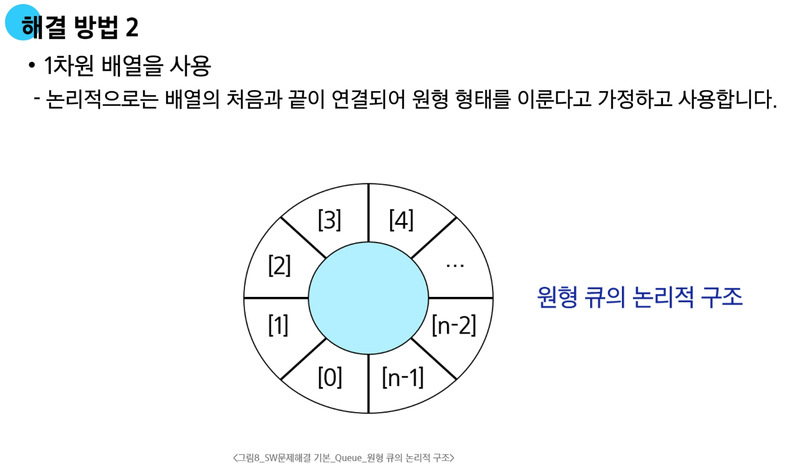
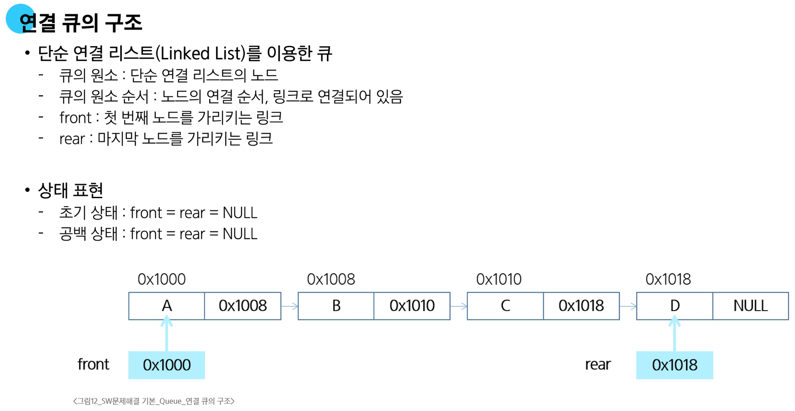
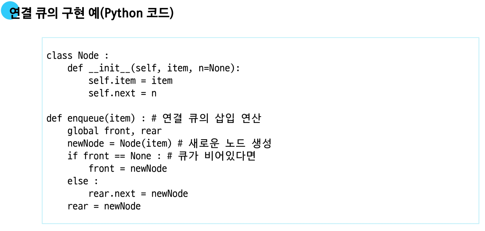
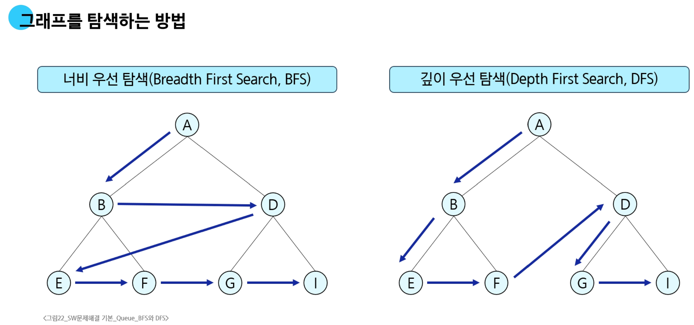

# 큐(Queue)

- **선입선출**
- **FIFO, First In First Out**





## 선형 큐(Linear Queue)

- **데이터를 일렬로 저장하며, 앞에서 꺼내고 뒤에 넣는 기본 큐**

#### 구현

- 배열이나 연결 리스트로 구현할 수 있습니다
  
- 배열로 구현한 경우 큐의 크기는 배열의 크기와 같습니다.

- front: 가장 최근에 삭제된 원소의 인덱스입니다.

- rear: 마지막으로 저장된 원소의 인덱스입니다.

#### 상태 표현

- 초기 상태: `front == rear == -1`
  
- 공백 상태: `front == rear`
  
- 포화 상태: `rear == n-1` (n: 배열의 크기, n1: 배열의 마지막 인덱스)

### 선형 큐의 구현

1. 초기 공백 큐 생성: `create_queue()`

  - 크기 n인 1차원 배열 생성

  - `front`와 `rear`를 `-1`로 초기화
  
    ```python
    # create_queue()에 해당
    q = [0] * n
    front = -1
    rear = -1
    ```

2. 삽입: `enqueue(item)`

  - 마지막 원소 뒤에 새로운 원소를 삽입하기 위해
    1) rear 값을 증가시켜 새로운 원소를 삽입할 자리를 지정
    2) 그 인덱스에 해당하는 배열원소 `q[rear]`에 `item`을 저장
   
    ```python
    def enqueue(item):
        global rear
        if is_full():
            print("Queue_FULL")
        else:
            rear = rear + 1
            q[rear] = item
    ```
    
3. 삭제: `dequeue()`

  - 가장 앞에 있는 원소를 삭제하기 위해
    1) front 값을 하나 증가시켜 큐에 남아있는 첫 번째 원소로 이동
    2) 첫 번째 원소를 리턴함으로써 삭제와 동일한 기능을 함
   
   
    ```python
    def dequeue(item):
        global front
        if is_empty():
            print("Queue_EMPTY")
        else:
            front = front + 1
            return q[front]
    ```
    
4. 공백상태 및 포화상태 검사: `is_empty()`, `is_full()`

  - 공백상태: front == rear
  - 포화상태: rear == n-1 (n: 배열의 크기, n-1: 배열의 마지막 인덱스)
   
    ```python
    def is_empty():
        return front == rear
    def is_full():
        return rear == len(q) - 1
    ```





## 원형 큐(Circular Queue)

- **선형 큐의 공간 낭비를 막기 위해 처음과 끝이 연결된 구조**

### 원형 큐의 구조

- 초기 공백 상태

  - `front = rear = 0`

- Index의 순환

  - `front` 또는 `rear`의 위치가 배열의 마지막 인덱스인 `n-1`을 가리킵니다.

  - 그 다음에는 논리적 순환을 이루어 배열의 처음 인덱스인 0으로 이동해야 합니다.

  - 이를 위해 나머지 연산자(%:mod)를 사용합니다.

- front 변수

  - 공백 상태와 포화 상태 구분을 쉽게 하기 위해 `front`가 있는 자리는 사용하지 않고 항상 빈자리로 둡니다.

### 원형 큐의 구현

1. **초기 공백 큐 생성**

  - 크기 n인 1차원 배열 생성
  - front와 rear를 0으로 초기화

    ```python
    cq = [0] * n
    front = rear = 0
    ```


2. **삽입:** `enqueue(item)`

- 마지막 원소 뒤에 새로운 원소를 삽입하기 위해

  1) `rear`값을 조정하여 새로운 원소를 삽입할 자리를 지정
    - `rear <- (rear + 1) mod n`
  2) 그 인덱스에 해당하는 배열원소 `cq[rear]`에 `item`을 저장
    ```python
    def enqueue(item):
        global rear
        if is_full():
            print("Queue_FULL")
        else:
            rear = (rear + 1) % len(cq)
            cq[rear] = item
    ```

3. **삭제:** `dequeue()`

- 가장 앞에 있는 원소를 삭제하기 위해

  1) `front`값을 조정하여 삭제할 자리를 지정
    - `front <- (front + 1) mod n`
  2) 새로운 `front` 원소를 리턴함으로써 삭제와 동일한 기능을 함
    ```python
    def dequeue():
        global front
        if is_empty():
            print("Queue_EMPTY")
        else:
            front = (front + 1) % len(cq)
            return cq[front]
    ```


4. **공백상태 및 포화상태 검사:** `is_empty()`, `is_full()`

- 공백상태: `front == rear`
  
- 포화상태: 삽입할 `rear`의 다음 위치 == 현재 `front`

  - `(rear + 1) mod n == front`

    ```python
    def is_empty():
        return front == rear
    def is_full():
        return (rear + 1) % len(cq) == front
    ```

## 연결 큐 (Linked Queue)
- **연결 리스트를 이용해 구현한 큐**



### deque(덱)

- 컨테이너 자료형 중 하나로 양쪽 끝에서 빠르게 추가와 삭제를 할 수 있는 리스트류 컨테이너
  - 연결 리스트를 직접 만들지 않아도 됩니다.

- deque의 연산
  
  - `append(x)`: 오른쪽에 x 추가
  - `popleft()`: 왼쪽에서 요소를 제거하고 반환, 요소가 없으면 `Index Error`
  
    ```python
    from collections import deque

    q = deque()
    q.append(1)     # enqueue()
    t = q.popleft() # dequeue()
    ```




## 우선순위 큐 (Priority Queue)

- **우선순위를 가진 항목들을 저장하는 큐**


### 우선순위 큐의 연산

- **삽입**: enqueue
- **삭제**: dequeue


### 배열을 이용한 우선순위 큐

- 배열을 이용하여 자료를 저장

- 원소를 삽입하는 과정에서 우선순위를 비교하여 적절한 위치에 삽입하는 구조

- 가장 앞에 최고 우선순위의 원소가 위치함

- **문제점**

  - 배열을 사용하므로, 삽입이나 삭제 연산이 일어날 때 원소의 재배치가 발생합니다.
  - 이에 소요되는 시간이나 메모리 낭비가 큼


### 효율적인 우선순위 큐

- 트리 구조인 **힙(Heap)** 이용
- 트리 단원에서 기본 원리를 다룸

# BFS



### 너비우선탐색 (BFS)
- **Breadth First Search**
  
  - 탐색 시작 정점에 인접한 정점들을 모두 차례로 방문한 후에,<br>방문했던 정점을 시작점으로 하여 다시 인접한 정점들을 차례로 방문하는 방식

#### BFS 알고리즘

- 입력 파라미터: 그래프 G와 탐색 시작점 v
  - 예제 1
   
      ```python
      def bfs(G, v): # 그래프 G, 탐색 시작점 v
          visited = [0] * (n + 1)       # n: 정점갯수
          queue= []                     # 큐 생성
          queue.append(v)               # 시작점 v를 큐에 삽입
          while queue:                  # 큐가 비어 있지 않은 경우
              t = queue.pop(0)          # 큐의 첫번째 원소 반환
              if not visited[t]:        # 방문하지 않은 곳이면
                  visited[t] = True     # 방문한 것으로 표시
                  visit(t)              # 정점 t에서 할일
                  for i in G[t]:        # t와 연결된 모든 정점에 대해
                      if not visited[i]: # 방문하지 않은 곳이면
                          queue.append(i) # 큐에 넣기
      ```
  - 예제 2
   
      ```python
      def bfs(G, v, n): # 그래프 G, 탐색 시작점 v
          visited = [0] * (n + 1)       # n: 정점갯수
          queue= []                     # 큐 생성
          queue.append(v)               # 시작점 v를 큐에 삽입
          visited[v] = 1
          while queue:                  # 큐가 비어 있지 않은 경우
              t = queue.pop(0)          # 큐의 첫번째 원소 반환
                  visit(t)              
                  for i in G[t]:        # t와 연결된 모든 정점에 대해
                      if not visited[i]: # 인큐하지 않은 곳이면
                          queue.append(i) # 큐에 넣기
                          visited[i] = visited[t] + 1 # n으로부터 1만큼 이동
      ```