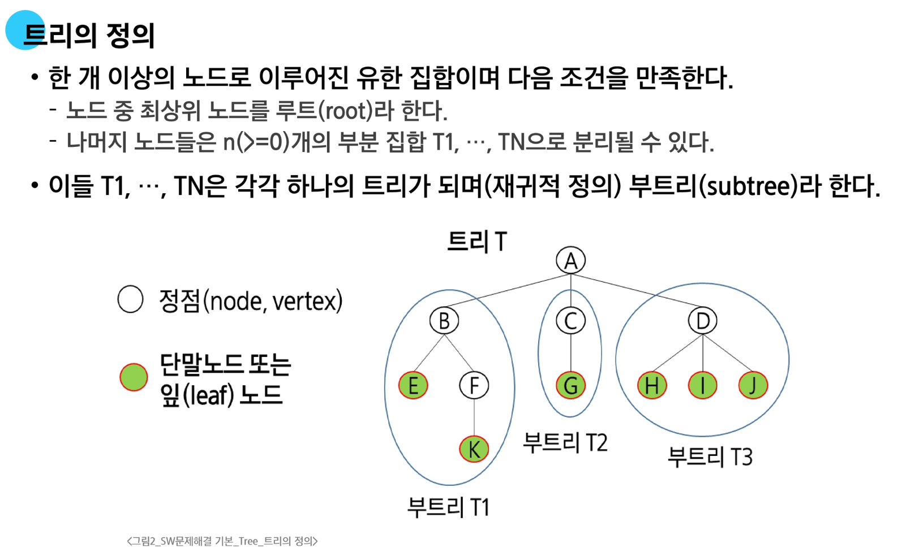
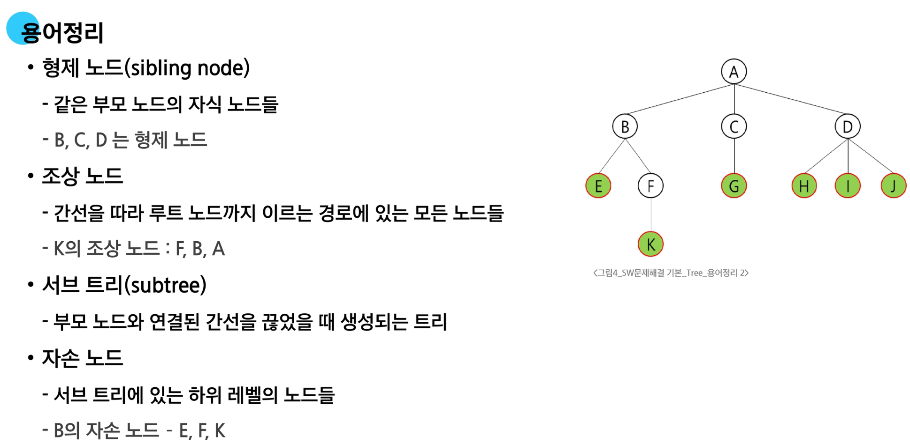
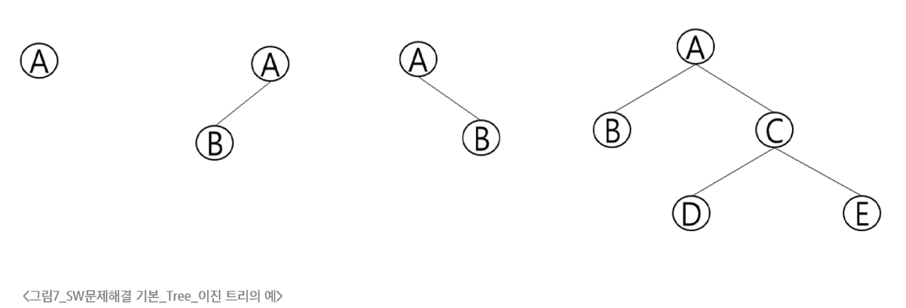
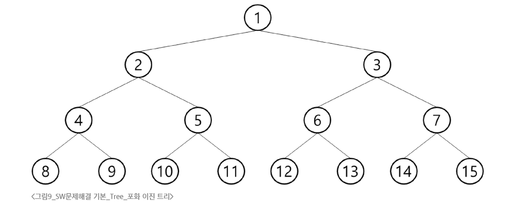
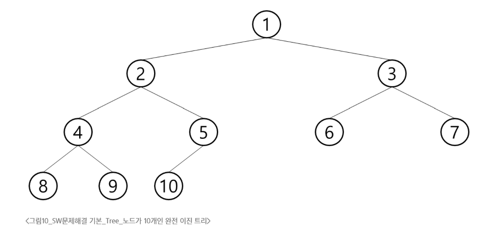
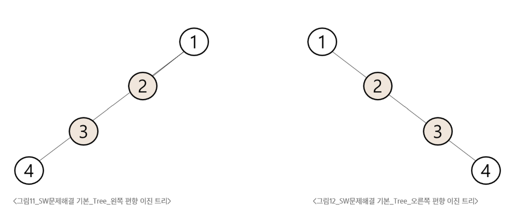
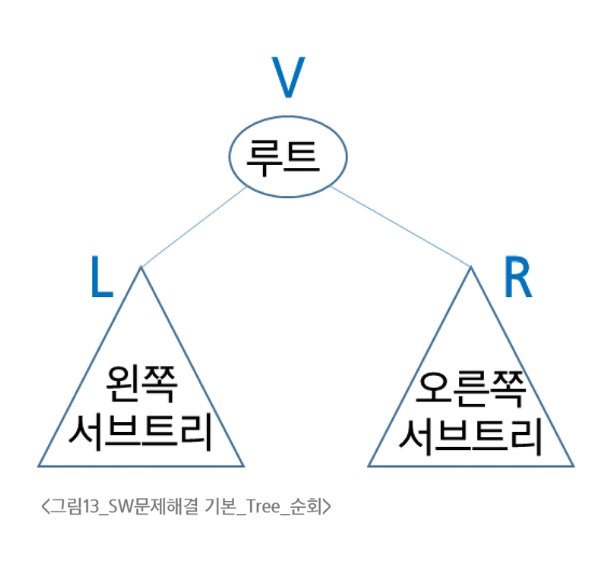
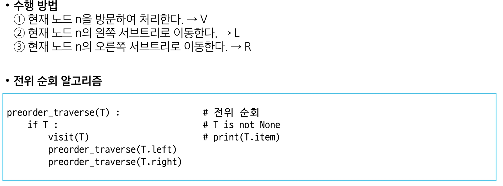
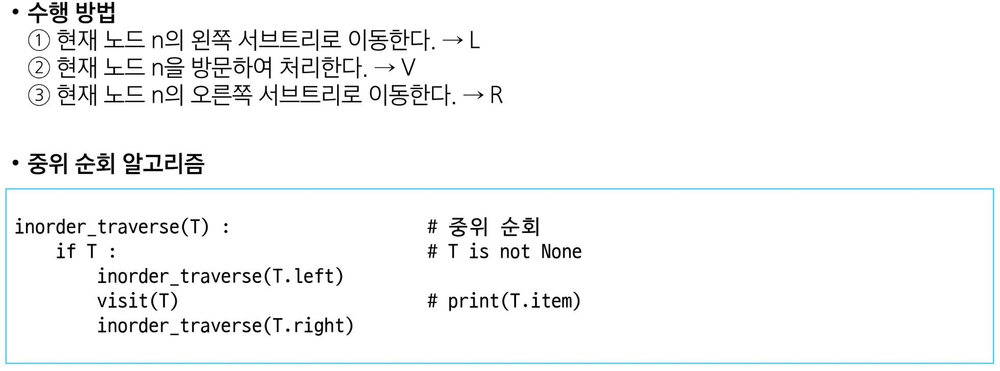
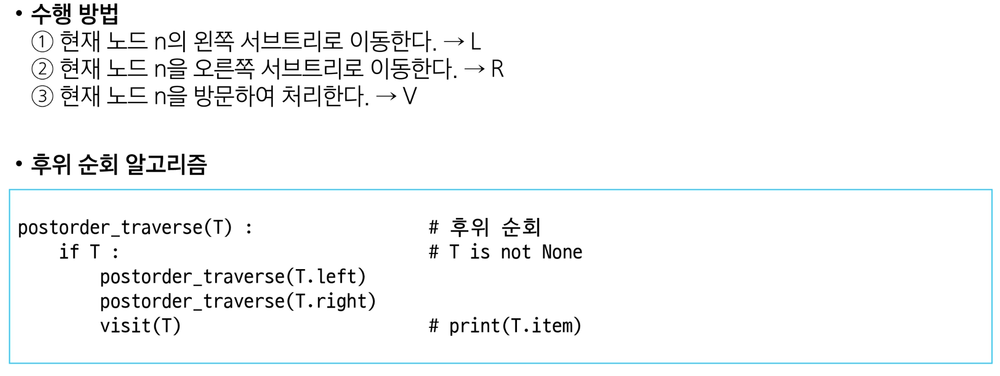

# 트리

### 트리의 개념

- 비선형 자료구조

- 원소들 간에 1:N 관계를 가지는 자료구조
  
- 원소들 간에 계층관계를 가지는 계층형 자료구조

- 상위 원소에서 하위 원소로 내려가면서 확장되는 트리(나무)모양의 구조

### 용어정리

- **노드의 차수**
  
  - 노드에 연결된 자식 노드의 수
  - B의 차수 = 2, C의 차수 = 1

- **트리의 차수**
  
  - 트리에 있는 노드의 차수 중에서 가장 큰 값
  - 트리 T의 차수 = 3

- **단말 노드 (리프 노드)**

  - 차수가 0인 노드. 자식 노드가 없는 노드

# 이진 트리

- **모든 노드들이 2개 이내의 서브 트리를 갖는 특별한 형태의 트리**

- **각 노드가 자식 노드를 최대한 2개까지만 가질 수 있음**

  - 왼쪽 자식 노드 (left child node)
  - 오른쪽 자식 노드 (right child node)

- **이진 트리의 예**

### 이진 트리의 특성

- 레벨 i에서의 노드 최대 개수는 2i개

- 높이가 h인 이진 트리가 가질 수 있는 노드의 최소 개수는 (h+1)개가 되며, 최대 개수는 (2h+1-1)개

## 포화 이진 트리

- **모든 레벨에 노드가 포화상태로 차 있는 이진 트리**

- **높이가 h일때, 최대의 노드의 개수인 (2h+1-1)의 노드를 가진 이진 트리**

  - 높이 3일때 23+1-1 = 15개의 노드를 갖습니다.

- **루트를 1번으로 하여 2h+1-1까지 정해진 위치에 대한 노드 번호를 가짐**

    

## 완전 이진 트리

- **높이가 h이고 노드 수개 n개일 때 (단, 2h ≤ n ≤ 2h+1-1), 포화 이진 트리의 노드 번호 1번부터 n번까지 빈 자리가 없는 이진 트리**

  - 예) 노드가 10개인 완전 이진 트리

    

## 편향 이진 트리 (Skewed Binary Tree)

- **높이가 h에 대한 최소 개수의 노드를 가지면서 한쪽 방향의 자식 노드만을 가진 이진 트리**

  - 왼쪽 편향 이진 트리
  - 오른쪽 편향 이진 트리

    

# 순회

**트리의 각 노드를 중복되지 않게 전부 방문(visit)하는 것**

### 순회의 정의 (Traversal)

- **트리의 노드들을 체계적으로 방문하는 것**

    

### 3가지의 기본적인 순회 방법

- **전위 순회(Preorder Traversal): VLR**

  - 부모 노드 방문 후, 자식 노드를 좌, 우 순서로 방문합니다.
  
    

- **중위 순회(Inorder Traversal): LVR**

  - 왼쪽 자식 노드, 부모 노드, 오른쪽 자식 노드 순으로 방문합니다.

    

- **후위 순회(Postorder Traversal): LRV**

  - 자식 노드를 좌, 우 순서로 방문한 후, 부모 노드로 방문합니다.

    