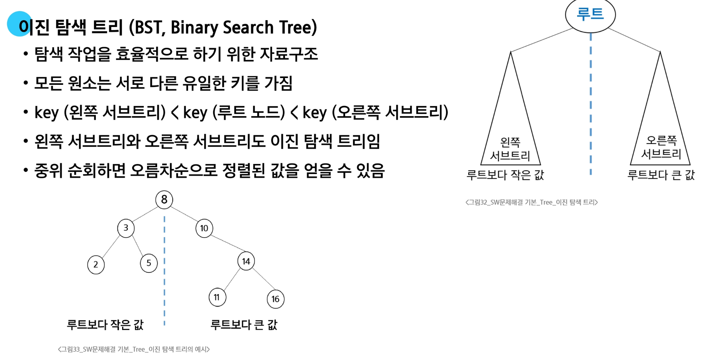
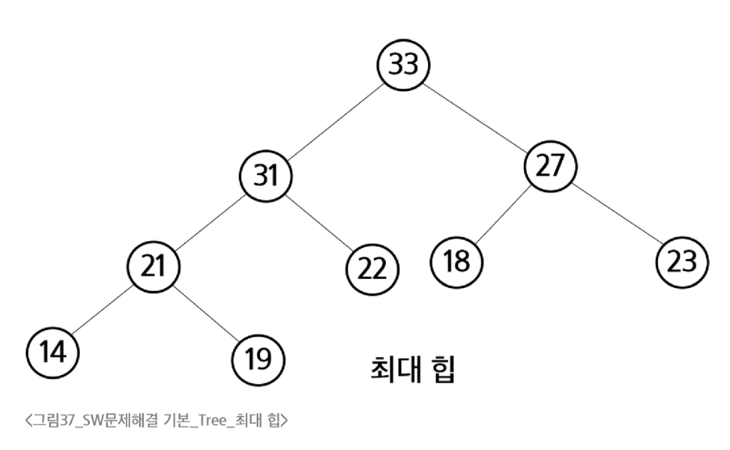
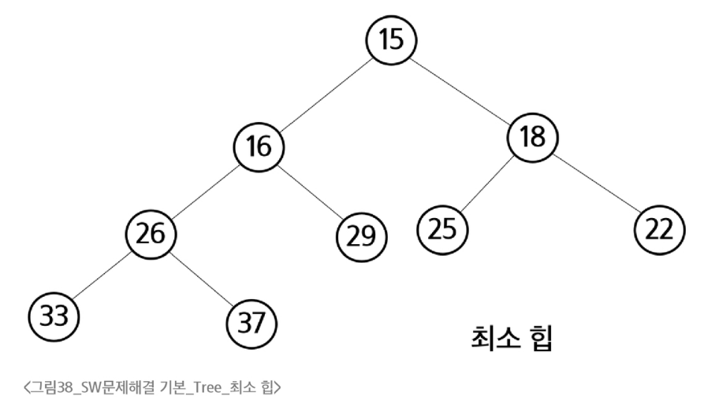

# 이진 탐색 트리
**BST, Binary Search Tree**

- 데이터를 빠르게 검색할 수 있도록 체계적으로 저장

- 최대 O(log _n_)의 빠른 속도로 값을 검색할 수 있는 자료구조

- 빠르게 검색될 수 있도록, 특정 규칙을 갖는 이진 트리 형태로 값을 저장
  

### 연결 리스트 vs BST

- **BST는 선형 연결리스트보다 더 빠른 삽입 / 삭제 / 탐색이 가능함**

- **연결리스트 성능**

  - 삽입: O(N)
  - 삭제: O(N)
  - 탐색: O(N)

- **BST 성능**

  - 삽입: 평균 O(log _N_)
  - 삭제: 평균 O(log _N_)
  - 탐색: 평균 O(log _N_)

# 힙 (Heap)

- **완전 이진 트리에 있는 노드 중에서 키 값이 가장 크거나 작은 노드를 찾기 위해서 만든 자료구조**

- **최대 힙(Max Heap)**

  - 키 값이 가장 큰 노드를 찾기 위한 힙입니다.

  - 항상 `{부모 노드의 키 값 > 자식 노드의 키 값}` 조건을 만족합니다.

  - **루트 노드**: 키 값이 가장 큰 노드입니다.

  

- **최소 힙(Min Heap)**

  - 키 값이 가장 작은 노드를 찾기 위한 힙입니다.

  - 항상 `{부모 노드의 키 값 < 자식 노드의 키 값}` 조건을 만족합니다.

  - **루트 노드**: 키 값이 가장 작은 노드입니다.

  