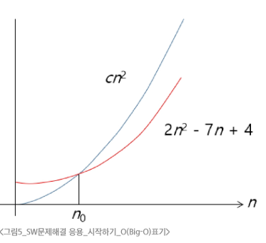

# SW 문제해결 역량이란?

- 프로그램을 하기 위한 많은 제약 조건과 요구 사항을 이해하고 최선의 방법을 찾아내는 능력

- <span style="color: darkblue">프로그래머가 사용하는 언어나 라이브러리, 자료구조, 알고리즘에 대한 지식을 적재적소에 퍼즐을 배치하듯 이들을 연결하여 큰 그림을 만드는 능력이라 할 수 있음</span>

- 문제해결 역량은 추상적인 기술임

  - 프로그래밍 언어, 알고리즘처럼 명확히 정의된 실체가 없습니다.

  - 무작정 알고리즘을 암기하고 문제를 풀어본다고 향상되지 않습니다.

- <span style="color: darkblue">문제해결 역량을 향상시키기 위해서 훈련이 필요함</span>


## 알고리즘의 효율

**공간적 효율성과 시간적 효율성**

- 공간적 효율성: 메모리 공간 효율성

- 시간적 효율성: 걸리는 시간

- 효율성을 뒤집으면? 복잡도(Cpmplexity)가 된다.
  - 복잡도가 높을수록 효율성은 저하된다.

**복잡도의 점근적 표기**

- 입력 크기에 대한 함수로 표기

  - 여러 개의 항을 가지는 다항식이다.

  - 이를 단순하게 표현하기 위해 점근적 표기 사용.(Asymptotic Notation)

```python
n = int(input())

for i in range(n):
  print(i, end = '')
```

### O(Big-Oh) 표기

- Big-Oh 표기는 복잡도의 점근적 상향을 의미

- 복잡도가 f(n) = 2n<sup>2</sup>-7n+4라면, f(n)는 O(n<sup>2</sup>)

- 먼저 f(n)의 단순화된 표현은 n<sup>2</sup>

- 단순화된 n<sup>2</sup>에 상수 c를 곱한 cn<sup>2</sup>이 n이 증가함에 따라 f(n)의 상한
  


#### 빅오로 표현하면

- **O(n)**
  ```python
  n = int(input())

  for i in range(n):
    print(i, end = '')

  for i in range(n):
    print(i, end = '')
  ```
- **O(n<sup>2</sup>)**
  ```python
  n = int(input())

  for i in range(n):
    for x in range(n):
      print(i, end = '')

    for y in range(n):
      print(i, end = '')
  ```

- **O(1)**
  ```python
  n = int(input())

  for i in range(50):
    print(i)
  ```

### 왜 효율적인 알고리즘이 필요한가?

- **10억개 숫자 정렬에 PC에서 O(n<sup>2</sup>)는 300년, O(nlogn)은 5분**


| O(n<sup>2</sup>) | 1,000 | 1백만 | 10억 |
| --- | --- | --- | --- |
| PC | < 1초 | 2시간 | 300년 |
| 슈퍼컴 | < 1초 | 1초 | 1주일 |

| O(nlogn) | 1,000 | 1백만 | 10억 |
| --- | --- | --- | --- |
| PC | < 1초 | < 1초 | 5분 |
| 슈퍼컴 | < 1초 | < 1초 | < 1초 |