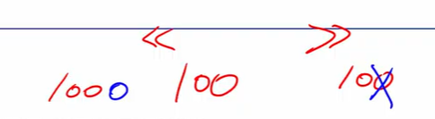
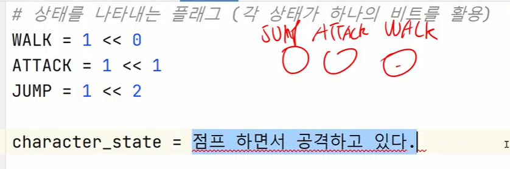
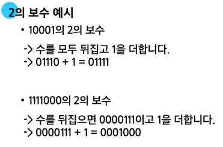
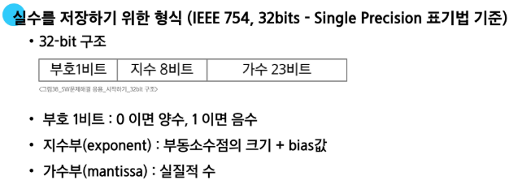

# 진법

### 10진수 -> 2진수로 변환 구현

- 10진수를 지속적으로 2로 나누어 구현

- 마지막으로 List를 거꾸로 뒤집기
  ```python
  tar = 149
  result = []

  while tar != 0:
    result.append(tar % 2)
    tar //= 2

  result.reverse()
  print(result)
  ```

# 비트 연산

### 비트와 바이트

- 1 bit: 0과 1을 표현하는 정보의 단위
- 1 Byte: 8-bit를 묶어 1 Byte라고 함(메모리 주소가 부여되는 단위)

### 비트 연산

- 컴퓨터의 CPU 내부적으로 비트 연산을 사용
  - 덧셈, 뺄셈, 곱셈 등을 계산함

### 비트 연산 AND와 OR 이해

- a <span style="color:darkblue">AND</span> b: a,b 둘 다 1일때만 결과가 1, 그 외에는 0

- a <span style="color:darkblue">OR</span> b: a,b 둘 중 하나만 1이면 결과가 1, 그 외에는 0

- 도전: 0x4A3 | 25(10)

| 계 | 산 | 기 |
| --- | --- | --- |
| 0100 | 1010 | 0011 |
| XXXX | 0001 | 1001 |
| 0100 | 1011 | 1011 |

### 시프트 연산자



### 음수 표현 방법

- 컴퓨터는 음수를 <span style="color:darkblue">"2의 보수"</span>로 관리함<br>맨 앞자리 bit<span style="color:darkblue">(MSB)</span>는 음수 or 양수를 구분하는 비트임

- 컴퓨터가 2의 보수를 사용하여 음수를 관리하는 이유
  - 뺄셈의 연산 속도 +, +0과 -0을 따로 취급하지 않기 위해
  

### Bitwise NOT (complement) 연산자

- ~ 연산자: 모든 비트를 반전시킴

- 만약 8-bit일때 ~(0001 1111)이라면 값은 1110 0000이 됨

# 실수


- **컴퓨터는 실수를 근사적으로 표현**

  - 이진법으로 표현할 수 없는 형태의 실수는 정확한 값이 아니라 근사 값으로 저장되는데 이때 생기는 작은 오차가 계산 과정에서 다른 결과를 가져옴

- **실수 자료형의 유효 자릿수**

  - 32비트 실수형 유효자릿수(10진수) -> 약 6자리 (C/C++, Java)
  - 64비트 실수형 유효자릿수(10진수) -> 약 15자리 (C/C++, Java, Python)