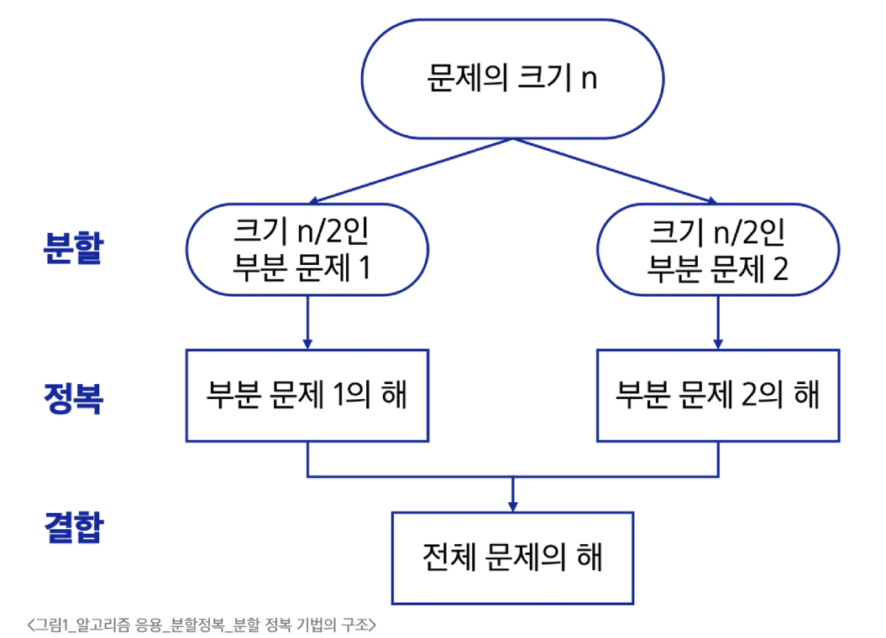
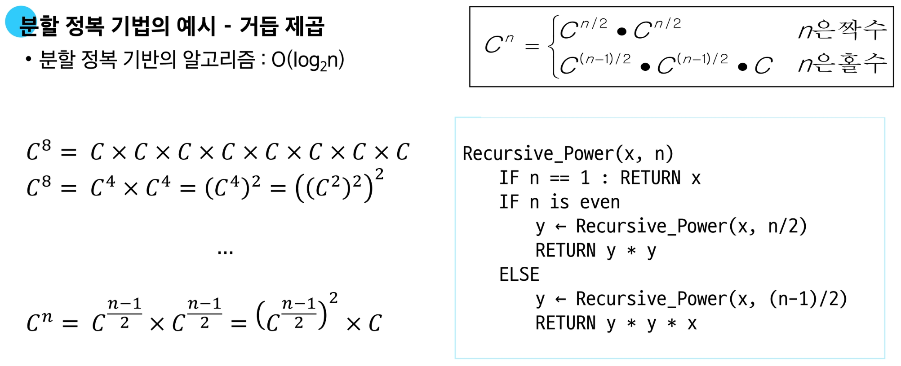

# 분할 정복
**문제를 작은 하위 문제로 나누고(분할) 각각을 해결(정복)한 뒤, 그 결과를 결합(통합)하여 원래 문제를 해결하는 알고리즘 기법**

## 분할 정복 기법의 설계 전략

- 분할(Divide): 해결할 문제를 여러 개의 작은 부분으로 나눔
- 정복(Conquer): 나눈 작은 문제를 각각 해결
- 통합(Combine): (필요하다면) 해결된 해답을 모음

## 분할 정복 기법의 구조
- Top-down approach 예시
  

- 거듭 제곱의 예시
  

# 병합 정렬

# 퀵 정렬

### 퀵 정렬의 시간 복잡도

- pivot의 설정에 따라 달라진다. (데이터의 분포에 따라 달라진다.)

- 평균: O(NlogN)
  - 실제 연산 시간이 효율적이다.
  - 데이터가 많을 수록 효율적이다.
  
- 최악: O(N2)
  - 반대로 정렬 될 수록 최악의 시간 복잡도

- 피봇을 정했으면 피봇 다음 i는 Pivot보다 큰 값을 찾기
- 끝 인덱스 j는 pivot보다 작은 값을 찾기

# 이진 검색

**자료의 가운데에 있는 항목의 키 값과 비교하여 다음 검색의 위치를 결정하고 검색을 계속 진행하는 방법**

## 이진 검색의 과정

1. 자료의 중앙에 있는 원소를 고른다.

2. 중앙 원소의 값과 찾고자 하는 목표 값을 비교한다.

3. 목표 값이 중앙 원소의 값보다 작으면 자료의 왼쪽 절반에 대해 검색 수행.

4. 크다면 자료의 오른쪽 반에 대해 새로 검색 수행.

5. 찾고자 하는 값을 찾을 때 까지 `1`~`3`의 과정을 반복한다.

**유의: 이진 검색을 하기 위해서는 자료가 정렬된 상태여야 한다.**

### 특징

- 정렬된 데이터를 기준으로 특정 값이나 범위를 검색하는 데 사용.

- [이진 검색을 활용한 심화 키워드] `Lower Bound`, `Upper Bound`
  - 정렬된 배열에서 특정 값 이상(이하)가 처음으로 나타나는 위치를 찾는 알고리즘
  - 특정 데이터의 범위 검색 등에서 활용

- [심화 키워드 2] `parametric search` 