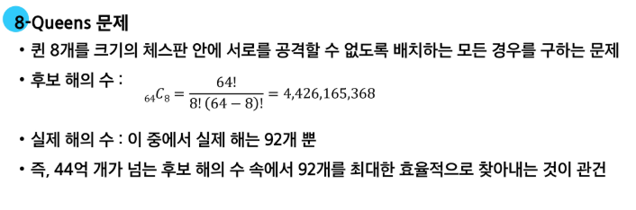
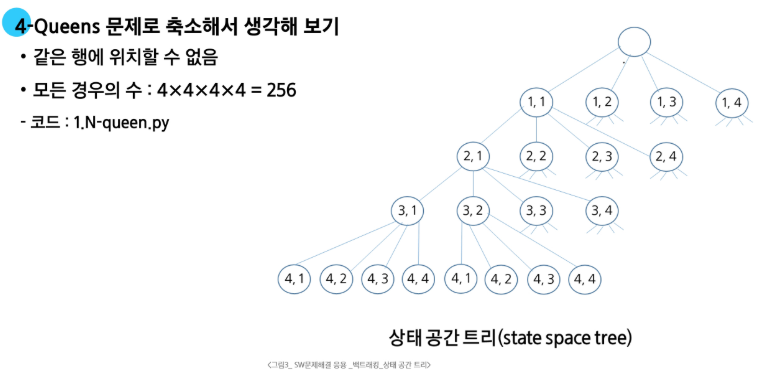

# 백트래킹
## 개념

- 여러 선택지(옵션)들이 존재하는 상황에서 한 가지 선택

- 선택이 이루어지면 새로운 선택지들의 집합이 생성됨

- 이런 선택을 반복하면서 최종 상태에 도달
  - 올바른 선택을 계속하면 목표 상태(goal state)에 도달

1. 전체를 보는 코드

2. 유망하지 않은 후보를 자르자!
     - 가지치기

### 백트래킹과 깊이 우선 탐색의 차이

**어떤 노드에서 출발하는 경로가 해결책으로 이어질 것 같지 않다면 더 이상 그 경로를 따라가지 않음으로써 시도의 횟수를 줄임**

- 이를 Pruning(가지치기)라고 합니다.

- 깊이 우선 탐색이 모든 경로를 추적하는데 비해 백트래킹은 불필요한 경로를 조기에 차단

- 깊이 우선 탐색을 가하기에는 경우의 수가 너무 많은 경우, 즉 N!가지 경우의 수를 가진 문제에 대해 깊이 우선 탐색을 가하면 당연히 처리 불가

- 백트래킹 알고리즘을 적용하면 일반적으로 경우의 수가 줄지만, 이 역시 최악의 경우에는 지수함수 시간을 요하므로 처리 불가능함

---
### N-Queens 문제

