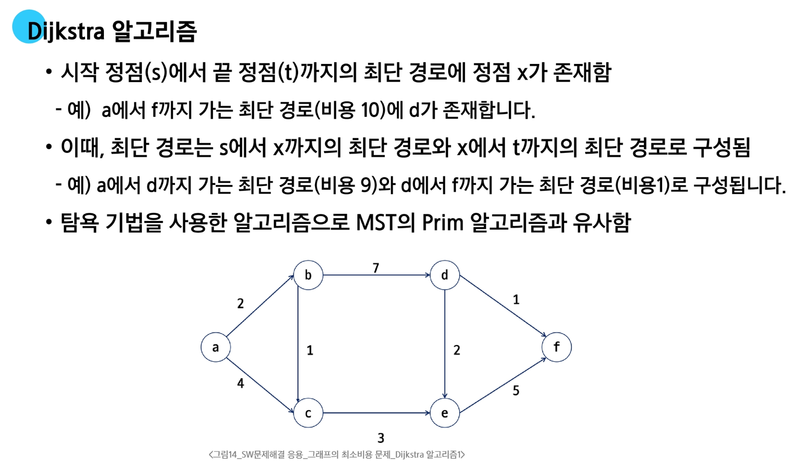

# 최소 비용 신장 트리 (MST)

**그래프에서 최소 비용 문제**

- 모든 정점을 연결하는 간선들의 가중치의 합이 최소가 되는 트리를 찾는다.
- 두 정점 사이의 비용이 최소인 경로를 찾는다.

**신장 트리**

- N개의 정점으로 이루어진 무방향 그래프에서 $N$개의 정점과 $N-1$개의 간선으로 이루어진 트리

**최소 신장 트리(MST, Minimum Spanning Tree)**

- 무방향 가중치 그래프에서 신장 트리를 구성하는 간선들의 가중치 하이 최소인 신장 트리

## Prim 알고리즘

- **하나의 정점에 연결된 간선들 중에서, 하나씩 선택하면서 MST를 만들어 가는 방식**
  
  1. 임의 정점을 하나 선택해서 시작
  2. 선택한 정점과 인접하는 정점들 중의 최소 비용의 간선이 존재하는 정점을 선택
  3. 모든 정점이 선택될 때까지 앞의 과정을 반복
   
- BFS처럼 정점에서 출발해서 "인접한 노드들 중 가중치가 가장 작은 것"을 먼저 고르자.
  - Queue에서 꺼낼 건데, 가장 작은것부터 먼저 꺼내기 -> 최소 힙(우선순위 큐)

## Kruskal

- **전체 간선들 보면서 "작은 것부터 고르자**
  1. 간선을 정렬
  2. 사이클이 없으면 선택 (연결이 되어 있지 않으면 선택)

**간선을 하나씩 선택해서 MST를 찾는 알고리즘**

1. 최초, 모든 간선을 가중치에 따라 오름차순으로 정렬
2. 가중치가 가장 낮은 간선부터 선택하면서 트리를 증가시킴
    - 사이클이 존재하면 다음으로 가중치가 낮은 간선 선택
  
3. $n-1$개의 간선이 선택될 때까지 2를 반복

### 어느 상황에서 어떤 알고리즘을 선택해야 할까?

**Prim vs Kruskal**
- 밀집 그래프일수록 Prim이 유리하다
- 희소 그래프일수록 Kruskal이 유리하다

- 정점의 개수가 최대 1000개
  - 최대 간선의 개수 -> 약 50만 개

---

# 최단 경로 알고리즘

**간선의 가중치가 있는 그래프에서 두 정점 사이의 경로들 중에 간선의 가중치의 합이 최소인 경로**

## 최단 경로 알고리즘의 종류

1. 하나의 시작 정점에서 끝 정점까지의 최단 경로
    - 다익스트라(Dijkstra) 알고리즘 - 음의 가중치를 허용하지 않음
    - 벨만 포드(Bellman-Ford) 알고리즘 - 음의 가중치 허용
  
2. 모든 정점들에 대한 최단경로
    - 플로이드-워샬(floyd-Warshall) 알고리즘

## Dijkstra 알고리즘

**시작 정점에서 거리가 최소인 정점을 선택해 나가면서 최단 경로를 구하는 알고리즘**

- 우선순위 큐의 활용
  - 특정 정점까지의 "누적 거리 중 가장 작은 걸 먼저 꺼낸다"

- A를 기준으로 다익스트라 한 번 돌리면
  - A에서 갈 수 있는 모든 정점들 까지의 거리가 한번에 구해진다