# 관계

### 관계의 정의

- 데이터베이스 내 여러 테이블 간의 논리적인 연결 관계를 나타냄

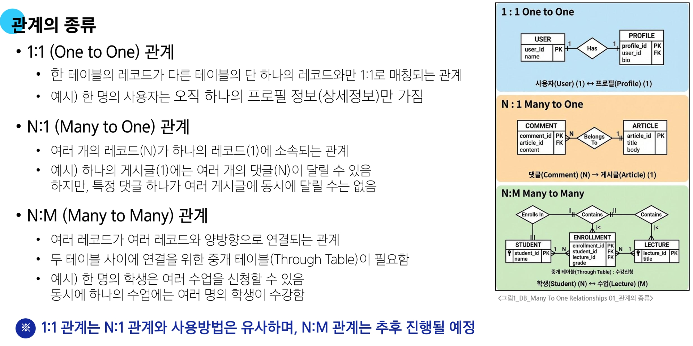

#### Many to one relationsships

**N:1 or 1:N**

- 한 테이블의 0개 이상의 레코드가 다른 테이블의 레코드 한 개와 관련된 관계

**N:1 예시**

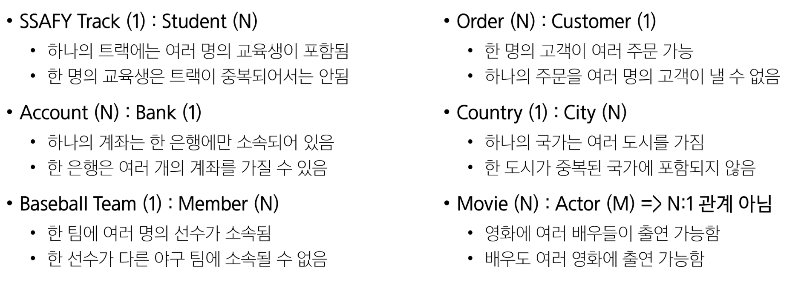

**댓글과 게시글의 관계**

- Comment(N) : Article(1)
  - 하나의 게시글에는 여러 개의 댓글이 달림
  - 단, 게시글에 댓글이 없는 경우도 존재함
  - 댓글이 소속된 게시글이 없는 경우는 없음
  -> 즉, 0개 이상의 댓글은 1개의 게시글에 작성될 수 있다.
  
##### 테이블 관계 설정

- 관계 설정을 위한 Foreign Key(외래 키, FK)를 N:1에서 1을 담당하는 테이블에 위치시키면 안됨
  - Article Table에 Foreign Key 컬럼을 위치시키면 중복 데이터로 인해 낭비가 발생함
    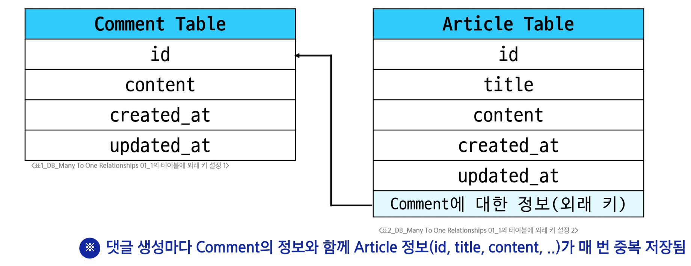
    
- 관계 설정을 위한 Foreign Key(외래 키, FK)의 적절한 위치는 바로 N:1에서 N을 담당하는 테이블에 위치
  - Comment가 생성되면 Article의 정보만 저장하면 됨
    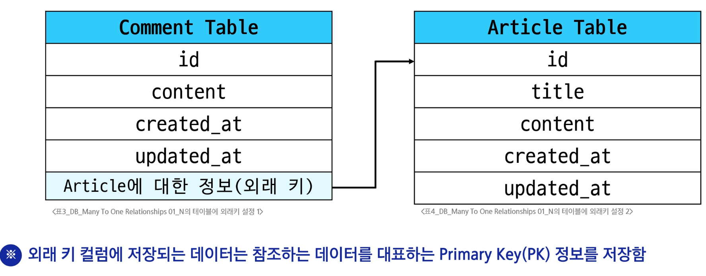

---
  
### 댓글 모델 정의

#### ForeignKey 필드

**`ForeignKey(to, on_delete)`**
- 한 모델이 다른 모델을 참조하는 관계를 설정하는 필드
  - N:1 관계 표현할 때 사용
  - 데이터베이스에서 외래 키로 구현됨
  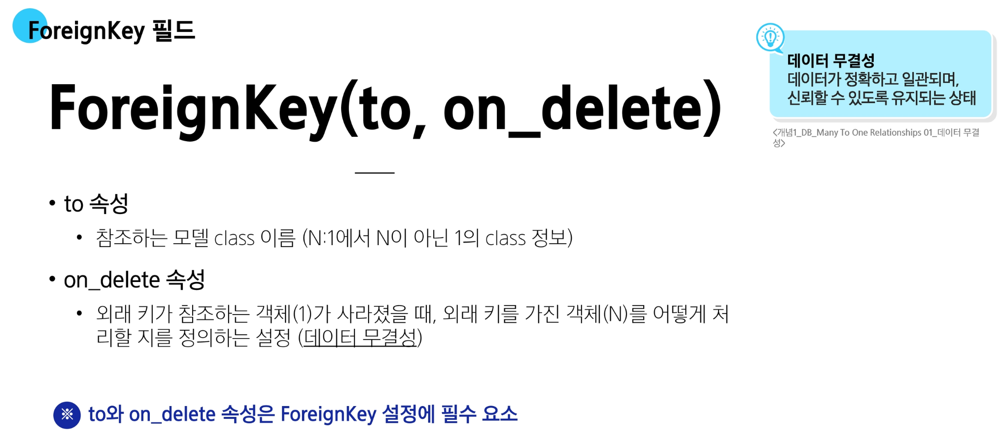

##### `on_delete` 속성 종류

- CASCADE
  - 참조된 객체(부모 객체)가 삭제될 때 이를 참조하는 모든 객체도 삭제되도록 지정
  - 예) 게시글이 삭제되면 해당 게시글의 모든 댓글을 삭제
  
- PROTECT
  - 삭제 하려는 부모 객체에 자식 객체가 존재한다면 해당 부모 객체를 삭제하지 못하도록 지정
  - 예) 게시글을 삭제할 때 해당 게시글에 댓글이 존재하면 게시글 삭제 불가
  
- SET_NULL
  - 부모 객체가 삭제되면, 해당 필드에 값이 **NULL이 저장**되도록 지정
  - 단, 해당 `ForeignKey` 필드 설정이 `null = True`가 설정되어야 함
  
- 기타 on_delete 설정 참고
  - https://docs.djangoproject.com/en/5.2/ref/models/fields/#arguments

#### 댓글 모델 정의하기

- ForeignKey 클래스의 인스턴스 이름은 참조하는 모델 클래스 이름의 <span style='color:crimson'>단수형</span>으로 작성하는 것을 권장
  - 외래 키 이름을 단수형으로 짓는 이유는 N에서 **1**을 참조하는 것을 명시하기 위해서
  ```python
  # articles/models.py
  class Comment(models.Model):
    article = models.ForeignKey(Article, on_delete=models.CASCADE)
    content = models.CharField(max_length=200)
    created_at = models.DateTimeField(auto_now_add=True)
    updated_at = models.DateTimeField(auto_now=True)
  ```

**Migration 이후 댓글 테이블 확인**

- 만들어지는 필드 이름 규칙
  - 작성한 외래 키 필드명 + '_' + 'id'

- 댓글 테이블의 article_id 외래 키 필드 확인
  - <u>bigint</u> 자료형 확인
    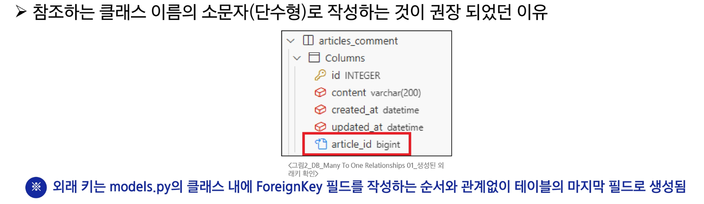
    
##### 댓글 생성 연습

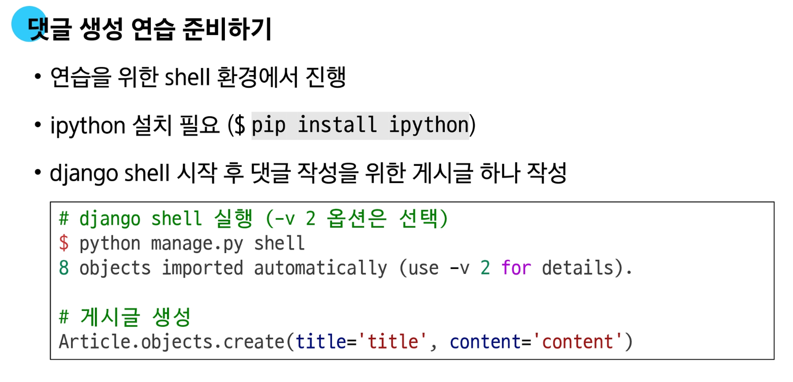
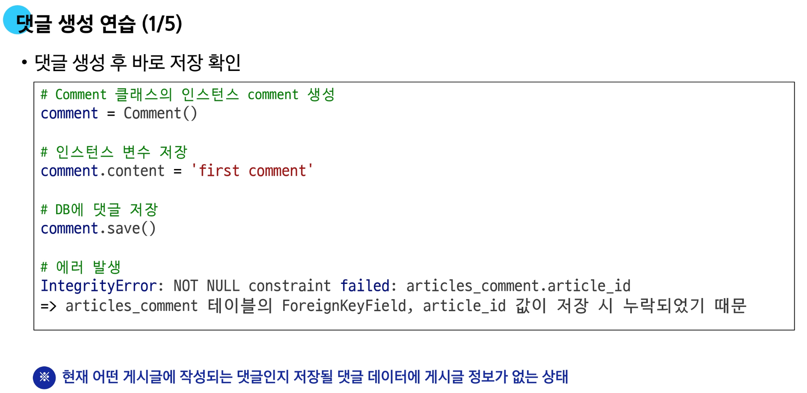
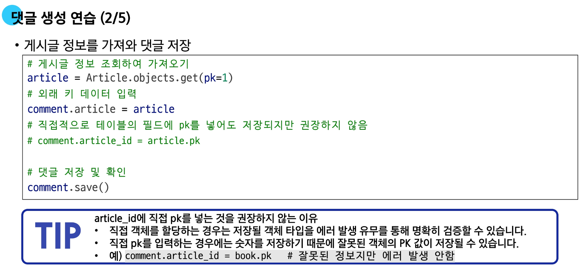
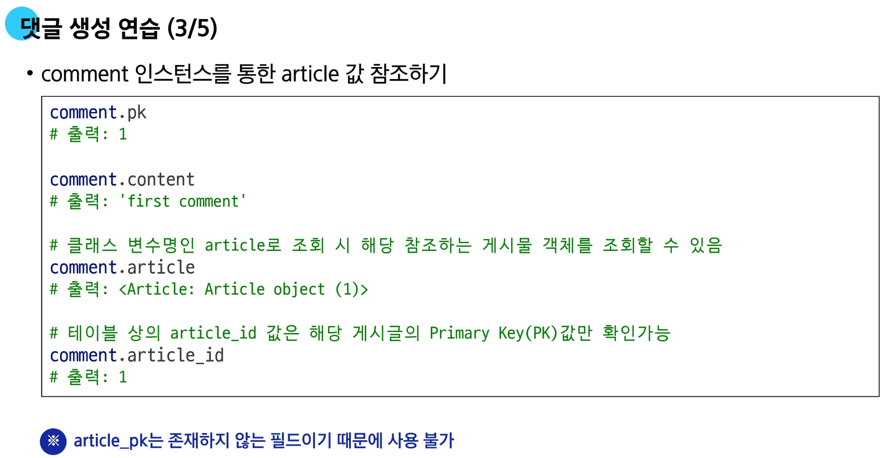
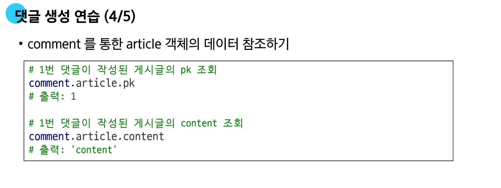
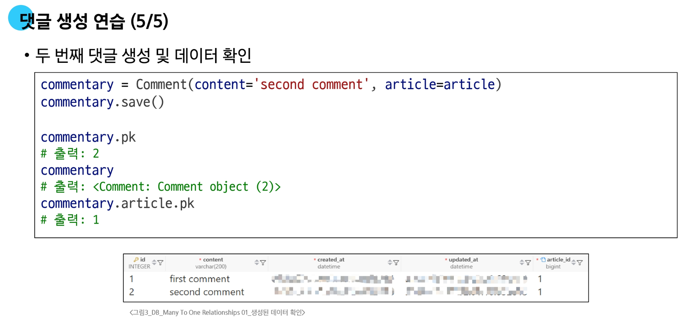

---

### 관계 모델 참조

#### 참조의 정의

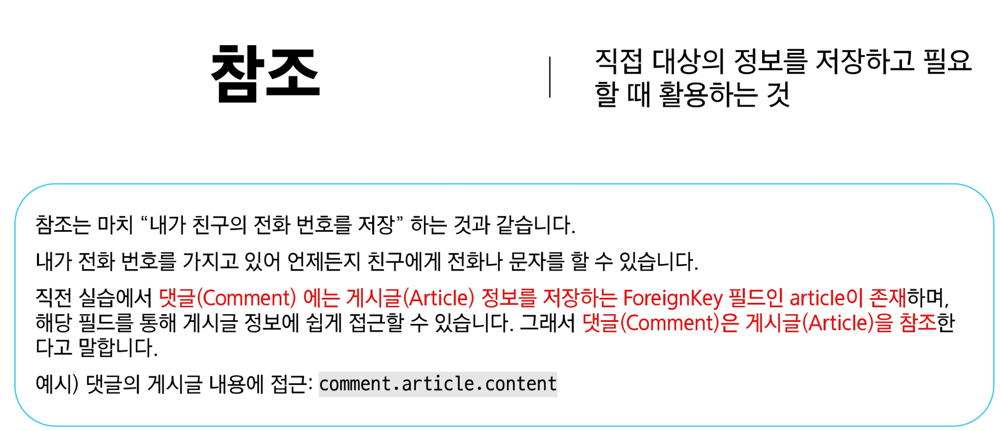

##### 특정 게시글(Article)의 댓글(Comment) 정보 조회하기

- QuerySet API의 `.all()` 사용하기❌
  - 특정 게시글(Article)의 댓글(Comment)들이 아닌 모든 댓글 정보를 가져오게 됨
    ```python
    # 특정 게시물의 댓글이 아닌 모든 댓글을 조회함
    comments = Comment.objects.all()
    ```

- QuerySet API의 `.filter()` 사용하기
  - 특정 게시글(Article) 정보를 조회 후 댓글(Comment)에서 filter를 활용해 댓글 조회 가능
    ```python
    # 특정 게시글 정보를 가져온 후 filter를 이용할 수 있음
    article = Article.objects.get(pk=1)
    comments = Comment.objects.filter(article=article)
    ```

#### 역참조

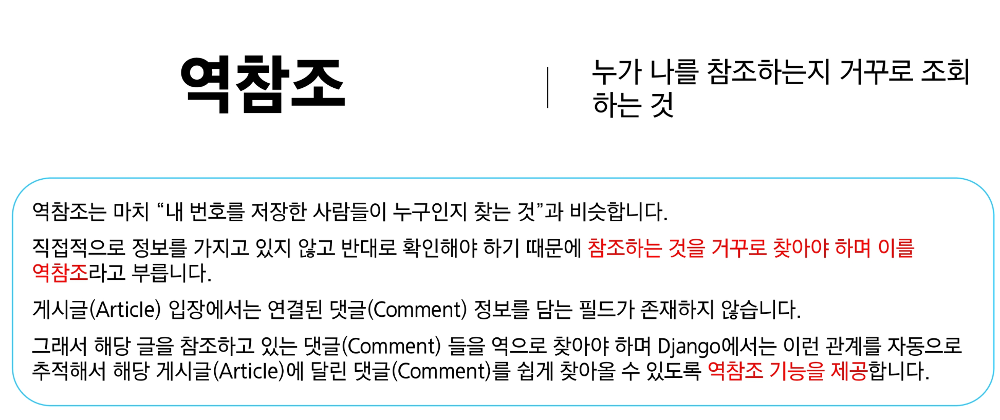

##### 역참조 기본 구조

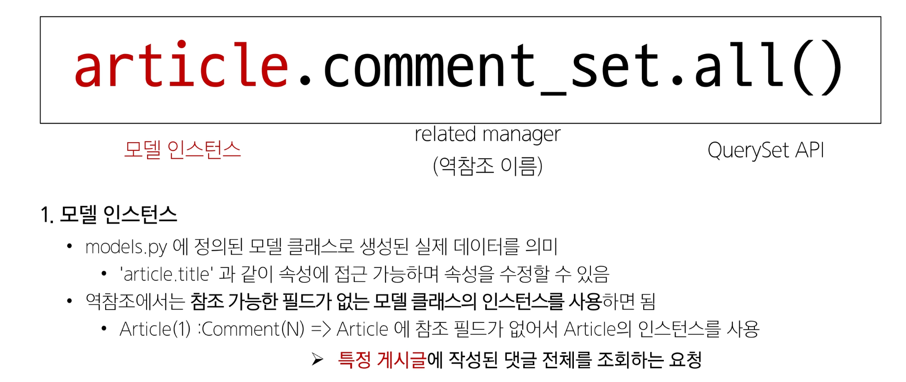