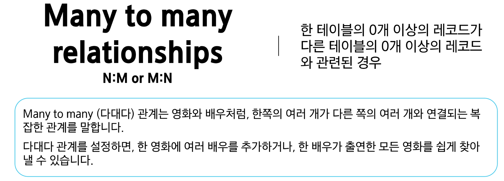
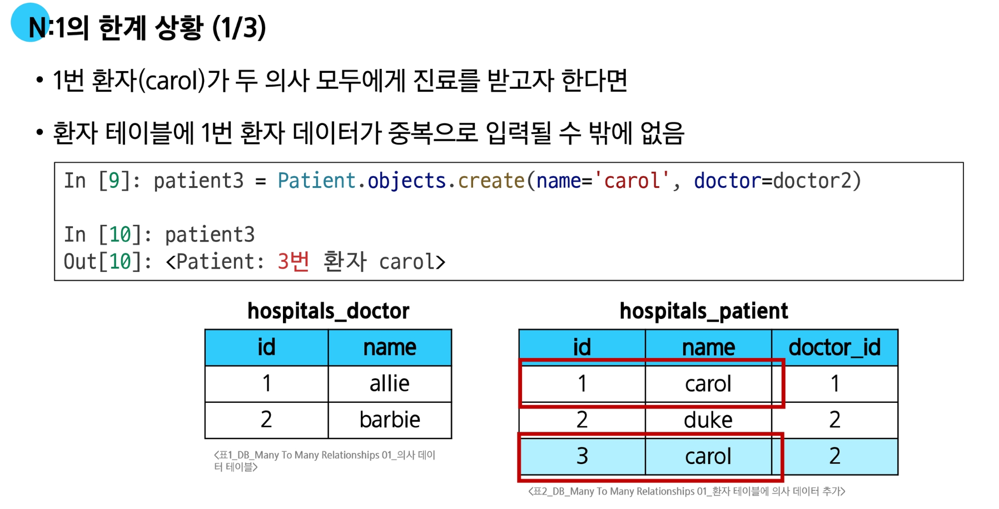
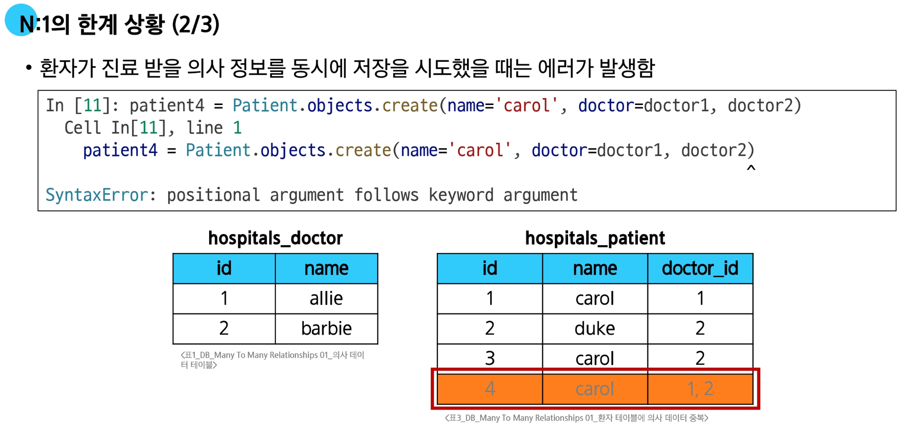
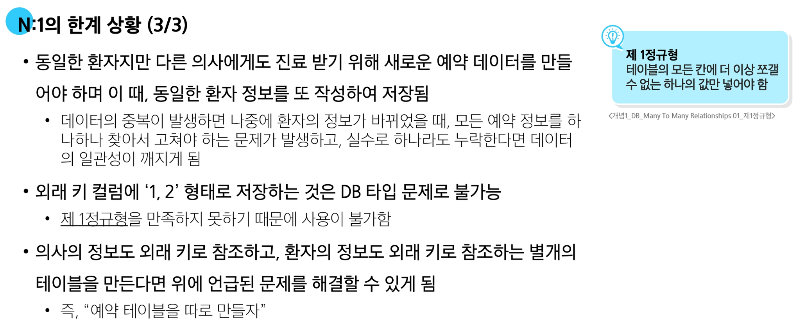

# Many to Many relationships

## 다대다 관계



### M:N관계의 역할과 필요성 이해하기

- '병원 진료 시스템 모델 관계'를 직접 만들어 보기
  - 환자와 의사 2개의 모델을 사용하여 모델 구조 구상
  
- 기존의 N:1 구조로 환자와 의사 테이블을 구성했을 때 어떤 한계가 있는지 확인

- N:M 관계는 어떻게 데이터베이스에서 관리하는지 확인

#### N:1의 한계

**의사와 환자 간 모델 관계 설정**

- 한 명의 의사에게 여러 환자가 예약할 수 있도록 models 클래스 정의
  - Patient(환자) 모델에 Doctor 모델을 참조하도록 정의





#### 중개 모델

**다대다 관계에서 두 모델을 연결하는 역할을 하는 특별한 기능을 가진 모델**

- 의사와 환자가 '예약'이라는 관계로 연결될 때, 단순히 '의사 A와 환자 B가 연결됐다'는 사실 외에 '언제 예약했는지', '예약의 상태는 무엇인지' 같은 정보를 함께 저장하는 모델
- 중개 모델을 사용하면 Doctor 모델이나 Patient 모델에 없는, 예약 행위 자체에 대한 상세한 정보를 담을 수 있어 현실 세계의 관계를 더욱 정교하게 표현할 수 있다

#### ManytoManyField

**M:N 관계 설정 모델 필드**

- 이 필드를 설정하면 Django는 자동으로 중간 테이블(중개 모델)을 생성하여 각 모델 간의 관계를 관리한다
- 모델 클래스 내부에 필드로 정의, 어느 모델에 정의해도 관계는 동일하게 유지
- ManytoManyField의 필드명은 다대다 관계를 나타내기 위해 복수형으로 작성 권장
- ManytoManyField의 필수 인자는 관계를 가지는 모델 클래스를 작성한다.

##### 필드 조작

- `add()` 메서드
  - 중개 테이블에 새로운 데이터를 추가할 때 사용
  - 인자로 연결할 대상 모델의 인스턴스를 넣어서 사용
  ```python
  # 단일 인스턴스 추가
  patient.doctors.add(doctor1)
  # 여러 인스턴스 한 번에 추가
  patient.doctors.add(doctor2, doctor3)
  ```

- `remove()` 메서드
  - 중개 테이블에 있는 데이터를 삭제할 때 사용
  - 인자로 전달한 인스턴스를 중개 테이블에서 제거하며, 대상 객체 자체는 삭제되지 않음
  ```python
  # 단일 관계 삭제
  patient.doctors.remove(doctor1)
  # 여러 관계 한 번에 삭제
  patient.doctors.remove(doctor2, doctor3)
  ```
  
#### 기본 ManytoManyField의 한계

- 기본 ManyToManyField로 생성된 예약 중개 테이블은 의사와 환자의 외래 키 정보만 저장하고 있음
- 만약 예약 중개 테이블에 증상, 예약 일정, 방문 횟수에 대한 추가 정보가 필요한 경우, 기본 ManyToManyField를 그대로 사용할 수 없음
- 추가 정보를 저장하기 위해서는 사용자가 직접 중개 테이블을 정의해야 함
  - 사용자가 중개 테이블을 직접 정의하면 `.add()`, `.remove()`에 메서드를 사용할 수 없음
- ManyToManyField에 `through` 속성을 통해 사용자가 작성한 중개 테이블을 등록하면 추가 정보 저장 및 `.add()`, `.remove()` 메서드를 그대로 활용 가능