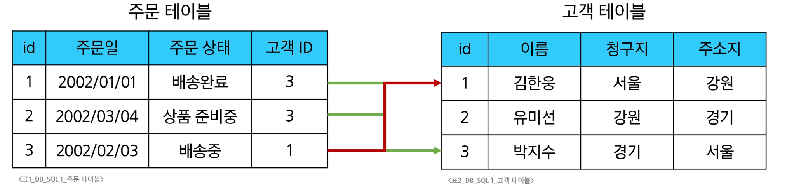
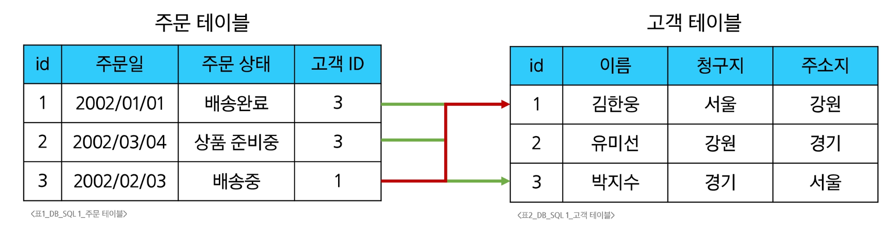
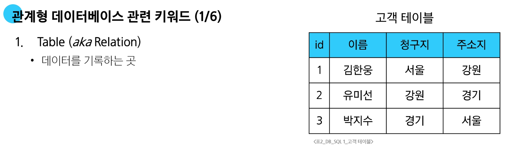
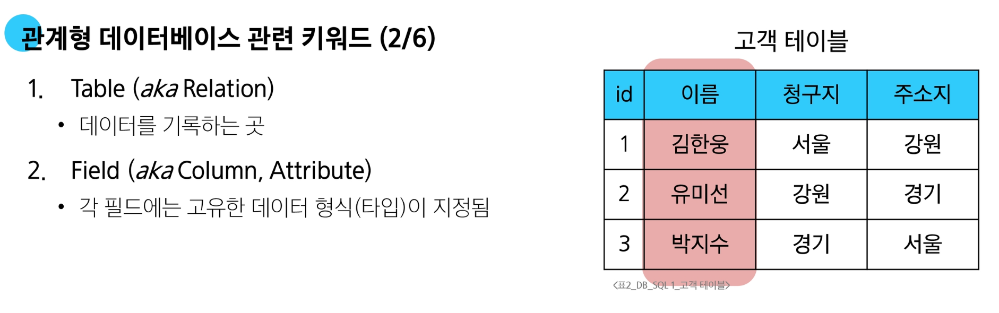
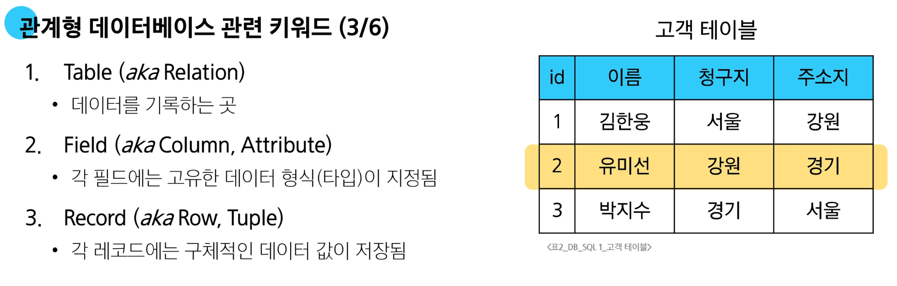
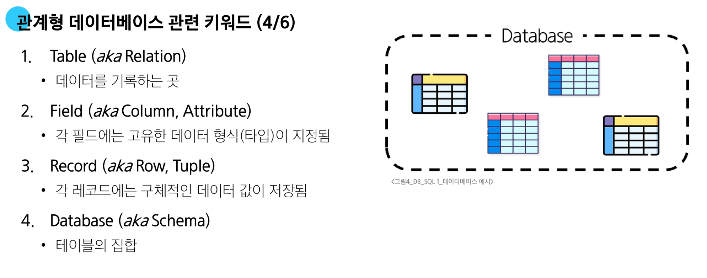
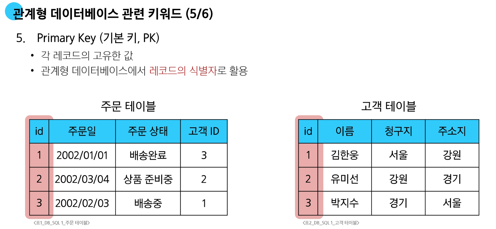
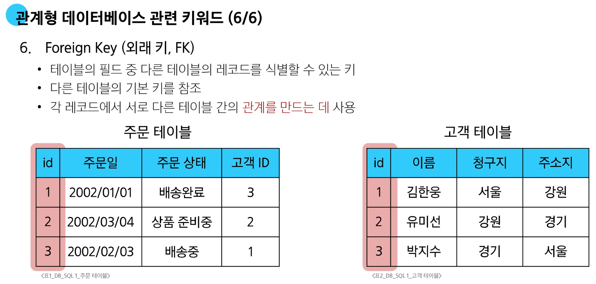

# SQL1

## Database

**데이터베이스 (Database)**
- 체계적으로 정리된 데이터의 모음

**데이터**
- 저장이나 처리를 위해 변환된 정보

**데이터 저장법**
1. 파일(File) 이용
   - 어디에서나 쉽게 사용 가능
   - 데이터를 구조적으로 관리하기 어려움
      ```plain
      개인정보.txt
      
      이름: 김한웅
      나이: 56
      사는 곳: 서울
      
      이름: 유미선
      나이: 21
      사는 곳: 강원
      
      이름: 박지수
      나이: 36
      사는 곳: 경기
      ```
2. 스프레드 시트 (Spreadsheet) 이용
   - 테이블의 열과 행을 사용해 데이터를 구조적으로 관리 가능
  
    | id | name | age | city |
    |:---:|:---:|:---:|:---:|
    | 1 | 김한웅 | 56 | 서울 |
    | 2 | 유미선 | 21 | 강원 |
    | 3 | 박지수 | 36 | 경기 |
  
**스프레드 시트의 한계**

- 크기
  - 일반적으로 약 100만 행까지만 저장 가능

- 보안
  - 단순히 파일이나 링크 소유 여부에 따른 단순한 접근 권한 기능 제공

- 정확성
  - 만약 공식적으로 "강원"의 지명이 "강언"으로 바뀌었다고 가정한다면?
  - 이 변경으로 인해 테이블 모든 위치에서 해당 값을 업데이트 해야 함
  - 만약 데이터가 여러 시트에 분산되어 있다면 변경에 누락이 생기거나 추가 문제가 발생할 수 있음

### 데이터베이스 역할

**"<span style='color:darkred'>C</span>reate <span style='color:darkred'>R</span>ead <span style='color:darkred'>U</span>pdate <span style='color:darkred'>D</span>elete"**

---

#### Relational Database


**관계형 데이터베이스 (Relational Database)**
- 데이터 간에 <span style='color:darkred'>관계</span>가 있는 데이터 항목들의 모음

- 테이블, 행, 열의 정보를 구조화하는 방식
- <span style='color:darkred'>서로 관련된 데이터 포인터를 저장</span>하고 이에 대한 <span style='color:darkred'>액세스</span>를 제공
  
  
#### 관계

- 여러 테이블 간의 (논리적) 연결
- 이 관계로 인해 두 테이블을 사용하여 데이터를 다양한 형식으로 조회할 수 있음
  - 특정 날짜에 구매한 모든 고객 조회
  - 지난 달에 배송일이 지연된 고객 조회 등
  
  
---

## RDBMS 관련 키워드







---

## DBMS
**Database Management System**
**데이터베이스를 관리하는 소프트웨어 프로그램**

- 데이터 저장 및 관리를 용이하게 하는 시스템
- 데이터베이스와 사용자 간의 인터페이스 역할
- 사용자가 데이터 구성, 업데이트, 모니터링, 백업, 복구 등을 할 수 있도록 도움

### 데이터베이스 정리

- Table은 데이터가 기록되는 곳
- Table에는 행에서 고유하게 식별 가능한 기본 키라는 속성이 있으며,<br>외래 키를 사용하여 각 행에서 서로 다른 테이블 간의 관계를 만들 수 있음
- 데이터는 기본 키 또는 외래 키를 통해 결합(join)될 수 있는 여러 테이블에 걸쳐 구조화 됨