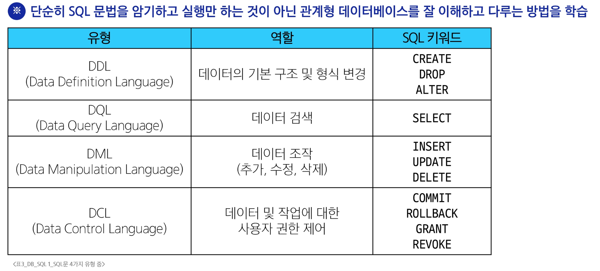
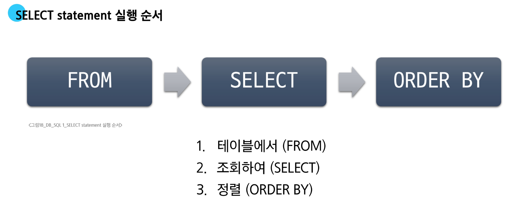
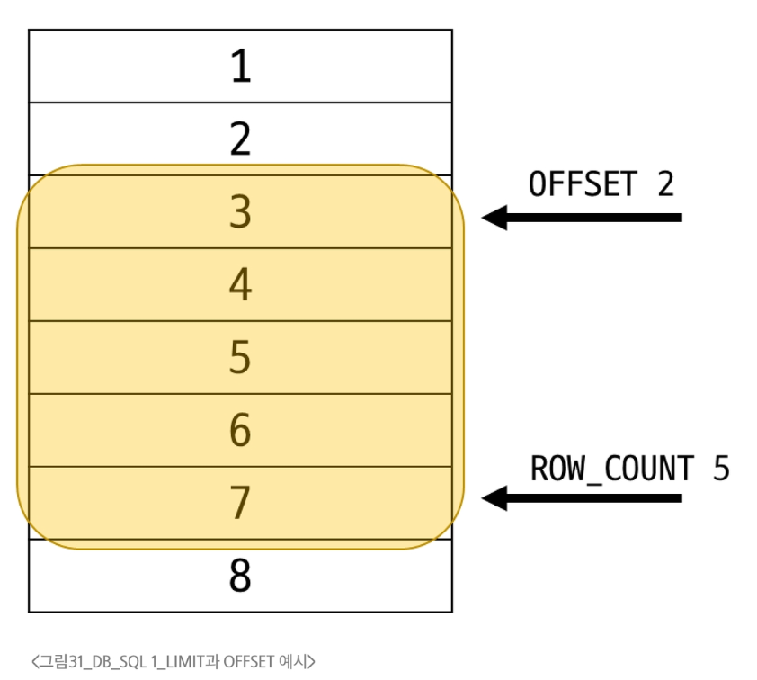
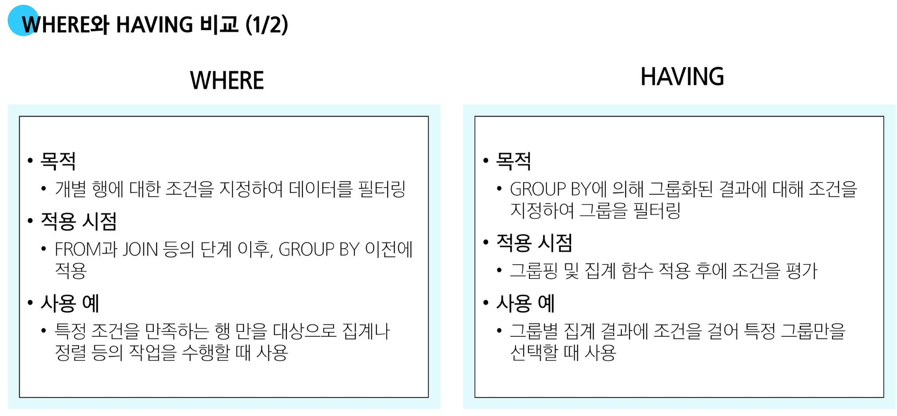
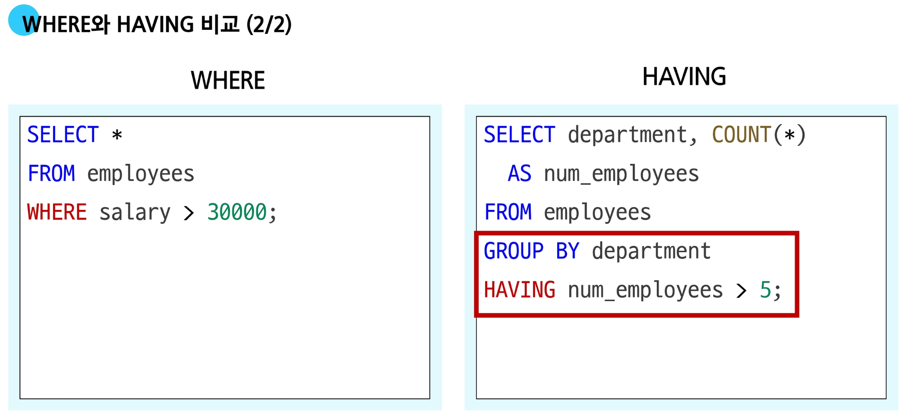
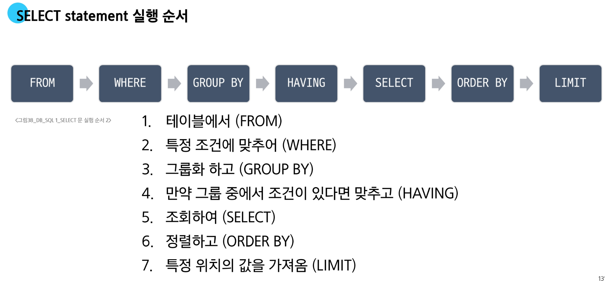

# SQL1

## SQL

**<span style='color:Crimson'>Structure</span> <span style='color:CornflowerBlue '>Query</span> Language**

**테이블의 형태로 <span style='color:Crimson'>구조화</span> 된 관계형 데이터베이스에게 요청을 <span style='color:CornflowerBlue'>질의(요청)</span>**

---

### SQL Syntax

```sql
SELECT column_name FROM table_name;
```
1. SQL 키워드는 대소문자를 구분하지 않음
   - 하지만 대문자로 작성하는 것을 권장 (명시적 구분)
2. 각 SQL Statements의 끝에는 세미콜론(;)이 필요
   - 세미콜론은 각 SQL Statements를 구분하는 방법 (명령어의 마침표)

#### SQL Statements

- SQL을 구성하는 가장 기본적인 코드 블록

#### SQL Statements 예시
```sql
SELECT column_name FROM table_name;
```
- 해당 코드 예시는 SELECT Statement라 부름
- Statement는 `SELECT`, `FROM` 2개의 keyword로 구성

#### 수행 목적에 따른 SQL Statements 4가지 유형
1. `DDL` - 데이터 정의
2. `DQL` - 데이터 검색
3. `DML` - 데이터 조작
4. `DCL` - 데이터 제어


---

### DQL

#### SELECT

**Syntax**
```sql
SELECT
  select_list
FROM
  table_name;
```
- SELECT 키워드 이후 데이터를 선택하려는 필드를 하나 이상 지정
- FROM 키워드 이후 데이터를 선택하려는 테이블의 이름을 지정

##### 활용

- 테이블 employees에서 LastName, FirstName 필드의 모든 데이터를 조회
  ```sql
  SELECT
    LastName
  FROM
    employees;
  ```

- 테이블 employees에서 모든 필드 데이터를 조회
  ```sql
  SELECT * FROM employees;
  ```
  
- 테이블 employees에서 FirstName 필드의 모든 데이터를 조회
  ```sql
  SELECT
    FirstName AS '이름'
  FROM
  employees;
  ```

- 테이블 tracks에서 Name, Milliseconds 필드의 모든 데이터 조회
  ```sql
  SELECT
    Name,
    Milliseconds / 60000 AS '재생 시간(분)'
  FROM
    tracks;
  ```
  
##### SELECT 정리

- 테이블의 데이터를 조회 및 반환
- '*' (asterisk)를 사용하여 모든 필드 선택

---

#### ORDER BY

**Syntax**
```sql
SELECT
  select_list
FROM
  table_name
ORDER BY
  column1 [ASC|DESC],
  column2 [ASC|DESC],
  ...;
```
- `FROM` clause 뒤에 위치
- 하나 이상의 컬럼을 기준으로 결과를 오름차순(`ASC`, 기본값), 내림차순(`DESC`)으로 정렬

##### 활용

- 테이블 `employees`에서 `FirstName` 필드의 모든 데이터를 오름차순으로 조회
  ```sql
  SELECT
    FirstName
  FROM
    employees
  ORDER BY
    FirstName;
  ```

- 테이블 `employees`에서 `FirstName` 필드의 모든 데이터를 내림차순으로 조회
  ```sql
  SELECT FirstName
  FROM employees
  ORDER BY FirstName DESC;
  ```

- 테이블 `customers`에서 `Country` 필드를 기준으로 내림차순 정렬한 다음<br>`City` 필드 기준으로 오름차순 정렬하여 조회
  ```sql
  SELECT Country, City
  FROM customers
  ORDER BY Country DESC, City ASC;
  ```
  
- 테이블 `tracks`에서 `Milliseconds` 필드를 기준으로 내림차순 정렬한 다음<br>`Name`, `Milliseconds` 필드의 모든 데이터를 조회
  - (단, `Milliseconds` 필드는 60,000으로 나눠 분 단위 값으로 출력)
  ```sql
  SELECT Name, Milliseconds / 60000 AS '재생시간(분)'
  FROM tracks
  ORDER BY Milliseconds DESC;
  ```
  
**정렬에서의 NULL**
- NULL 값이 존재할 경우 오름차순 정렬 시 결과에 NULL이 먼저 출력
  ```sql
  SELECT ReportsTo
  FROM employees
  ORDER BY ReportsTo;
  ```


---

### Filtering Data

**관련 Keywords**

- <u>Clause</u>
  - <span style='color:Crimson'>DISTINCT</span>
  - <span style='color:Crimson'>WHERE</span>
  - <span style='color:Crimson'>LIMIT</span>
  
- <u>Operator</u>
  - <span style='color:Crimson'>BETWEEN</span>
  - <span style='color:Crimson'>IN</span>
  - <span style='color:Crimson'>LIKE</span>
  - Comparison
  - Logical

---

#### DISTINCT

**Syntax**
```sql
SELECT DISTINCT
  select_list
FROM
  table_name;
```
- `SELECT` 키워드 바로 뒤에 작성해야 함
- `SELECT DISTINCT` 키워드 다음에 고유한 값을 선택하려는 하나 이상의 필드를 지정

##### 활용

- 테이블 `customers`에서 `Country` 필드의 모든 데이터를 중복없이 오름차순 조회
  ```sql
  SELECT DISTINCT
    Country
  FROM
    customers
  ORDER BY
    Country;
  ```

---

#### WHERE

**Syntax**
```sql
SELECT
  select_list
FROM
  table_name
WHERE
  search_condition;
```
- `FROM` clause 뒤에 위치
- `search_condition`은 비교연산자 및 논리연산자 (`AND`, `OR`, `NOT` 등)을 사용하는 구문이 사용됨

##### 활용

1. 테이블 customers에서 `City` 필드 값이 `Prague`인 데이터의 `LastName`, `FirstName`, `City` 조회
    ```sql
    SELECT
      LastName, FirstName, City
    FROM
      customers
    WHERE
      City = 'Prague';
    ```

2. 테이블 `customers`에서 `City` 필드 값이 `Prague`가 아닌 데이터의 `LastName`, `FirstName`, `City` 조회
    ```sql
    SELECT
      LastName, FirstName, City
    FROM
      customers
    WHERE
      City != 'Prague';
    ```

3. 테이블 `customers`에서 `Company` 필드 값이 `NULL`이고<br>`Country` 필드 값이 'USA'인 데이터의 `LastName`, `FirstName`, `Company`, `Country` 조회
    ```sql
    SELECT
      LastName, FirstName, Company, Country
    FROM
      customers
    WHERE
    -- NULL = NULL 결과: NULL
    -- 값이 없는 것 = 값이 없는 것 ==> 둘 다 모르는 상태에서 비교하는 거라 결과도 모름
    -- "3치(진) 논리"
      Company IS NULL
      AND Country = 'USA';
    ```
  
4. 테이블 `customers`에서 `Company` 필드 값이 `NULL`이거나<br>`Country` 필드 값이 'USA'인 데이터의 `LastName`, `FirstName`, `Company`, `Country` 조회
    ```sql
    SELECT
      LastName, FirstName, Company, Country
    FROM
      customers
    WHERE
      Company IS NULL
      OR Country = 'USA';
    ```

5. 테이블 `tracks`에서 `Bytes` 필드 값이 10,000 이상 500,000 이하인 데이터의 `Name`, `Bytes` 조회
    ```sql
    SELECT
      Names, Bytes
    FROM
      tracks
    WHERE
      Bytes BETWEEN 10000 AND 500000;
      
    -- WHERE
    --    Bytes >= 10000
    --    AND Bytes <= 500000;
    ```
  
6. 테이블 `tracks`에서 `Bytes` 필드 값이 10,000 이상 500,000 이하인 데이터의 `Name`, `Bytes` 를 Bytes 기준으로 오름차순 조회
    ```sql
    SELECT
      Names, Bytes
    FROM
      tracks
    WHERE
      Bytes BETWEEN 10000 AND 500000
    ORDER BY
      Bytes;
    ```

7. 테이블 `customers`에서 `Country` 필드 값이<br>'Canada' 또는 'Germany' 또는 'France'인 데이터의 LastName, FirstName, Country 조회
    ```sql
    SELECT
      LastName, FirstName, Country
    FROM
      customers
    WHERE
      Country IN ('Canada', 'Germany', 'France');
    
    -- WHERE
    --    Country = 'Canada'
    --    OR Country = 'Germany'
    --    OR Country = 'France';
    ```
  
8. 테이블 `customers`에서 `Country` 필드 값이<br>'Canada' 또는 'Germany' 또는 'France'가 아닌 데이터의 LastName, FirstName, Country 조회
    ```sql
    SELECT
      LastName, FirstName, Country
    FROM
      customers
    WHERE
      Country NOT IN ('Canada', 'Germany', 'France');
    
    -- WHERE
    --    Country != 'Canada'
    --    OR Country != 'Germany'
    --    OR Country != 'France';
    ```

9. 테이블 `customers`에서 `LastName` 필드 값이 'son'으로 끝나는 데이터의 `LastName`, `FirstName` 조회
    ```sql
    SELECT
      LastName, FirstName
    FROM
      customers
    WHERE
      LastName LIKE '%son';
    ```
    
10. 테이블 `customers`에서 `FirstName` 필드 값이 4자리이면서 'a'로 끝나는 데이터의 `LastName`, `FirstName` 조회
    ```sql
    SELECT
      LastName, FirstName
    FROM
      customers
    WHERE
      FirstName LIKE '___a';
    ```
  
---

### Operators

**Comparison Operators**
- 비교 연산자
  - =, >=, <=, !=
  - IS, <u>LIKE</u>, <u>IN</u>
  - BETWEEN...AND

**Logical Operators**
- 논리 연산자
  - AND(&&)
  - OR(||)
  - NOT(!)

**Wildcard Characters**

- **'%'**
  - <span style='color:Crimson'>0개 이상의 문자열</span>과 일치하는지 확인
  
- **'_'**
  - <span style='color:Crimson'>단일 문자</span>와 일치하는지 확인
  
#### LIMIT

**Syntax**
```sql
SELECT
  select_list
FROM
  table_name
LIMIT [offset,] row_count;
```
- 하나 또는 두 개의 인자를 사용 (0 또는 양의 정수)
- row_count는 조회하는 최대 레코드 수를 지정

##### 예시
```sql
SELECT
  ..
FROM
  ..
LIMIT 2, 5;
```


##### 활용

1. 테이블 `tracks`에서 `TrackId`, `Name`, `Bytes` 필드 데이터를 `Bytes` 기준 내림차순으로 7개만 조회
    ```sql
    SELECT
      TrackId, Name, Bytes
    FROM
      tracks
    ORDER BY Bytes DESC
    LIMIT 7;
    ```

2. 테이블 `tracks`에서 `TrackId`, `Name`, `Bytes` 필드 데이터를 `Bytes` 기준 내림차순으로 4번째부터 7번째 데이터만 조회
    ```sql
    SELECT
      TrackId, Name, Bytes
    FROM
      tracks
    ORDER BY
      bytes DESC
    LIMIT 3, 4;
    -- LIMIT 4 OFFSET 3;
    ```

---

### Grouping data

#### GROUP BY

**Syntax**
```sql
SELECT
  c1, c2, ..., cn, aggregate_function(ci)
FROM
  table_name
GROUP BY
  c1, c2, ..., cn;
```
- `FROM` 및 `WHERE` 절 뒤에 배치
- `GROUP BY` 절 뒤에 그룹화 할 필드 목록을 작성
  
**집계 함수**
**Aggregation Functions**
- 값에 대한 계산을 수행하고 단일한 값을 반환하는 함수
  - SUM, AVG, MAX, MIN, COUNT

##### 예시

1. Country 필드를 그룹화
    ```sql
    SELECT
      Country
    FROM
      customers
    GROUP BY
      Country;
    ```

2. COUNT 함수는 그룹별로 묶은 총 수를 반환
    ```sql
    SELECT
      Country, COUNT(*)
    FROM
      customers
    GROUP BY
      Country;
    ```
    
##### 활용

1. 테이블 `tracks`에서 `Composer` 필드를 그룹화하여 각 그룹에 대한 `Bytes`의 평균 값을 내림차순 조회
   ```sql
   SELECT
    Composer, AVG(Bytes) AS avgOfBytes
    FROM
      tracks
    GROUP BY
      Composer
    ORDER BY
      avgOfBytes DESC;
    ```
    
2. 테이블 `tracks`에서 `Composer` 필드를 그룹화하여 각 그룹에 대한 `Milliseconds`의 평균 값이 10 미만인 데이터 조회
   - (단, Milliseconds 필드는 60,000으로 나눠 분 단위 값의 평균으로 계산)
      ```sql
      SELECT
        Composer,
        AVG(Milliseconds / 60000) AS avgOfMinute
      FROM tracks
      WHERE
        avgOfMinute < 10
      GROUP BY
        Composer;
      -- 이 쿼리는 에러 발생
      -- Invalid use of group function
      ```
      
#### HAVING clause

**집계 항목에 대한 세부 조정을 지정**



