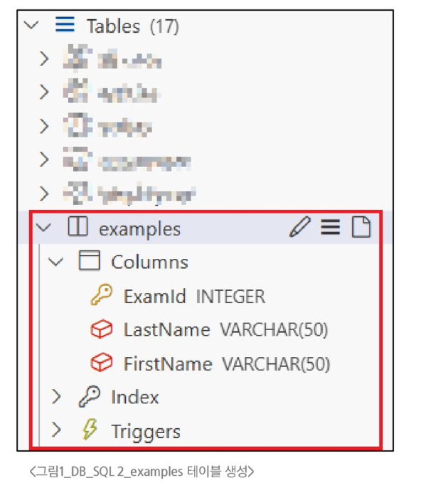
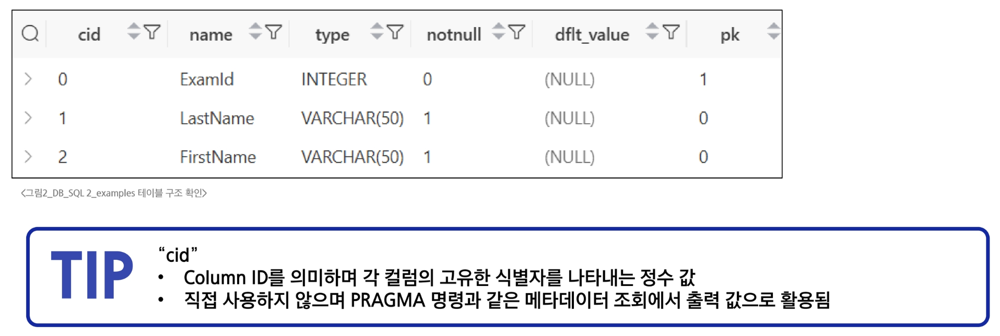
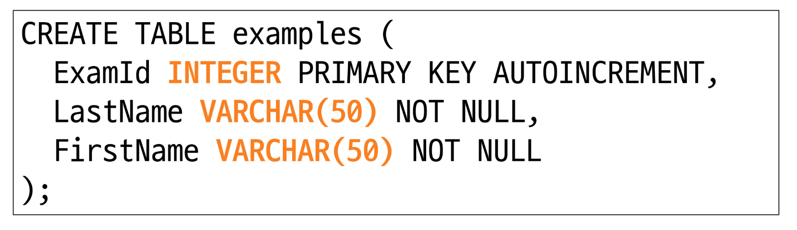
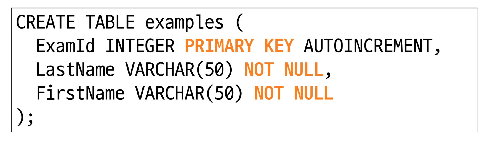
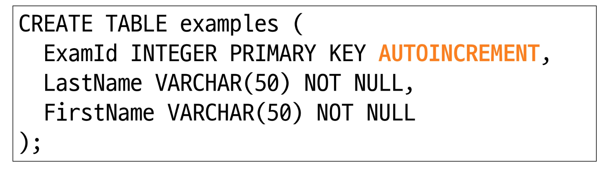

# SQL2 - Managing Table

## CREATE TABLE
**Syntax**
```sql
CREATE TABLE table_name (
  column_1 data_type constaints,
  column_2 data_type constaints,
  ...,
);
```
- 각 필드에 적용할 데이터 타입 작성
- 테이블 및 필드에 대한 제약조건(constraints) 작성

#### CREATE TABLE 활용

- examples 테이블 생성 및 확인
  ```sql
  CREATE TABLE examples (
    ExamId INTEGER PRIMARY KEY AUTOINCREMENT,
    LastName VARCHAR(50) NOT NULL,
    FirstName VARCHAR(50) NOT NULL
  );
  ```
  

- **PRAGMA**
  - 테이블 schema(구조) 확인
    ```sql
    PRAGMA table_info('examples');
    ```
    
    
- **CREATE TABLE Statement 구성**
  - 데이터 타입
    
  - 제약 조건
    
  - AUTOINCREMENT 키워드
    
    
##### SQLite 데이터 타입

- NULL
  - 아무런 값도 포함하지 않음을 나타냄
- TEXT
  - 문자열
- INTEGER
  - 정수
- BLOB
  - 이미지, 동영상, 문서 등의 바이너리 데이터
- REAL
  - 부동 소수점

##### 제약 조건이란?
- 테이블의 필드에 적용되는 규칙 또는 제한 사항
  - 데이터의 무결성을 유지하고 데이터베이스의 일관성을 보장

- **대표 제약 조건 3가지**
  - **PRIMARY KEY**
    - 해당 필드를 기본 키로 지정
      - INTEGER 타입만 적용, INT, BIGINT 등 다른 정수 유형 불가능
  - **NOT NULL**
    - 해당 필드에 NULL 값을 허용하지 않도록 지정
  - **FOREIGN KEY**
    - 다른 테이블과의 외래 키 관계를 정의
  
- <u>AUTOINCREMENT</u> 특징
  - 필드의 자동 증가를 나타내는 특수한 키워드
  - 주로 primary key 필드에 적용
  - `INTEGER PRIMARY KEY AUTOINCREMENT`가 작성된 필드는 항상 새로운 레코드에 대해 이전 최대 값보다 큰 값을 할당
  - 삭제된 값은 무시되며 재사용할 수 없게 됨

---

## Modifying table fields

### ALTER TABLE

#### 역할
|명령어|역할|
|:---|:---:|
|ALTER TABVLE <span style='color:crimson'>ADD COLUMN</span>|필드 추가|
|ALTER TABLE <span style='color:crimson'>RENAME COLUMN</span>|필드 이름 변경|
|ALTER TABLE <span style='color:crimson'>DROP COLUMN</span>|필드 삭제|
|ALTER TABLE <span style='color:crimson'>RENAME TO</span>|테이블 이름 변경|

#### <u>ALTER TABLE ADD COLUMN</u> Syntax
```sql
ALTER TABLE
  table_name
ADD COLUMN
  column_definition;
```
- ADD COLUMN 키워드 이후 추가하고자 하는 새 필드 이름과 데이터 타입 및 제약 조건 작성
  - <span style='color:RoyalBlue'>단, 추가하고자 하는 필드에 NOT NULL 제약조건이 있을 경우 NULL이 아닌 기본 값 설정 필요</span>

##### ALTER TABLE ADD COLUMN 활용

1. examples 테이블에 다음 조건에 맞는 Country 필드 추가
   ```sql
   ALTER TABLE
    examples
   ADD COLUMN
    Country VARCHAR(50) NOT NULL DEFAULT 'default value';
   ```
   
2. examples 테이블에 다음 조건에 맞는 Age, Address 필드 추가
   ```sql
   ALTER TABLE examples
   ADD COLUMN Age INTEGER NOT NULL DEFAULT 0;
   
   ALTER TABLE examples
   ADD COLUMN Address VARCHAR(100) NOT NULL DEFAULT 'default value';
   ```
   - <span style='color:RoyalBlue'>SQLite는 단일 문을 사용하여 한번에 여러 필드를 추가할 수 없음</span>
  
#### <u>ALTER TABLE RENAME COLUMN</u> Syntax
```sql
ALTER TABLE
  table_name
RENAME COLUMN
  current_name TO new_name;
```
- RENAME COLUMN 키워드 뒤에 이름을 바꾸려는 필드의 이름을 지정하고 TO 키워드 뒤에 새 이름을 지정

##### ALTER TABL RENAME COLUMN 활용

1. examples 테이블 Address 필드의 이름을 PostCode로 변경
   ```sql
   ALTER TABLE examples
   RENAME COLUMN Address TO PostCode;
   ```

#### <u>ALTER TABLE DROP COLUMN</u> Syntax
```sql
ALTER TABLE
  table_name
DROP COLUMN
  column_name;
```
- DROP COLUMN 키워드 뒤에 삭제 할 필드 이름 지정

##### ALTER TABL DROP COLUMN 활용

1. examples 테이블의 PostCode 필드를 삭제
   ```sql
   ALTER TABLE examples
   DROP TABLE PostCode;
   ```
   
#### <u>ALTER TABLE RENAME COLUMN</u> Syntax
```sql
ALTER TABLE
  table_name
RENAME TO
  new_table_name;
```
- RENAME TO 키워드 뒤에 새로운 테이블 이름 지정

##### ALTER TABLE RENAME COLUMN 활용

1. examples 테이블 이름을 new_examples로 변경
   ```sql
   ALTER TABLE examples
   RENAME TO new_examples;
   ```

---

### DROP TABLE

#### <u>DROP TABLE</u> Syntax
```sql
DROP TABLE table_name;
```
- DROP TABLE statement 이후 삭제할 테이블 이름 작성

##### DROP TABLE 활용
- new_examples 테이블 삭제
  ```sql
  DROP TABLE new_examples;
  ```