# SQL2 - Modifying Data

## Insert data

### INSERT

#### <u>INSERT</u> syntax
```sql
INSERT INTO table_name (c1, c2, ...)
VALUES (v1, v2, ...);
```
- INSERT INTO 절 다음에 테이블 이름과 괄호 안에 필드 목록 작성
- VALUES 키워드 다음 괄호 안에 해당 필드에 삽입할 값 목록 작성

##### INSERT 활용

1. articles 테이블에 다음과 같은 데이터 입력
   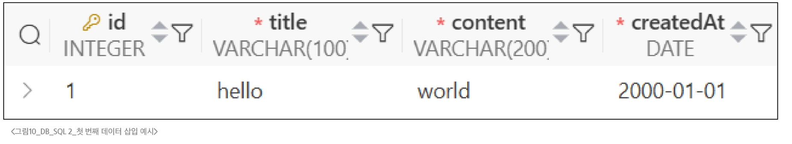
   ```sql
   INSERT INTO
      articles (title, content, createdAt)
   VALUES
      ('hello', 'world', '2000-01-01');
   ```
   
2. articles 테이블에 다음과 같은 데이터 <span style='color:crimson'>추가</span> 입력
   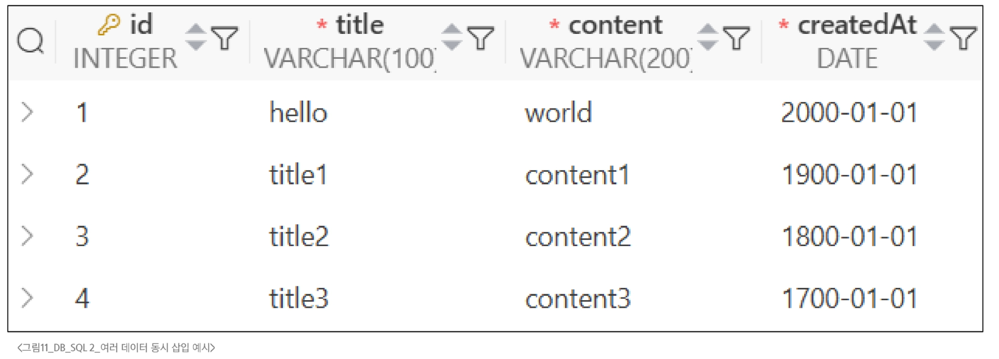
   ```sql
   INSERT INTO
      articles (title, content, createdAt)
   VALUES
      ('title1', 'content1', '1900-01-01'),
      ('title2', 'content2', '1800-01-01'),
      ('title3', 'content3', '1700-01-01');
   ```
  
3. <span style='color:crimson'>DATE 함수</span>를 사용해 articles 테이블에 다음과 같은 데이터 추가 입력
   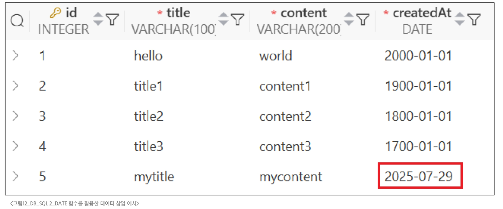
   ```sql
   INSERT INTO
      articles (title, content, createAt)
   VALUES
      ('mytitle', 'mycontent', DATE());
   ```
   
### UPDATE

#### <u>UPDATE</u> Syntax
```sql
UPDATE table_name
SET column_name = expression,
[
  WHERE condition
];
```
- SET 절 다음에 수정할 필드와 새 값을 지정
- WHERE 절에서 수정할 레코드를 지정하는 조건 작성
- WHERE 절을 작성하지 않으면 모든 레코드를 수정

##### UPDATE 활용

1. articles 테이블 1번 레코드의 title 필드 값을 'update Title'로 변경
   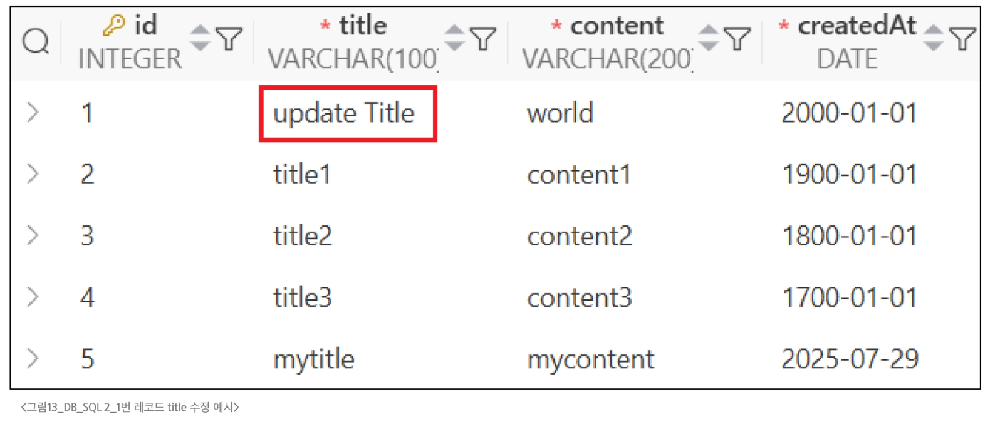
   ```sql
   UPDATE
      articles
   SET
      title = 'update Title'
   WHERE
      id = 1;
   ```

2. articles 테이블 2번 레코드의 title, content 필드 값을 각각  'update Title', 'update Content'로 변경
   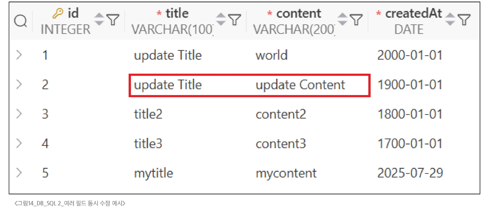
   ```sql
   UPDATE
      articles
   SET
      title = 'update Title',
      content = 'update Content'
   WHERE
      id = 2;
   ```

### DELETE

#### <u>DELETE</u> Syntax
```sql
DELETE FROM table_name
[
  WHERE condition
]
```
- DELETE FROM 절 다음에 테이블 이름 작성
- WHERE 절에서 삭제할 레코드를 지정하는 조건 작성
- WHERE 절을 작성하지 않으면 모든 레코드를 삭제

##### DELETE 활용

1. articles 테이블의 1번 레코드 삭제
   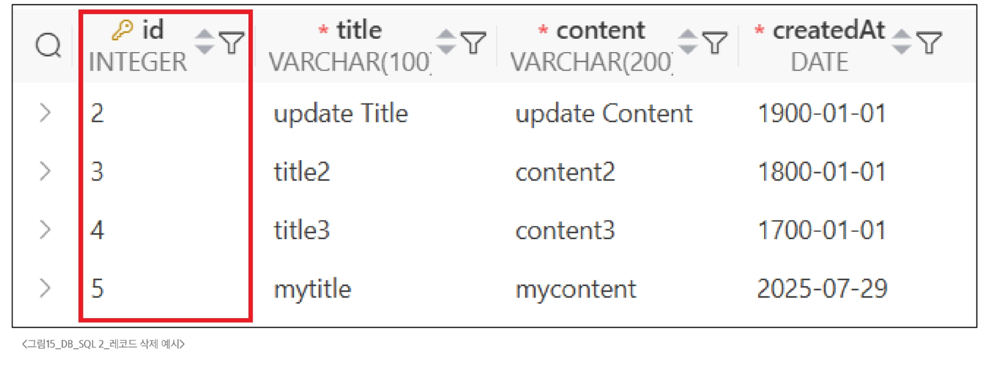
   ```sql
   DELETE FROM
      articles
   WHERE
      id = 1;
   ```  
   
2. articles 테이블에서 작성일이 오래된 순으로 레코드 2개 삭제
   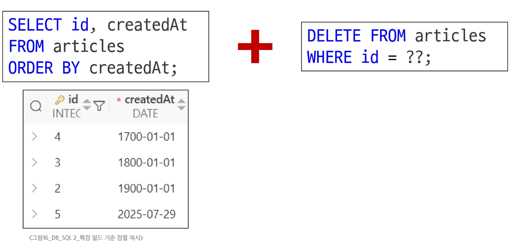
   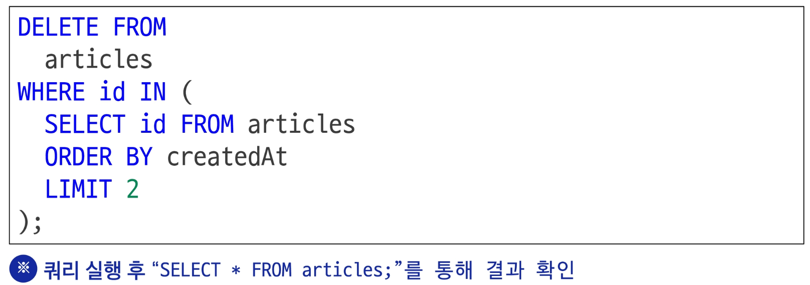
   
---

## Multi table queries

### Join

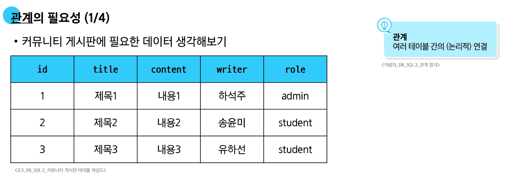
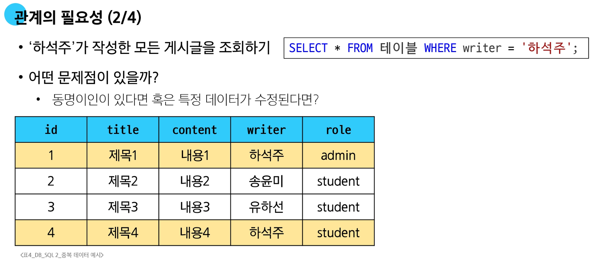
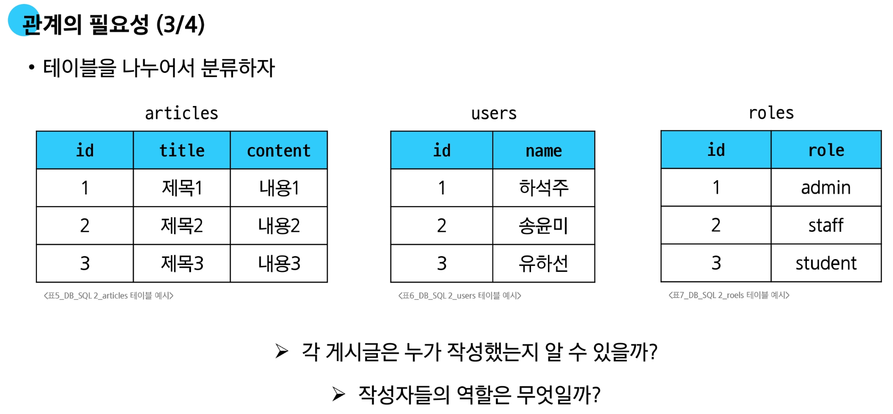
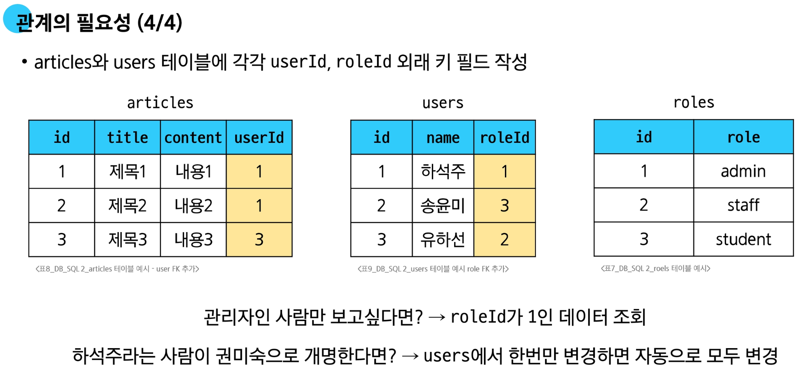

- **JOIN이 필요한 순간**
  - 테이블을 분리하면 데이터 관리는 용이해질 수 있으나 출력시에는 문제가 있음
  - 테이블 한 개를 출력할 수 없어 다른 테이블과 결합하여 출력하는 것이 필요해짐
  -> 이 때 사용하는 것이 'JOIN'
  
  
#### INNER JOIN

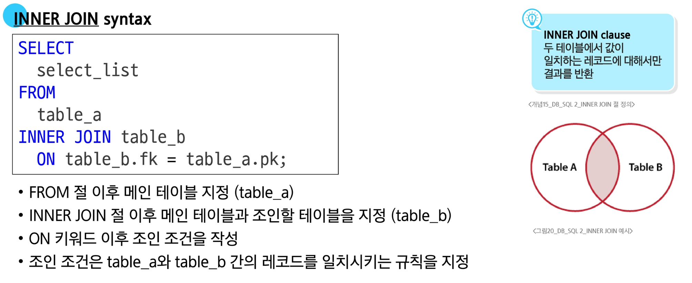
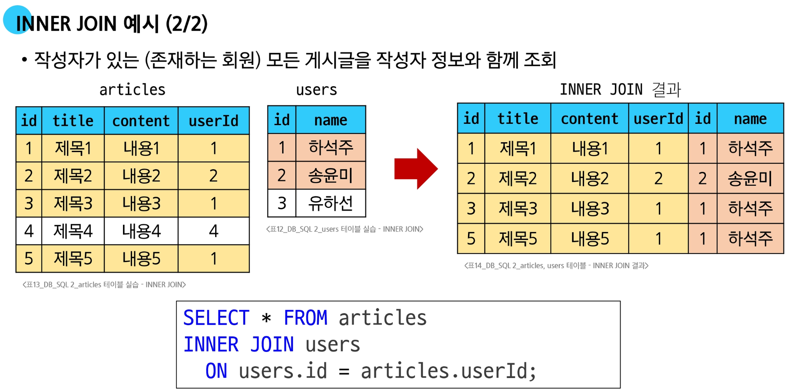

#### LEFT JOIN

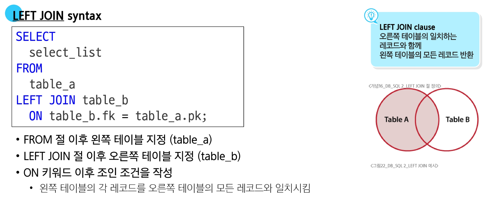
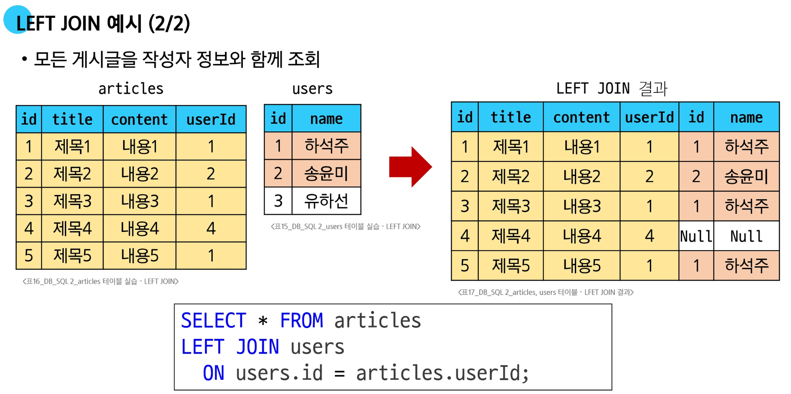