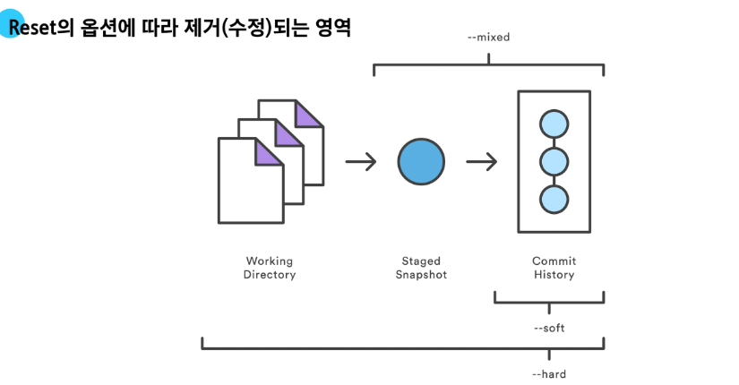

# GIT 특강 2일차

**협업을 위한 코드 공유**

- Git은 분산 버전 관리 시스템이라고 배웠다. 이는 참여하고 있는 개발자 모두 각자 복제된 코드 전체를 가지고 있다는 뜻

- 그렇다면 그들은 이 코드를 어디서 가져오는 것일까?

## 원격 저장소(Remote Repository)

**코드와 버전 관리 이력을 온라인 상의 특정 위치에 저장하여 여러 개발자가 협업하고 코드를 공유할 수 있는 저장 공간**

**다양한 원격 저장소 _서비스_**

- GitLab, GitHub, Bitbucket
    - 내가 버전 관리를 한 프로젝트를 **공유**할 수 있는 원격 저장소를 제공해주는 서비스

**로컬 & 원격 저장소**

**remote**

```bash
git remote add origin remote_repo_url
```

- `origin`: 추가하는 원격 저장소의 별칭. 보통 약속으로써 `origin`을 사용함

**push / pull & clone**

- **push**

    ```bash
    git push origin master
    ```

    - 원격 저장소에 commit 목록을 업로드

- **pull**

    ```bash
    git pull origin master
    ```

    - 원격 저장소의 변경사항만을 받아옴 (업데이트)

- **clone**

    ```bash
    git clone remote_repo_url
    ```

    - 원격 저장소 전체를 복제 (다운로드)
    - clone 받은 프로젝트는 이미 git init이 되어 있다.

## gitignore

**Git에서 특정 파일이나 디렉토리를 추적하지 않도록 설정하는 데 사용되는 텍스트 파일**
    
    - 프로젝트에 따라 공유하지 않아야 하는 것들도 존재하기 때문
  
## Revert & reset

**Git revert**

```bash
git revert <commit id>
```

- `<commit id>`에 해당하는 commit을 없었던 일로 되돌리기

**Git revert 작동 원리**

- "재설정"
  
- 단일 commit을 실행 취소하는 것
  
- 프로젝트 기록에서 commit을 없었던 일로 처리 후 그 결과를 새로운 commit으로 추가함

**Git Revert 정리**

- 변경 사항을 안전하게 **실행 취소**할 수 있도록 도와주는 순방향 실행 취소 작업

- Commit 기록에서 commit을 삭제하거나 분리하는 대신, 지정된 변경 사항을 반전시키는 새 commit을 생성

- Git에서 기록이 손실되는 것을 방지, 기록의 무결성과 협업의 신뢰성을 높임

## Reset

**특정 commit으로 되돌아가는 작업**

```bash
git reset [옵션] <commit id>
```

- `<commit id>`까지 되돌아가기

**Git reset 작동 원리**

- "되돌리기"

- 시계를 마치 과거로 돌리는 듯한 행위

- 특정 commit으로 되돌아 갔을 때, 되돌아간 commit 이후의 commit은 **모두 삭제**

**reset의 3가지 옵션**

- `--soft`, `--mixed`, `--hard`

- `reset`은 과거 commit으로 되돌아간 후 해당 commit 이후 만들어진 commit들이 삭제됨

- 그런데 삭제되는 commit들의 기록을 어떤 영역에 남겨둘 것인지 옵션을 활용해 조정할 수 있음

**옵션별 동작 방식**

- `--soft`
  
  - 삭제된 commit들의 기록을 staging area에 남김

- `--mixed`

    - 삭제된 commit들의 기록을 working directory에 남김 (기본값)

- `--hard`
  - 삭제된 commit들의 기록을 남기지 않음



**Reset 주의사항**

- Reset은 만들어진 commit을 되돌리는 행위
  
- Remote에 올라간 commit을 reset하게 되면?
  
  - Remote에 기록된 commit과 다른 commit 이력으로 작업하게 됨
  
  - 이미 Remote의 commit을 가지고 간 동료의 코드가 충돌을 일으킬 수 있음
  
- <span style="color: red">**Remote에 올라간 commit은 절대 reset 해서는 안됨**</span>
  
  - 이미 올라간 commit의 경우 revert를 활용

## Github 활용하기

- TIL을 통해 내가 학습하는 것을 기록

- 개인, 팀 프로젝트 코드를 공유
  
    - 개발 면접 지원 시 본인의 Github 주소를 공유해 어떤 프로젝트들을 진행했고, 어떤 코드를 작성했는지 공유하고 평가 받기 위해 사용

- 오픈 소스 프로젝트에 기여


### 직전 생성한 commit 수정하기

```bash
git commit --amend
```

1. Commit 메시지 수정
2. Commit 전체 수정