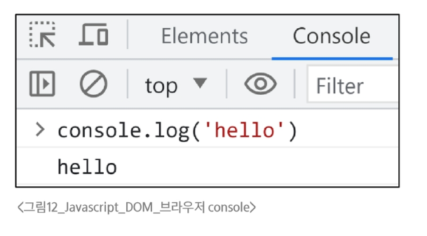
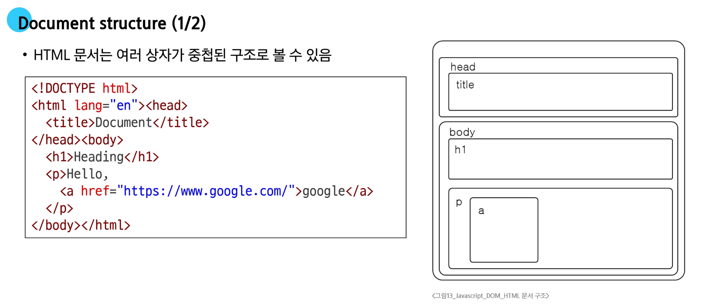
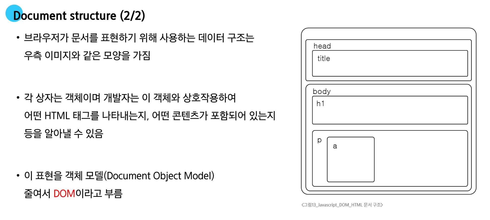

# 변수

---

## 식별자(변수명) 작성 규칙

- 반드시 문자, 달러(`'$'`) 또는 밑줄(`'_'`)로 시작
- 대소문자를 구분
- 예약어 사용 불가
  - `for`, `if`, `function` 등

> 의미가 드러나는 이름을 사용하여 데이터의 의미를 명확히 설명 (e.g. username, phoneNumber)

> '$'나 '_'로 시작하는 변수는 특별한 용도(DOM 선택, 내부용 변수)로 쓰이니, 일반 변수와 구분

## 식별자(변수명) Naming Convention

- 카멜 케이스(camelCase)
  - 변수, 객체, 함수에 사용
- 파스칼 케이스(PascalCase)
  - 클래스, 생성자에 사용
- 대문자 스네이크 케이스(SNAKE_CASE)
  - <u>상수(constants)</u>에 사용

> 상수: 한 번 선언하면 값을 바꿀 수 없도록 잠궈버리는 특별한 변수

> 가장 중요한 것은 <span style="color:crimson">'일관성'</span>이고, 팀의 스타일 가이드를 따르는 것이 우선

<br>

# 변수 선언 키워드

---

## 변수 선언 키워드 3가지

1. `let`
   - 재할당이 필요한 변수를 선언할 때 사용
2. `const`
   - 재할당이 불가능한 상수를 선언할 때 사용
3. ~~`var`~~
   - 재선언/재할당이 가능하고, <span style="color:crimson">현재는 호이스팅(Hoisting) 문제로 사용 비권장함</span>
<br>

#### let

블록 스코프(block scope)를 갖는 지역 변수를 선언

1. <span style="color:crimson">재할당 가능</span>
2. 재선언 불가능
3. ES6에서 추가
<br>
```js
let number = 10 // 1. 선언 및 초기값 할당
number = 20     // 2. 재할당
```
```js
let number = 10 // 1. 선언 및 초기값 할당
let number = 20 // 2. 재선언 불가능
```

#### const

블록 스코프(block scope)를 갖는 지역 변수를 선언

1. <span style="color:crimson">재할당 불가능</span>
2. 재선언 불가능
3. ES6에서 추가
<br>
```js
const number = 10 // 1. 선언 및 초기값 할당
number = 10       // 2. 재할당 불가능
```
```js
const number = 10 // 1. 선언 및 초기값 할당
const number = 20 // 2. 재선언 불가능
const number // const' declarations must be initialized
```
<br>

#### 블록 스코프(block scope)

- `if`, `for`, 함수 등의 <span style="color:crimson">'중괄호({}) 내부'</span>를 가리킴
- 블록 스코프를 가지는 변수는 블록 바깥에서 접근 불가능
<br>
```js
let x = 1
if (x === 1) {
    let x = 2
    console.log(x)  // 2
}
console.log(x)  // 1
```

> 스코프 안에서 'let'으로 선언하면 밖에서 접근할 수 없다

> 'var'는 블록을 무시하고 함수 단위로 작동해 파이썬과 비슷하지만 사용 비권장

#### 어떤 변수 키워드를 사용해야 할까?

- **<span style="color:crimson">"const를 기본으로 사용할 것"</span>**
  - 코드의 의도 명확화
    - 해당 변수가 재할당되지 않을 것임을 명확히 표현
    - 개발자들에게 변수의 용도와 동작을 더 쉽게 이해할 수 있게 해줌
  - 버그 예방
    - 의도치 않은 변수 값 변경으로 인한 버그를 예방
    - 큰 규모의 프로젝트나 팀 작업에서 중요
- **필요한 경우에만 let으로 전환(재할당이 필요한 경우**
  - let을 사용하는 것은 해당 변수가 의도적으로 변경될 수 있음을 명확히 나타냄
  - 코드의 유연성을 확보하면서도 const의 장점을 최대한 활용할 수 있음

<br>

## DOM

---

### 웹 브라우저에서의 JavaScript

- 웹 페이지에서 동적인 기능을 담당

1. HTML script 태그
   ```html
   <body>
      <script>
        console.log('hello')
      </script>
   <body>
   ```

2. js 확장자 파일
   ```js
   // hello.js
   console.log('hello')
   ```
   ```html
   <body>
     <script src="hello.js"></script>
   </body>
   ```

3. 브라우저 console
   

<br>

### 문서 구조




#### DOM

- The Document Object Model

웹 페이지(Document)를 구조화된 객체로 제공하여 프로그래밍 언어가 페이지 구조에 접근할 수 있는 방법을 제공

##### DOM 핵심

문서의 요소들을 객체로 제공하여 다른 프로그래밍 언어에서 접근하고 조작할 수 있는 방법을 제공하는 API

> - DOM은 문서를 부모-자식 관계의 계층적인 트리 구조로 표현
> - DOM 조작은 웹페이지에 실시간으로 반영되어, 사용자와 상호작용하는 동적 페이지를 만든다
> - 사용자의 클릭이나 키보드 입력같은 이벤트를 감지하고, 이에 반응하는 상호작용을 만드는 기반이 된다


---

# DOM 선택

## 1. DOM 조작 시 기억해야 할 것

웹 페이지를 **동적으로 만들기**란 곧 **웹 페이지를 조작하기**를 의미합니다. DOM을 조작할 때는 항상 아래의 순서를 기억해야 합니다.

### DOM 조작 순서
1. 조작하고자 하는 요소를 **선택** (또는 탐색)
2. 선택된 요소의 콘텐츠 또는 속성을 **조작**

---

## 2. 선택 메서드 (Selection Methods)

DOM에서 요소를 선택할 때 가장 대표적으로 사용되는 두 가지 메서드입니다.

> **💡 참고: `selector` (선택자)란?**
> 찾고 싶은 HTML 요소를 지정하는 검색 조건입니다. (CSS 선택자와 동일)
> * 예시: `.content` (클래스), `#id` (아이디), `div > p` (자식 요소) 등

### ① `document.querySelector(selector)`
* **요소 한 개 선택**할 때 사용합니다.
* 제공한 선택자(selector)와 일치하는 **첫 번째 요소**를 하나 선택합니다.
* 제공한 선택자를 만족하는 첫 번째 element 객체를 반환합니다. (일치하는 요소가 없다면 `null` 반환)

### ② `document.querySelectorAll(selector)`
* **요소 여러 개 선택**할 때 사용합니다.
* 제공한 선택자와 일치하는 여러 element를 모두 선택합니다.
* 제공한 선택자를 만족하는 요소들을 담은 **NodeList**를 반환합니다.

---

## 3. DOM 선택 실습

아래의 HTML 구조와 JavaScript 코드를 통해 선택 메서드가 어떻게 동작하는지 콘솔 결과를 확인할 수 있습니다.

### HTML 및 JavaScript 코드 (`select.html`)
```html
<body>
  <h1 class="heading">DOM 선택</h1>
  <a href="https://www.google.com/">google</a>
  
  <p class="content">content1</p>
  <p class="content">content2</p>
  <p class="content">content3</p>
  
  <ul>
    <li>list1</li>
    <li>list2</li>
  </ul>

  <script>
    // 1. 단일 요소 선택 (클래스가 heading인 요소)
    console.log(document.querySelector('.heading'))
    
    // 2. 단일 요소 선택 (클래스가 content인 첫 번째 요소만 선택됨)
    console.log(document.querySelector('.content'))
    
    // 3. 다중 요소 선택 (클래스가 content인 모든 요소를 NodeList로 반환)
    console.log(document.querySelectorAll('.content'))
    
    // 4. 다중 요소 선택 (ul 태그 자식인 모든 li 요소를 NodeList로 반환)
    console.log(document.querySelectorAll('ul > li'))
  </script>
</body>
```

### 브라우저 Console 출력 결과
```text
<h1 class="heading">DOM 선택</h1>

<p class="content">content1</p>

▼ NodeList(3)
  ▶ 0: p.content
  ▶ 1: p.content
  ▶ 2: p.content
    length: 3
  ▶ [[Prototype]]: NodeList

▼ NodeList(2)
  ▶ 0: li
  ▶ 1: li
    length: 2
  ▶ [[Prototype]]: NodeList
```


---

# DOM 조작

DOM 조작은 크게 4가지로 나눌 수 있으며, 이번 장에서는 **속성(attribute) 조작**에 대해 다룹니다.
1. **속성(attribute) 조작** (클래스 속성, 일반 속성)
2. HTML 콘텐츠 조작
3. DOM 요소 조작
4. 스타일 조작

---

## 속성 조작

속성 조작은 크게 요소의 스타일과 상태를 다루는 **클래스(Class) 속성 조작**과, id나 href 등의 HTML 고유 속성을 다루는 **일반 속성(Attribute) 조작**으로 나뉩니다.

### 1. 클래스(Class) 속성 조작
스타일링 및 상태 제어를 위해 HTML 요소의 클래스 목록을 동적으로 추가하거나 제거할 때 사용합니다.

### 2. 일반 속성(Attribute) 조작
`id`, `href`, `src` 등 요소의 모든 HTML 속성 값을 직접 설정하거나 조회할 때 사용합니다.

---

## 1. 클래스 속성 조작 메서드

요소의 클래스를 조작할 때는 **`classList` 프로퍼티**를 사용합니다.
* `classList`: 요소의 클래스 목록을 `DOMTokenList` (유사 배열) 형태로 반환합니다.
* HTML 요소의 클래스 목록을 쉽게 제어(추가/제거)하는 도구입니다.

### 주요 메서드
* **`element.classList.add()`**
  * 지정한 클래스 값을 **추가**합니다.
* **`element.classList.remove()`**
  * 지정한 클래스 값을 **제거**합니다.
* **`element.classList.toggle()`**
  * 지정한 클래스가 존재한다면 제거하고 `false`를 반환합니다.
  * 존재하지 않으면 클래스를 추가하고 `true`를 반환합니다.
  * 💡 **참고:** 스위치처럼 있으면 끄고(제거), 없으면 켜는(추가) 식으로 상태를 바꾸는 기능입니다.

### 클래스 속성 조작 실습

```html
<!-- element-manipulation.html -->
<style>
  .red {
    color: crimson;
  }
</style>

<body>
  <h1 class="heading">DOM 조작</h1>
  <!-- 기타 생략 -->

  <script>
    const h1Tag = document.querySelector('.heading');
    
    // 1. 현재 클래스 목록 확인
    console.log(h1Tag.classList); 
    // 출력: DOMTokenList ['heading', value: 'heading']

    // 2. 클래스 추가
    h1Tag.classList.add('red');
    console.log(h1Tag.classList); 
    // 출력: DOMTokenList(2) ['heading', 'red', value: 'heading red']

    // 3. 클래스 제거
    h1Tag.classList.remove('red');
    console.log(h1Tag.classList); 
    // 출력: DOMTokenList ['heading', value: 'heading']

    // 4. 클래스 토글 (현재 'red'가 없으므로 추가됨)
    h1Tag.classList.toggle('red');
    console.log(h1Tag.classList); 
    // 출력: DOMTokenList(2) ['heading', 'red', value: 'heading red']
  </script>
</body>
```

---

## 2. 일반 속성 조작 메서드

일반적인 HTML 속성을 다룰 때 사용하는 메서드입니다.

### 주요 메서드
* **`Element.getAttribute(name)`**
  * 해당 요소에 지정된 값을 반환(조회)합니다.
* **`Element.setAttribute(name, value)`**
  * 지정된 요소의 속성 값을 설정합니다.
  * 속성이 이미 있으면 기존 값을 갱신하고, 없으면 지정된 이름과 값으로 새 속성을 추가합니다.
* **`Element.removeAttribute(name)`**
  * 요소에서 지정된 이름을 가진 속성을 제거합니다.

> 🚨 **주의사항 (TIP)**
> * `getAttribute()`는 HTML의 **초기값**을 반환합니다. 반면 요소의 `.value`와 같은 프로퍼티는 사용자가 입력한 **현재 상태 값**을 반환하므로 상황에 맞게 구분해서 사용해야 합니다.
> * `setAttribute()`는 숫자나 boolean 값을 넣어도 **모두 문자열로 변환하여 저장**하므로 데이터 타입에 주의해야 합니다.

### 일반 속성 조작 실습

```html
<!-- element-manipulation.html -->
<body>
  <a href="https://www.google.com/">google</a>
  <!-- 기타 생략 -->

  <script>
    const aTag = document.querySelector('a');
    
    // 1. 속성 조회
    console.log(aTag.getAttribute('href'));
    // 출력: https://www.google.com/

    // 2. 속성 변경
    aTag.setAttribute('href', 'https://www.naver.com/');
    console.log(aTag.getAttribute('href'));
    // 출력: https://www.naver.com/

    // 3. 속성 제거
    aTag.removeAttribute('href');
    console.log(aTag.getAttribute('href'));
    // 출력: null
  </script>
</body>
```


---

# DOM 조작 (콘텐츠 및 요소 조작)

앞서 배운 속성 조작에 이어, 이번에는 HTML 요소의 텍스트 콘텐츠를 변경하거나, 새로운 HTML 요소를 생성, 추가, 삭제하는 방법에 대해 알아봅니다.

---

## 1. HTML 콘텐츠 조작

요소 내부의 텍스트를 읽어오거나 수정할 때 사용합니다.

### `textContent` 프로퍼티
* **요소의 텍스트 콘텐츠를 표현**합니다.
* HTML 태그를 완전히 제거하고 **순수한 텍스트 데이터**만 얻고 싶을 때 가장 유용합니다.
  * *예시)* `<p>lorem</p>` 에 접근하여 값을 가져오면 `lorem` 문자열만 반환됩니다.

### HTML 콘텐츠 조작 실습

```html
<!-- contents-manipulation.html -->
<body>
  <h1 class="heading">DOM 조작</h1>
  
  <script>
    const h1Tag = document.querySelector('.heading');
    
    // 1. 현재 텍스트 내용 조회
    console.log(h1Tag.textContent); 
    // 출력: DOM 조작

    // 2. 텍스트 내용 수정
    h1Tag.textContent = '내용 수정';
    console.log(h1Tag.textContent); 
    // 출력: 내용 수정 (실제 브라우저 화면의 텍스트도 변경됨)
  </script>
</body>
```

---

## 2. DOM 요소 조작

JavaScript를 사용하여 새로운 HTML 태그를 만들고 문서에 배치하거나, 기존 태그를 삭제하는 방법입니다.

### DOM 요소 조작 주요 메서드

* **`document.createElement(tagName)`**
  * 작성한 `tagName`의 HTML 요소를 **생성하여 반환**합니다.
* **`Node.appendChild()`**
  * 한 Node를 특정 부모 Node의 자식 NodeList 중 **마지막 자식으로 삽입**합니다.
  * 추가된 Node 객체를 반환합니다.
* **`Node.removeChild()`**
  * DOM에서 **자식 Node를 제거**합니다.
  * 제거된 Node를 반환합니다.

> 💡 **중요 TIP**
> * `createElement()`는 **메모리에만 요소를 만들 뿐**입니다. 실제로 브라우저 화면에 보이게 하려면 반드시 `appendChild()` 등을 사용하여 **문서에 삽입해야 합니다.**
> * `removeChild()`로 DOM 트리에선 제거되었더라도 해당 노드는 **메모리에 남아있습니다.** 따라서 변수에 담아두면 언제든지 다시 참조하거나 삽입할 수 있습니다.

### DOM 요소 조작 실습

```html
<!-- dom-manipulation.html -->
<body>
  <div>
    <p>기존 문단</p>
  </div>

  <script>
    // 1. 요소 생성 (Create)
    const h1Tag = document.createElement('h1');
    h1Tag.textContent = '제목';
    console.log(h1Tag); 
    // 출력: <h1>제목</h1> (아직 메모리에만 존재, 화면엔 안 보임)

    // 2. 요소 추가 (Append)
    const divTag = document.querySelector('div');
    divTag.appendChild(h1Tag); 
    // div 태그 내부의 마지막 자식으로 h1 요소가 삽입되어 화면에 표시됨
    console.log(divTag);

    // 3. 요소 삭제 (Remove)
    const pTag = document.querySelector('p');
    divTag.removeChild(pTag); 
    // div 태그 내부의 자식인 p 요소가 화면과 DOM 구조에서 제거됨
  </script>
</body>
```