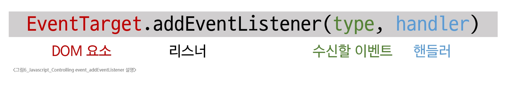

# 이벤트

---

## 🌍웹에서의 이벤트
- 화면을 스크롤하는 것
- 버튼을 클릭했을 때 팝업 창이 출력되는 것
- 마우스 커서의 위치에 따라 드래그 앤 드롭하는 것
- 사용자의 키보드 입력 값에 따라 새로운 요소를 생성하는 것
  -> 웹에서의 거의 <span style="color:crimson">모든 상호작용은 이벤트와 함께 함</span>

### event

웹 페이지 상에서 '무언가 일어났다'는 신호 또는 사건

**<u>DOM 요소</u>와 이벤트**

- 모든 DOM 요소는 다양한 형태의 이벤트를 발생시킬 수 있음
- e.g. button을 클릭하면 click 이벤트, input 값 변경 시 input 이벤트, ...

**event object**

- DOM에서 이벤트가 발생하면, 브라우저는 해당 이벤트에 관한 정보를 담은 'event object'를 자동으로 생성
- 이벤트 종류
  - mouse
  - input
  - keyboard
  - ...
> 이벤트 객체는 이벤트 발생 순간의 상황(어떤 요소에서 이벤트가 발생했는지, 마우스 좌표는 어디인지, 눌린 키는 무엇인지 등)과 관련된 상세 정보를 담고 있습니다.

> 이를 통해 이벤트와 관련된 구체적인 정보를 참조할 수 있습니다.

- **DOM 요소에서 event가 발생하면, 해당 event는 연결된 이벤트 처리기(<span style="color:crimson">event handler</span>)에 의해 처리됨**

---

## event handler

특정 이벤트가 발생했을 때 실행되는 (콜백)함수

#### `.addEventListner()`

- 특정 DOM 요소에, 지정한 이벤트가 발생했을 때 실행할 이벤트 핸들러를 <span style="color:crimson">등록하는 메서드</span>

- `handlerClick` 함수가 <u>이벤트 핸들러</u>이며, `button.addEventListener()`는 그 핸들러를 `click` 이벤트에 연결해주는 역할

```js
const button = document.querySelector('button')

// 이벤트 핸들러
const handleClick = function () {
    window.alert('버튼이 클릭 되었습니다!')
}

// addEventListener 메서드를 이용해 버튼에 이벤트 핸들러를 등록
button.addEventListener('click', handleClick)
```
<br>

---


## 이벤트 등록(addEventListener)

- <span style="color:crimson">DOM 요소</span>: HTML 문서의 각 태그를 하나의 객체로 변환한 것
- <span style="color:green">수신할 이벤트</span>: 무언가 일어났다는 신호 또는 사건
- <span style="color:skyblue">핸들러</span>: 특정 이벤트가 발생했을 때 실행되는 (콜백) 함수
  


## 1. `addEventListener` 구조
특정 요소에 이벤트가 발생했을 때 실행될 함수(핸들러)를 등록하는 메서드입니다.

### 메서드 구문
```javascript
element.addEventListener(type, handler)
```
* **`type`**: 수신할 이벤트 유형
  * 문자열로 작성합니다. (예: `'click'`, `'mouseover'` 등)
* **`handler`**: 이벤트 발생 시 호출되는 콜백 함수
  * 자동으로 **event 객체**를 첫 번째 매개변수로 받습니다.
  * 반환 값은 없습니다.

**기본 형태 예시:**
```javascript
element.addEventListener('click', function (event) {
  // 이벤트 처리 로직
})
```

---

## 2. 이벤트 객체 전달 및 핸들러에서의 `this`

### 이벤트 객체 전달
* 이벤트 발생 시, 이벤트에 대한 상세 정보(발생 요소, 이벤트 타입, 추가 데이터 등)를 담은 **이벤트 객체**가 핸들러 함수에 자동으로 전달됩니다.
* 핸들러 함수는 이 인자를 통해 적절한 동작을 수행할 수 있습니다.

### 핸들러에서의 `this`
* 일반 함수를 이벤트 핸들러로 사용할 경우, 핸들러 내부의 `this`는 **이벤트 리스너가 연결된 요소**를 가리킵니다.
* 즉, `this`는 `event.currentTarget` 속성 값과 동일합니다.

**예시 코드:**
```html
<button id="btn">버튼</button>
```
```javascript
// 1. 버튼 요소 선택
const btn = document.querySelector('#btn');

// 2. 이벤트 핸들러 정의
const detectClick = function (event) {
  console.log(event);               // PointerEvent 객체 출력
  console.log(event.type);          // 'click'
  
  // this와 currentTarget은 동일한 요소를 가리킴
  console.log(event.currentTarget); // <button id="btn">버튼</button>
  console.log(this);                // <button id="btn">버튼</button>
};

// 3. 버튼에 이벤트 핸들러 등록
btn.addEventListener('click', detectClick);
```

---

## 3. 이벤트 버블링 (Event Bubbling)

### 개념
한 요소에 이벤트가 발생하면, 해당 요소의 핸들러가 동작한 후 이어서 **부모 요소의 핸들러가 연달아 동작하는 현상**을 말합니다. 이 과정은 가장 최상단의 조상 요소(`document`)를 만날 때까지 반복됩니다.

> **💡 TIP**
> 이벤트가 제일 깊은 곳에 있는 요소에서 시작해 부모 요소를 거슬러 올라가며 발생하는 모습이 마치 **물속 거품(Bubble)**과 닮았다고 하여 '버블링'이라고 부릅니다.

### 버블링 예시 (form > div > p)
`<form>` 안에 `<div>`가 있고, 그 안에 `<p>`가 있는 중첩 구조에서 모든 요소에 클릭 이벤트가 등록되어 있다고 가정해 봅니다.
최하위 요소인 **`<p>`를 클릭**하면 다음과 같은 순서로 이벤트 핸들러가 동작합니다.
1. `p` 요소 핸들러 실행 ("p가 클릭되었습니다.")
2. `div` 요소 핸들러 실행 ("div가 클릭되었습니다.")
3. `form` 요소 핸들러 실행 ("form이 클릭되었습니다.")

---

## 4. `target` vs `currentTarget`
이벤트가 정확히 어디서 발생했는지, 어느 요소에서 처리되고 있는지 구분하기 위해 두 속성의 차이를 이해해야 합니다.

### 1) `event.currentTarget`
* **'현재' 요소**를 나타냅니다.
* 항상 **이벤트 핸들러가 직접 연결된(등록된) 요소**만을 참조합니다.
* 핸들러 내의 `this`와 같습니다.

### 2) `event.target`
* 이벤트가 처음 발생한 **가장 안쪽의 요소(target)**를 참조합니다.
* **실제 이벤트가 시작된 요소**입니다.
* 버블링이 진행되어 상위 요소의 핸들러가 실행되더라도, `event.target` 값은 변하지 않습니다.

### 비교 예시 (중첩된 박스 구조)
`outerouter` > `outer` > `inner` 형태로 중첩된 구조가 있고, **최상위인 `outerouter`에만 클릭 핸들러가 연결**되어 있을 때:

```html
<div id="outerouter">
  outerouter
  <div id="outer">
    outer
    <div id="inner">inner</div>
  </div>
</div>

<script>
  const outerOuterElement = document.querySelector('#outerouter');

  const clickHandler = function (event) {
    console.log('currentTarget: ', event.currentTarget.id);
    console.log('target: ', event.target.id);
  }

  outerOuterElement.addEventListener('click', clickHandler);
</script>
```

* **`inner` 박스를 클릭했을 때 (버블링 발생):**
  * `currentTarget`: `outerouter` (핸들러가 연결된 요소)
  * `target`: `inner` (실제 클릭된 요소)
* **`outer` 박스를 클릭했을 때 (버블링 발생):**
  * `currentTarget`: `outerouter` (핸들러가 연결된 요소)
  * `target`: `outer` (실제 클릭된 요소)
* **`outerouter` 박스를 클릭했을 때:**
  * `currentTarget`: `outerouter`
  * `target`: `outerouter`

# 캡처링과 버블링 (Capturing & Bubbling)

## 1. 캡처링 (Capturing)

* 이벤트가 최상위 조상 요소에서부터 타겟 요소까지 하위로 전파되는 단계를 말합니다. (버블링과 반대 방향)
* 예를 들어 `table`의 하위 요소인 `td`를 클릭했을 때 이벤트 전파 흐름은 다음과 같습니다.
  1. **캡처링 (Capture Phase):** 이벤트가 최상위 요소(`Window` -> `Document` -> `<html>` -> `<body>` ...)부터 아래로 전파됩니다.
  2. **타겟 (Target Phase):** 실제 이벤트가 발생한 지점(`event.target`인 `td`)에 도달하여 실행됩니다.
  3. **버블링 (Bubbling Phase):** 다시 위로(`tr` -> `tbody` -> `table` ...) 전파됩니다.

> **💡 TIP**
> 캡처링 단계에서 이벤트를 다루는 경우는 실제 개발에서 거의 없으므로, **버블링을 집중적으로 학습**하는 것이 좋습니다.

---

## 2. 버블링의 필요성 (이벤트 위임의 기초)

### 여러 요소에 이벤트 핸들러를 달아야 할 때의 문제점
만약 각자 다른 동작을 수행하는 버튼이 여러 개(예: 10개, 100개)가 있다고 가정해 봅시다. 
이 버튼들마다 일일이 서로 다른 이벤트 핸들러를 등록해야 할까요? 이는 코드를 길어지게 하고 메모리 효율을 떨어뜨립니다.

**해결책: 각 버튼의 공통 조상 요소에 이벤트 핸들러 단 하나만 할당하기**

### 버블링을 활용한 효율적인 이벤트 처리
버블링의 특성을 이용하면 **요소들의 공통 조상에 이벤트 핸들러를 하나만 등록**하여, 여러 자식 요소에서 발생하는 이벤트를 한곳에서 효율적으로 다룰 수 있습니다.

* 공통 조상(예: `<div>`)에 이벤트 핸들러를 할당합니다.
* 자식 요소(예: `<button>`)를 클릭하면 버블링이 발생하여 조상 요소의 핸들러가 실행됩니다.
* 이때 조상 요소의 핸들러 내부에서 **`event.target`**을 확인하면, 실제 어느 위치(어떤 버튼)에서 이벤트가 최초로 발생했는지 정확히 알 수 있습니다.

**예시 코드:**

```html
<!-- HTML 구조 -->
<div>
  <button>버튼 1</button>
  <button>버튼 2</button>
  ...
  <button>버튼 N</button>
</div>
```

```javascript
// JavaScript 코드
// 1. 버튼들의 공통 조상인 div 요소 선택
const divTag = document.querySelector('div');

// 2. 조상 요소에만 단일 이벤트 핸들러 등록
divTag.addEventListener('click', function (event) {
  // 이벤트가 실제 발생한 요소(클릭된 특정 버튼)를 출력
  console.log(event.target); 
});
```