# OOP

## 프로그래밍 패러다임

### 절차 지향 프로그래밍

**함수와 로직 중심 작성<br>데이터를 순차적으로 처리**

- 라면의 예
  1. 물을 끓인다
  2. 스프를 넣는다
  3. 면을 넣고 익힌다
  4. 불을 끄고 그릇에 담는다

  - 이처럼 순서대로 작업을 지시하는 방식이 절차 지향 프로그래밍
  - 모든 과정이 위에서 아래로 차례차례 실행되도록 구성

**절차 지향 프로그래밍 특징**

- 입력을 받고, 처리하고, 결과를 내는 과정이 위에서 아래로 순차적으로 흐르는 형태

- 순차적인 명령어 실행

- 데이터와 함수(절차)의 분리

- 함수 호출의 흐름이 중요
  
  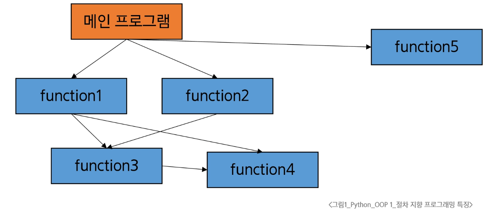
---

**절차 지향적 프로그래밍의 한계**
1. 복잡성 증가
   - 프로그램의 규모가 커질수록 데이터와 함수의 관리가 어려움
   - 전역 변수의 증가로 인한 관리의 어려움

2. 유지보수 문제
   - 코드 수정 시 영향 범위 파악이 어려움

---
### 객체 지향 프로그래밍

**클래스는 설계도, 인스턴스는 실제 물건**

**객체 지향 사고 예시**
- 사람(객체) 안에 `name`, `age`와 이와 관련된 기능(메서드) 포함
  ```python
    # 객체 지향 사고
    # 예: 사람(객체) 안에 name, age와 이와 관련된 기능(메서드) 포함
    class Person:
        def __init__(self, name, age):
            self.name = name
            self.age = age

        def introduce(self):
            print(f'안녕하세요, {self.name}입니다. 나이는 {self.age}살입니다.')


    alice = Person('Alice', 25)
    alice.introduce()  # 객체가 자신의 정보를 출력
    ```

**객체 지향 프로그래밍 특징**
- 프로그램을 데이터(변수)와 그 데이터를 처리하는 함수(메서드)를<br>하나의 단위(객체)로 묶어서 조직적으로 관리
- 데이터와 메서드의 결합
  - 주방 도구(프라이팬, 칼), 재료(야채, 고기), 행동(볶기, 썰기)를 각각 별개로 생각하지 않고,<br>"볶음밥 기계"라는 객체로 만들어 놓고 그 기계가 알아서 해동 행동과 재료를 관리하는 방식
---

#### 절차 지향 & 객체 지향

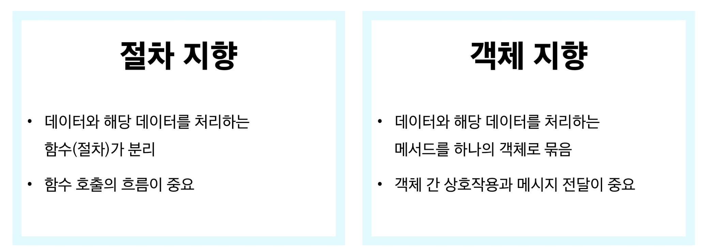
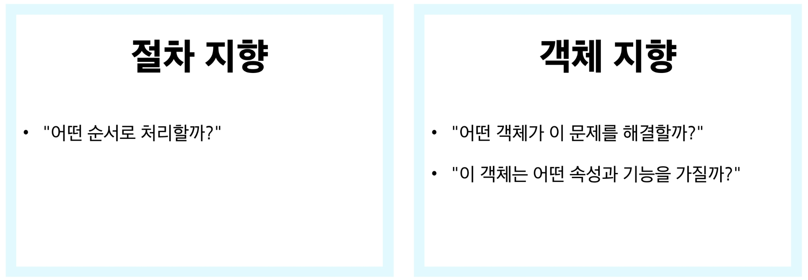

- **객체 지향 - "데이터가 살아나다"**
  - 객체 지향은 수동적인 데이터가 능동적인 객체로 변화한 것
  - 절차 지향에서는 데이터가 함수의 매개변수로 전달되어 처리되는 수동적 존재였지만,<br>객체 지향에서는 데이터와 해당 데이터를 처리하는 메서드가 하나의 객체로 통합되어 스스로 기능을 수행하는 능동적 존재가 됨
  - 이는 코드의 구조화와 재사용성을 높이는 동시에,<br>실제 세계의 모델링 방식과 더 유사한 프로그래밍을 가능하게 함

## 객체와 클래스

### 객체(Object)

- 실제 존재하는 사물을 추상화
- '속성'과 '동작'을 가짐

### 클래스(Class)

- 객체를 만들기 위한 설계도
- 데이터와 기능을 함께 묶는 방법을 제공
- 파이썬에서 타입을 표현하는 방법

- 객체 예시
  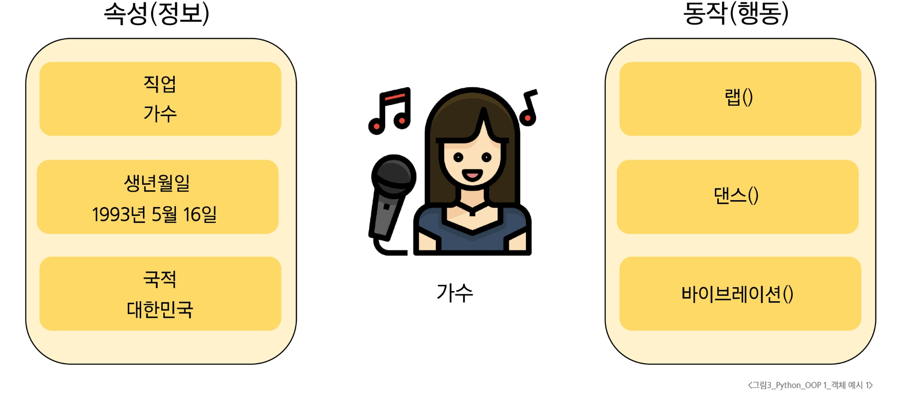
  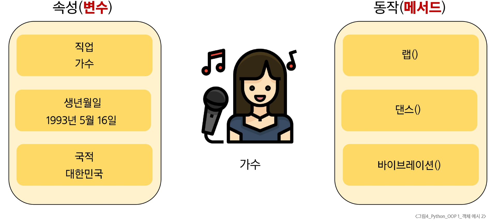

**객체 특징**

- **속성(Attribute)**
  - 객체의 상태/데이터

- **메서드(Method)**
  - 객체의 행동/기능

- **고유성**
  - 각 객체는 고유한 특성을 가짐

---

### 클래스 기초

#### 클래스(Class)

- 클래스는 관련된 데이터(속성)와 기능(메서드)를 하나의 '묶음'으로 정의하는 설계도(blueprint)


1. **클래스(Class) == 자동차 설계도**
   
   - 특정 자동차 모델(X나타)를 만들기 위한 설계도.

2. **속성(Attribute) == 자동차의 데이터**
   
   - 설계도에는 자동차의 데이터가 명시되어 있다. (색상, 최고 속도, 좌석 수)

3. **메서드(Method) == 자동차의 기능**
   
   - 설계도에는 자동차가 할 수 있는 기능도 함께 정의된다. (가속하기(), 정지하기(), 방향 바꾸기())
  
4. **인스턴스(Instance) == 실제 자동차**
   
   - 이 설계도를 바탕으로 실제로 생산된 '각각의 자동차'가 바로 인스턴스.

##### 클래스 정의

- class 키워드
- 클래스 이름은 파스칼 케이스(Pascal Case)방식으로 작성

##### 클래스 예시

- `__init__`메서드는 `생성자 메서드`로 불리며,<br>새로운 객체를 만들 때 필요한 초기값을 설정(메서드 챕터에서 진행)
  ```python
  class Person:
    def __init__(self, name, age):
        self.name = name  # 인스턴스 속성
        self.age = age  # 인스턴스 속성

    def introduce(self):
        print(f'안녕하세요. 저는 {self.name}, 나이는 {self.age}살입니다.')
    ```

#### 인스턴스(Instance)

- 클래스를 통해 생성된 **객체**
  
  - 인스턴스는 클래스를 사용해 실제로 만들어진 객체
  
  - 같은 클래스로 여러 인스턴스를 만들 수 있으며,<br>각 인스턴스는 클래스 구조를 따라 동작하지만 서로 독립된 데이터를 가질 수 있다.

##### 인스턴스 예시

- 클래스가 설계도라면, 인스턴스는 그 설계도로부터 실제로 만든 '개별 물건'

- Person("Alice", 25)라고 하면 Person이라는 설계도로부터 이름이 Alice이고<br>나이가 25인 '사람 객체'가 탄생
  ```python
    p1 = Person('Alice', 25)
    p1.introduce()  # "안녕하세요. 저는 Alice, 나이는 25살입니다."

    p2 = Person('Bella', 30)
    p2.introduce()  # "안녕하세요. 저는 Bella, 나이는 30살입니다."
    ```

#### 클래스와 인스턴스
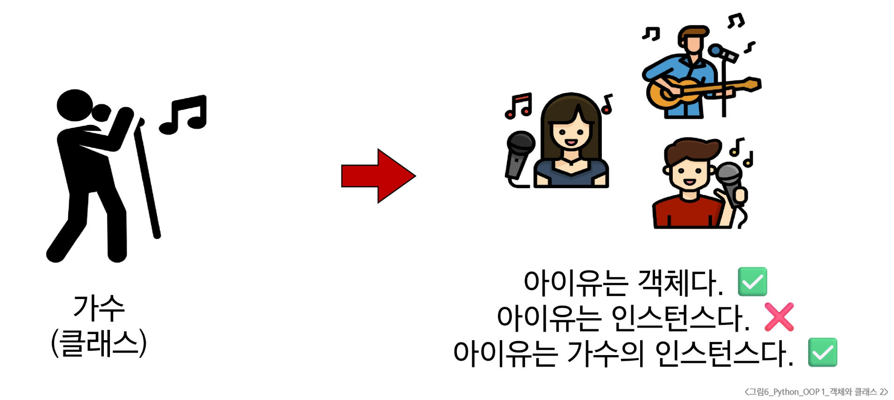

- 클래스를 정의한다는 것은 **공통된 특성과 기능을 가진 틀을 만드는 것**

- 실제 활동하는 개별 객체들은 이 틀에서 생성된 인스턴스(instance)

- 공통된 특성과 기능을 가진 틀을 만드는 것은 곧 새로운 타입을 만드는 행위

  - "아이유는 인스턴스다." 라는 표현이 모호한 이유 역시 마찬가지
  - "무슨 타입의 인스턴스"인지를 알 수 없기 때문

  ```python
  class Singer:
    pass
  iu = Singer() # <class '__main__.Singer'>
  ```
  - type(iu)를 출력하면 `Singer`가 출력됨. 즉, Python은 iu가 어떤 타입에 속하는지 알고 있어야 함

#### 클래스와 인스턴스 2

- 변수 `name`의 타입은 `str` 클래스다.

- 변수 `name`은 `str` 클래스의 인스턴스이다.
  - 우리가 사용해왔던 데이터 타입은 사실 모두 클래스였다.

  ```python
    # 문자열 변수 name은 (정확히는 'Alice')는 str 클래스의 인스턴스
    name = 'Alice'
    print(type(name)) # <class 'str'>
    ```
#### 클래스와 인스턴스 3

- `'', 'hello', '파이썬'`: 문자열 타입(클래스)의 객체(인스턴스)
- `[1, 2, 3], [1], [], ['hi']`: 리스트 타입(클래스)의 객체(인스턴스)

### 클래스 구성요소

#### 클래스 구조

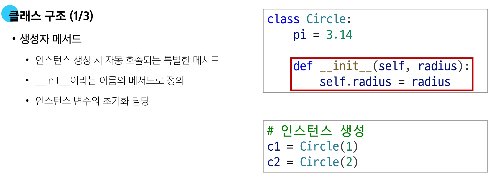
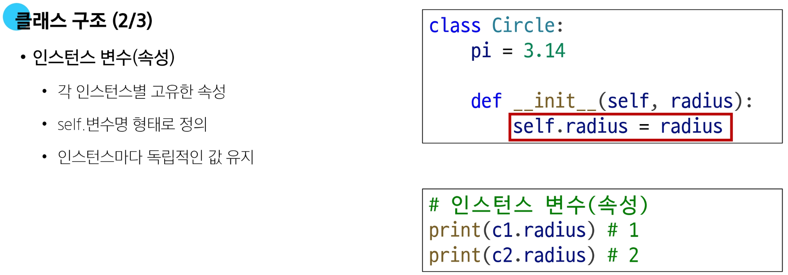
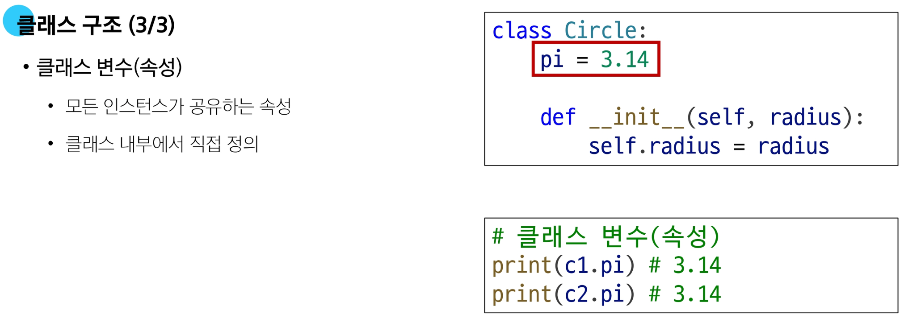

---

### 메서드

**Method, 클래스 내부에 정의된 함수로,<br>해당 객체가 어떻게 동작할 지를 정의**

#### 인스턴스 메서드

**인스턴스의 상태를 조작하거나 동작을 수행한다.**

##### 인스턴스 메서드 구조

- 클래스 내부에 정의되는 메서드의 기본
- 반드시 첫 번째 인자로 인스턴스 자신(self)을 받음
- 인스턴스의 속성에 접근하거나 변경 가능
  
  ```python
  class MyClass:

    def instance_method(self, arg1, ...):
      pass
  ```
  - self는 매개변수 이름일 뿐이며 다른 이름 설정 가능, 하지만 self 강력 권장

##### self 동작 원리(1/2)
  - upper 메서드를 사용해 문자열 'hello'를 대문자로 변경하기
    ```python
    'hello'.upper()
    ```
  - 하지만 실제 파이썬 내부 동작은 다음과 같이 진행됨
    ```python
    str.upper('hello')
    ```
  - str 클래스가 upper 메서드를 호출했고, 그 첫번째 인자로 문자열 인스턴스가 들어간 것

  - 인스턴스 메서드의 첫번째 인자가 반드시 인스턴스 자기 자신인 이유


#### 클래스 메서드

**클래스 변수를 조작하거나 클래스 레벨의 동작을 수행합니다.**

##### 클래스 메서드 구조

- `@classmethod` 데코레이터를 사용하여 정의
- 호출 시, 첫번째 인자로 해당 메서드를 호출하는 클래스(cls)가 전달됨
- 클래스를 인자로 받아 클래스 속성을 변경하거나 읽는 데 사용

  ```python
  class MyClass:

    @classmethod
    def class_method(cls, arg1, ...):
      pass
  ```

#### 스태틱 메서드

**클래스, 인스턴스와 상관없이 독립적으로 동작하는 메서드**

##### 스태틱 메서드 구조

- `@staticmethod` 데코레이터를 사용하여 정의
- 호출 시 자동으로 전달 받는 인자가 없음 (self, cls를 받지 않음)
- 인스턴스나 클래스 속성에 직접 접근하지 않는, '도우미 함수'와 바슷한 역할

  ```python
  class MyClass:

    @staticmethod
    def static_method(arg1, ...):
      pass
  ```

##### 스태틱 메서드 예시

- 수학에 관련 기능을 담은 `MathUtils` 클래스에서 덧셈 기능을 제공하는 예시

  ```python
  class MathUtils:
    @staticmethod
    def add(a, b):
      return a + b

  print(MathUtils.add(3, 5)) # 8
  ```

### 메서드 정리

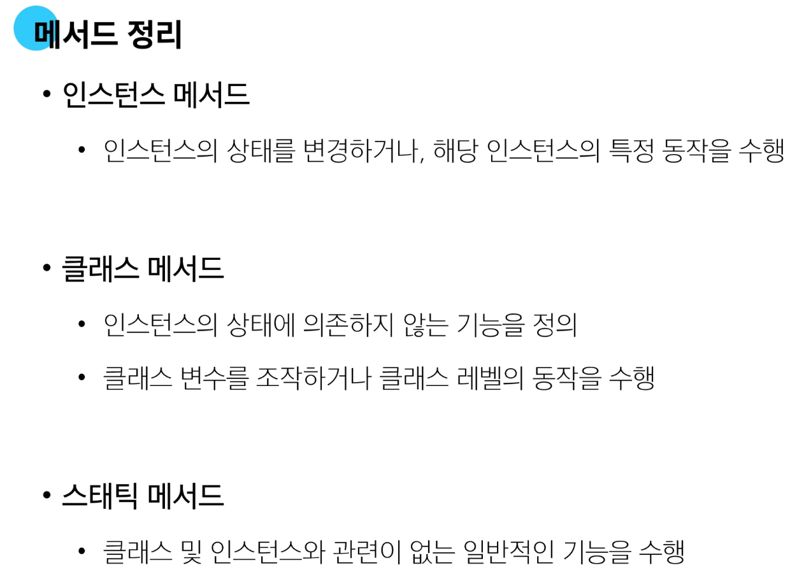
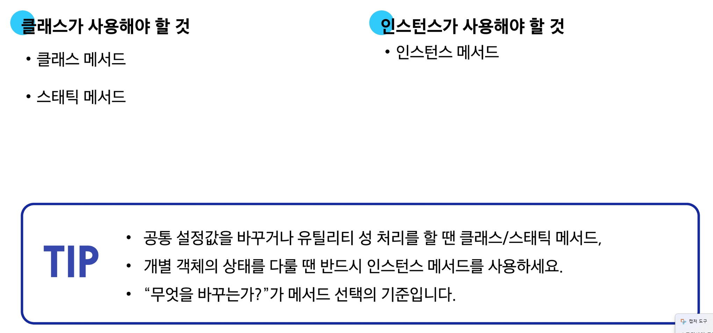
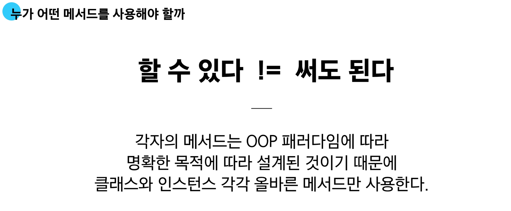