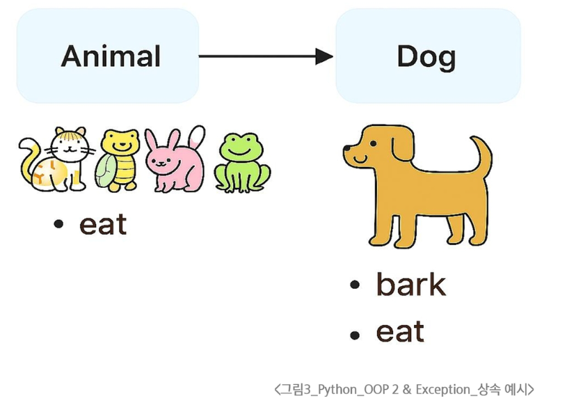
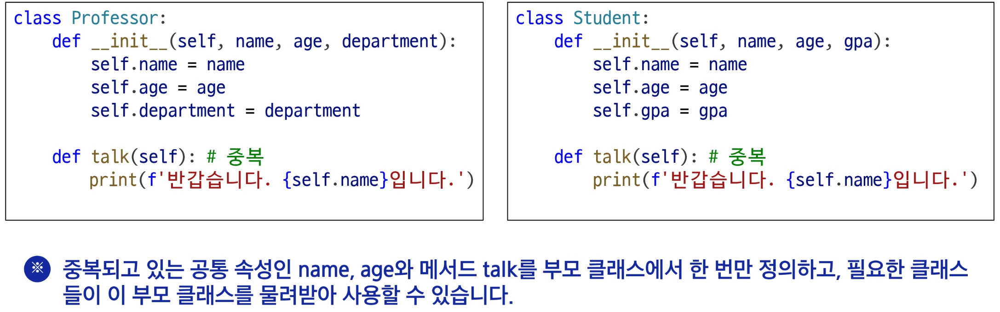
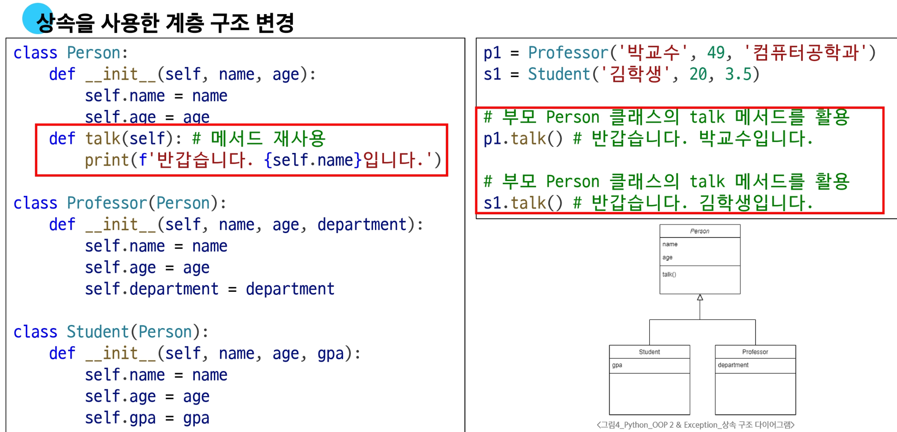
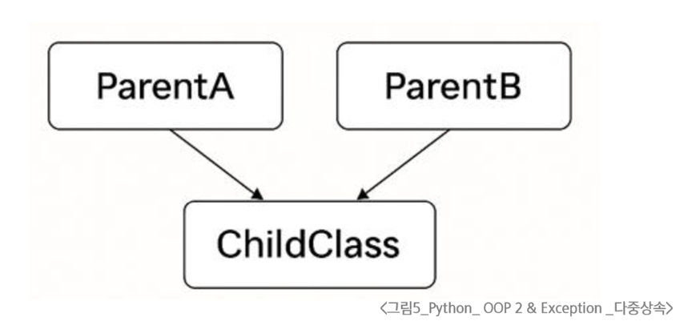
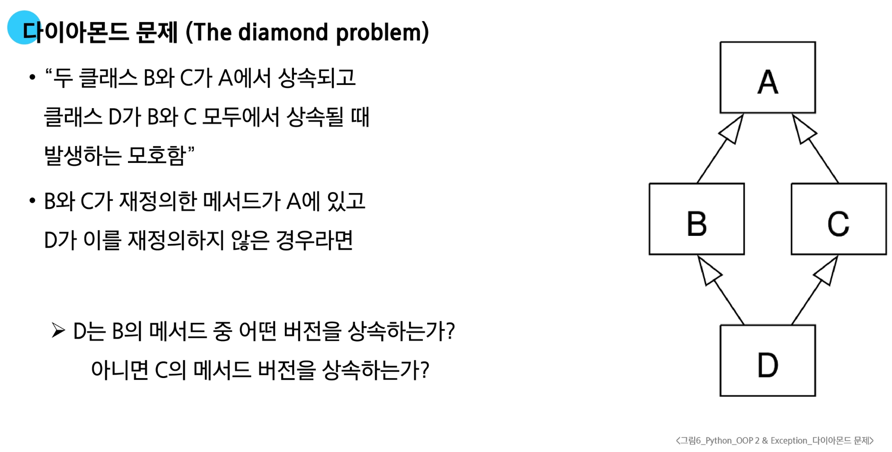
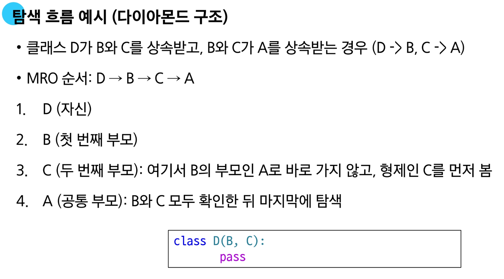
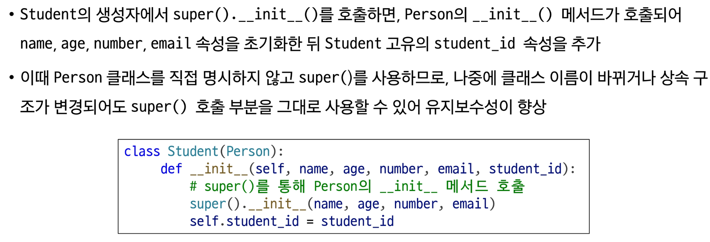
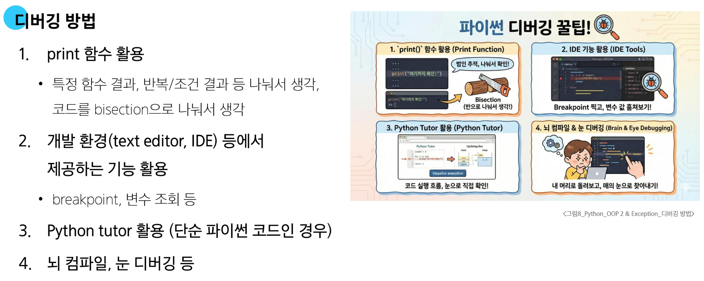
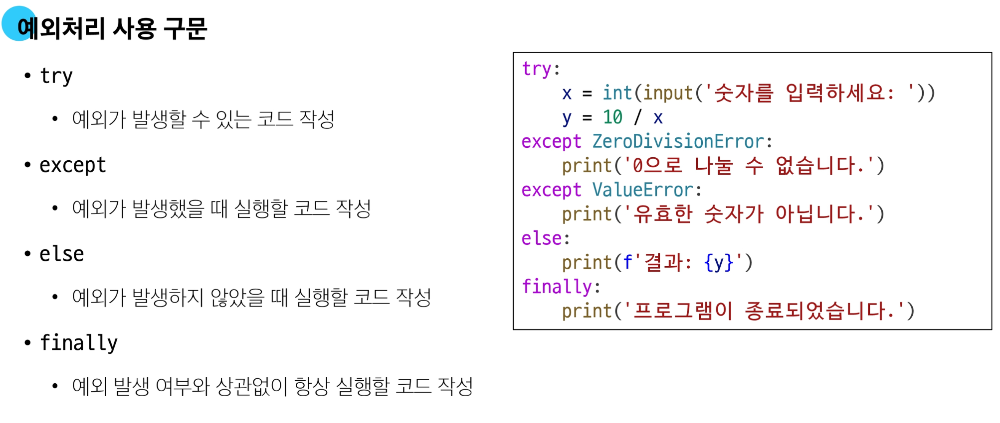
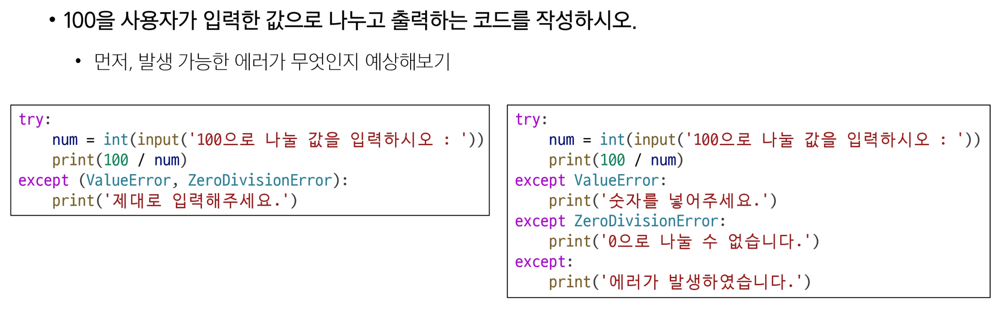

# OOP 2

## 상속

- 한 클래스(부모)의 속성과 메서드를
- 다른 클래스(자식)가 물려받는 것

### 상속 예시

```python
class Animal:
    def eat(self):
        print('먹는 중')


class Dog(Animal):
    def bark(self):
        print('멍멍')


my_dog = Dog()

my_dog.bark()  # 멍멍

# 부모 클래스(Animal) 메서드 사용 가능
my_dog.eat() # 먹는 중
```


## 클래스 상속

### 상속 없이 구현하는 경우 1

- 상속이 없이 구현하는 경우 학생/교수 정보를 별도로 표현하기 어려움
- `Person class`만을 사용하는 경우 학생과 교수가 가지는 각각의 고유 속성을 표현하기 어려움.
- 나이와 이름만으로는 직업 정보를 나타낼 수 없음
  
  ```python
    # 상속 없는 경우 - 1
    class Person:
        def __init__(self, name, age):
            self.name = name
            self.age = age

        def talk(self):
            print(f'반갑습니다. {self.name}입니다.')


    s1 = Person('김학생', 23)
    s1.talk()  # 반갑습니다. 김학생입니다.

    p1 = Person('박교수', 59)
    p1.talk()  # 반갑습니다. 박교수입니다.
    ```
### 상속 없이 구현하는 경우 2

- 상속 없이 구현하는 경우 교수/학생 클래스로 각각 선언하여 구현함
- 클래스를 각각 분리했지만 메서드가 중복으로 정의될 수 있음



### 상속을 사용한 계층 구조 변경



## 메서드 오버라이딩

**부모 클래스의 메서드를 같은 이름, 같은 파라미터 구조로 재정의하는 것**

- 자식 클래스에서 메서드를 다시 정의하면, 부모 클래스의 메서드 대신 자식 클래스의 메서드가 실행됩니다.
- 오버라이딩은 동일한 이름과 매개변수를 사용하지만, 내부 동작을 원하는 대로 바꿀 수 있게 해줍니다.
- 부모 클래스의 기능을 유지하면서도 일부 동작을 맞춤형으로 바꾸고 싶을 때 유용합니다.
  
### 메서드 오버라이딩 예시

- 자식 클래스가 부모 클래스의 메서드를 덮어써서 새로운 동작을 구현할 수 있음
- `Animal class`를 상속받은 `Dog`클래스에서 `eat`메서드를 다시 정의하는 것

  ```python
    class Animal:
        def eat(self):
            print('Animal이 먹는 중')


    class Dog(Animal):
        # 오버라이딩 (부모 클래스 Animal의 eat 메서드를 재정의)
        def eat(self):
            print('Dog가 먹는 중')


    my_dog = Dog()

    my_dog.eat()  # Dog가 먹는 중
    ```

## 다중 상속



- 둘 이상의 상위 클래스로부터 여러 행동이나 특징을 상속받을 수 있다.
- 상속받은 모든 클래스의 요소를 활용 가능하다.
- 중복된 속성이나 메서드가 있는 경우 상속 순서에 의해 결정된다.
  
### 다이아몬드 문제



#### 파이썬에서의 해결책

- MRO(Method Resolution Order) 알고리즘을 사용하여 메서드를 탐색할 클래스의 순서를 미리 정의
- C3 Linearization(선형화) 알고리즘ㅇ르 적용하여 다음과 같은 원칙으로 순서를 결정
  
  1. **자식 클래스 우선**: 부모 클래스보다 자식 클래스를 먼저 탐색
  2. **왼쪽 부모 우선**: 다중 상속 시, 리스트에 나열된 순서(왼쪽부터 오른쪽)대로 탐색
  3. **중복 방문 방지**: 공통 부모 클래스는 모든 자식 클래스의 탐색이 끝난 뒤 단 한 번만 탐색

    

#### 메서드 결정 순서

##### MRO

- 파이썬이 메서드를 찾는 순서에 대한 규칙 (메서드 결정 순서)

  - MRO는 다중 상속에서 어떤 부모 클래스의 메서드를 먼저 사용할 지 순서를 정의한다.
  - 파이썬은 미리 MRO를 통해 다중 상속 환경에서도 예측 가능한 방식으로 메서드 탐색이 이루어지도록 한다.

## super() 메서드

- MRO에 따라,<br>현재 클래스의 부모 클래스의 메서드나 속성에 접근할 수 있게 해주는 내장 함수

### super() 사용 예시 (단일 상속)

- 명시적으로 부모 클래스 이름을 적지 않아도 부모 메서드를 안전하게 호출할 수 있음

    ```python
    # super를 사용했을 때
    class Person:
        def __init__(self, name, age, number, email):
            self.name = name
            self.age = age
            self.number = number
            self.email = email


    class Student(Person):
        def __init__(self, name, age, number, email, student_id):
            # super()를 통해 Person의 __init__ 메서드 호출
            super().__init__(name, age, number, email)
            self.student_id = student_id
    ```
### super() 사용 예시 (단일 상속) 2




## 에러와 예외

### 버그와 디버깅

#### 버그

- 소프트웨어에서 발생하는 오류 또는 결함
- 프로그램의 예상된 동작과 실제 동작 사이의 불일치

#### 디버깅

- 소프트웨어에서 발생하는 버그를 찾아내고 수정하는 과정
- 프로그램의 오작동 원인을 식별하여 수정하는 작업



### 에러

- 프로그램 실행 중에 발생하는 예외 상황

  - 프로그램을 실행할 때 예상치 못한 문제가 발생하면 오류가 생긴다.
  - 예를 들어, 존재하지 않는 파일을 읽으려 하거나 0으로 나누면 오류가 발생한다.
  - 이러한 상황을 처리하지 않으면 프로그램이 중단된다.

### 예외

- 프로그램 실행 중에 감지되는 에러

  - 예외는 프로그램이 잘못된 동작을 시도할 때 자동으로 감지
  - 예를 들어, 리스트에 없는 값을 꺼내려 하면 예외가 발생
  - 이런 상황을 처리하지 않으면 프로그램은 즉시 종료된다.

#### 내장 예외

- 예외 상황을 나타내는 예외 클래스들

#### 예외 처리(Exception Handling)

- 예외가 발생했을 때 프로그램이 비정상적으로 종료되지 않고, 적절하게 처리할 수 있도록 하는 방법

  - 예외 처리를 통해 오류가 발생해도 프로그램의 흐름을 안전하게 이어갈 수 있다.
  - Python에서는 `try`, `except` 구문을 사용해 특정 예외를 잡아내고 원하는 동작을 수행할 수 있다.
  - 예외 처리를 구현하면 프로그램 사용자에게 오류 메시지를 보여주거나 대체 로직을 실행할 수 있다.

##### 예외처리 사용 구문



#### try & except

```python
try:
    # 예외가 발생할 수 있는 코드
except 예외:
    # 예외 처리 코드
```

#### 복수 예외 처리

