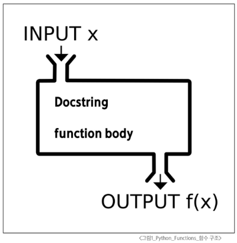

# Python Finctions

## 함수

**특정 작업을 수행하기 위한 재사용 가능한 코드 묶음**

- 계산기에 있는 '+' 버튼을 생각해보자
  - 1 + 1을 하든, 100 + 100을 하든, '두 숫자를 더한다'는 하나의 정해진 작업을 수행한다.


**함수를 사용하는 이유**

- 두 수의 합을 구하는 함수를 정의하고 사용함으로써 코드의 중복을 방지

- 재사용성이 높아지고, 코드의 가독성과 유지보수성 향상

```python
# 5와 3을 더하기
num1 = 5
num2 = 3
result1 = num1 + num2
print(result1)

# 10과 20(코드 중복)
num3 = 10
num4 = 20
result2 = num3 + num4
print(result2)
```
- 코드 중복 발생

```python
# 덧셈 함수 정의
def get_sum(num1, num2):
    return num1 + num2

# 서로 다른 입력값으로 함수 사용
result_1 = get_sum(5, 3)
result_2 = get_sum(10, 20)

# 결과 확인
print(result_1)
print(result_2)
```

**함수 호출(Function call)**

- 함수를 실행하기 위해 함수의 이름을 사용하여 해당 함수의 코드 블록을 실행하는 것
`function_name(arguments)`

**함수 구조**


**함수 정의와 호출(1/5)**

- 함수 정의
  - 함수 정의는 def 키워드로 시작
  - def 키워드 이후 함수 이름 작성
  - 괄호 안에 매개변수를 정의할 수 있음
  - 매개변수(parameter)는 함수에 전달되는 값

**함수 정의와 호출(2/5)**

- 함수 body
  - 콜론(:) 다음에 들여쓰기 된 코드 블록
  - 함수가 실행될 때 수행되는 코드를 정의

**함수 정의와 호출(3/5)**

- Docstring
  - 함수 body 앞에 선택적으로 작성 가능한 함수 설명서

**함수 정의와 호출(4/5)**

- 함수 반환 값
  - 함수는 필요한 경우 결과를 반환
  - `return` 키워드 이후에 반환값 명시
  - `return`문은 함수의 실행 종료, 결과를 호출 부분으로 반환
  - 함수 내에서 `return`문이 없다면 `None`이 반환됨

**함수 정의와 호출(5/5)**

- 함수 호출
  - 함수를 사용하기 위해서는 호출이 필요
  - 함수의 이름과 소괄호를 활용해 호출
  - 필요한 경우 인자(argument)를 전달해야 함
  - 호출 부분에서 전달된 인자는 함수 정의 시 작성한 매개변수에 대입됨

**매개변수(parameter)**

- 함수를 *정의*할 때, 함수가 받을 값을 나타내는 변수

**인자(argument)**

- 함수를 *호출*할 때, 실제로 전달되는 값

## 다양한 인자 종류

1. **Positional Arguments (위치 인자)**
   - 함수 호출 시 인자의 위치에 따라 전달되는 인자
   - 위치 인자는 함수 호출 시 반드시 값을 전달해야 함

2. **Default Argument Values(기본 인자 값)**
   - 함수 정의에서 매개변수에 기본 값을 할당하는 것
   - 함수 호출 시 인자를 전달하지 않으면, 기본값이 매개변수에 할당됨

3. **Keyword Arguments(키워드 인자)**
   - 함수 호출 시 인자의 이름과 함께 값을 전달하는 인자
   - 매개변수와 인자를 일치시키지 않고, 특정 매개변수에 값을 할당할 수 있음
   - 인자의 순서는 중요하지 않으며, 인자의 이름을 명시하여 전달
   - 단, 호출 시 키워드 인자는 위치 인자 뒤에 위치해야 함 

**왜 위치 인자가 앞에 와야 할까?**

- 위치 인자가 키워드 인자보다 반드시 먼저 와야 하는 이유는 "순서의 모호성" 때문
- **순서 의존:** 위치 인자는 첫 번째, 두 번째라는 순서에 따라 값이 전달됨
- **순서 파괴:** 키워드 인자는 순서를 무시하고 이름을 직접 지정함
- 이미 키워드 인자로 순서가 깨진 상태에서 다시 위치 인자(이름 없는 값)을 던지면, 컴퓨터는 "이 값이 몇 번째 자리에 들어가야 하는지" 판단이 불가능함

4. **Arbitary Argument Lists(임의의 인자 목록)**
   - 정해지지 않은 개수의 인자를 처리하는 인자
   - 함수 정의 시 매개변수 앞에 `*`를 붙여 사용
   - 여러 개의 인자를 `tuple`로 처리 
  
5. **Arbitary Keyword Argument Lists(임의의 키워드 인자 목록)**
   - 정해지지 않은 개수의 키워드 인자를 처리하는 인자 
   - 함수 정의 시 매개변수 앞에 `**`를 붙여 사용
   - 여러 개의 인자를 `dictionary`로 묶어 처리

**함수 인자 권장 작성 순서**

- 위치 → 기본 → 가변 → 가변 키워드
- 호출 시 인자를 전달하는 과정에서 혼란을 줄일 수 있도록 함
- 단, 모든 상황에 적용되는 절대적인 규칙은 아니며, 상황에 따라 유연하게 적용
```python
# 인자의 모든 종류를 적용한 예시
def func(pos1, pos2, default_arg='default', *args, **kwargs):
    print('pos1:', pos1)
    print('pos2:', pos2)
    print('default_arg:', default_arg)
    print('args:', args)
    print('kwargs:', kwargs)


func(1, 2, 3, 4, 5, 6, key1='value1', key2='value2')
"""
pos1: 1
pos2: 2
default_arg: 3
args: (4, 5, 6)
kwargs: {'key1': 'value1', 'key2': 'value2'}
"""
```

## 재귀 함수

**재귀 함수 예시 - 팩토리얼 (1/3)**

- n!
  - n * (n - 1)!
    - n * (n - 1) * (n - 2)!

**재귀 함수 예시 - 팩토리얼 (2/3)**

- factorial 함수는 자기 자신을 재귀적으로 호출하여 입력된 숫자 n의 팩토리얼을 계산
- 재귀 호출은 n이 0이 될 때까지 반복되며, 종료 조건을 설정하여 재귀 호출이 멈추도록 함
- 재귀 호출의 결과를 이용하여 문제를 작은 단위의 문제로 분할하고, 분할된 문제들의 결과를 조합하여 최종 결과를 도출

**재귀 함수 예시 - 팩토리얼 (3/3)**

- n! = n * (n-1) * (n-2) * ... * 1
- 5! = 5 * 4 * 3 * 2 * 1 = 120
```python
def factorial(n):
  if n == 1:
    return 1
  else:
    return n * factorial(n-1)

print(factorial(5)) # 120
```

**재귀 함수 특징**

- 특정 알고리즘 식을 표현할 때 변수의 사용이 줄어들며, 코드의 가독성이 높아짐
- 1개 이상의 base case(종료되는 상황)가 존재하고, 수렴하도록 작성

**재귀 함수 활용 시 기억해야 할 것**

- 종료 조건을 명확히 할 것
- 반복되는 호출이 종료 조건을 향하도록 할 것

## 내장 함수

**파이썬에 기본적으로 내장된 함수 (별도의 import 없이 즉시 사용 가능)**

- 자주 사용되는 내장 함수 예시
  ```python
  numbers = [1, 2, 3, 4, 5]

  print(numbers)  # [1, 2, 3, 4, 5]
  print(len(numbers))  # 5
  print(max(numbers))  # 5
  print(min(numbers))  # 1
  print(sum(numbers))  # 15
  print(sorted(numbers, reverse=True))  # [5, 4, 3, 2, 1]
  ```

## 함수와 Scope

**Python의 범위(Scope)**
- 함수는 코드 내부에 local scope를 생성하며, 그 외의 공간인 global scope로 구분
  - 함수 내부에 들여쓰기가 된 부분은 독립적으로 작동, 바깥의 부분을 인지하지 못함
  
**범위와 변수 관계**

**Scope 예시**
- num은 local scope에 존재하기 때문에 global scope에서 사용할 수 없음
  - 이는 변수의 수명주기와 연관이 있음
  ```python
    # Scope 예시
  def func():
      num = 20
      print('local', num)  # local 20


  func()

  print('global', num)  # NameError: name 'num' is not defined
  ```

**이름 검색 규칙(Name Resolution)**
- 파이썬에서 사용되는 이름(식별자)들은 특정한 이름공간(namespace)에 저장되어 있음
- 아래와 같은 순서로 이름을 찾아 나가며, **LEGB Rule**이라고 부름
  1. Local Scope: 지역 범위
  2. Enclosed Scope: 지역 범위 한 단계 위 범위
  3. Global Scope: 최상단에 위치한 범위
  4. Built-in Scope: 모든 것을 담고 있는 범위 (정의하지 않고 사용할 수 있는 모든 것)

## global 키워드

**'global' 키워드**
  - 변수의 스코프를 전역 범위로 지정하기 위해 사용
  - 일반적으로 함수 내에서 전역 변수를 수정하려는 경우에 사용
  ```python
    num = 0  # 전역 변수


  def increment():
      global num  # num를 전역 변수로 선언
      num += 1


  print(num)  # 0

  increment()

  print(num)  # 1
  ``` 

**'global' 키워드 주의사항 - 1**
  - global 키워드 선언 전에 참조 불가
  ```python
    # ‘global’ 키워드 주의사항 1 - global 키워드 선언 전에는 참조불가
  num = 0


  def increment():
      # SyntaxError: name 'num' is used prior to global declaration
      print(num)
      global num
      num += 1
  ```

**'global' 키워드 주의사항 - 2**
  - 매개변수에는 global 키워드 사용 불가
  ```python
    # ‘global’ 키워드 주의사항 2 - 매개변수에는 global 키워드 사용불가
  num = 0


  def increment(num):
      # SyntaxError: name 'num' is parameter and global
      global num
      num += 1
  ```

## 함수 이름 작성 규칙

**기본 규칙**
  - 소문자와 언더스코어(_) 사용
  - 동사로 시작하여 함수의 동작 설명
  - 약어 사용 지양

## 단일 책임 원칙

**단일 책임 원칙(Single Responsibility Principle)**
  - 모든 객체는 하나의 명확한 목적과 책임만을 가져야 함

**함수 설계 원칙**

1. 명확한 목적
   - 함수는 한 가지 작업만 수행
   - 함수 이름으로 목적을 명확히 표현

2. 책임 분리
   - 데이터 검증, 처리, 저장 등을 별도 함수로 분리
   - 각 함수는 독립적으로 동작 가능하도록 설계  
  
3. 유지보수성
   - 작은 단위의 함수로 나누어 관리
   - 코드 수정 시 영향 범위를 최소화 

## Packing & Unpacking

### Packing

**여러 개의 데이터를 하나의 컬렉션으로 모아 담는 과정**
  - 기본 원리
    - 여러 개의 값을 하나의 튜플로 묶는 파이썬의 기본 동작
    - 한 변수에 콤마(,)로 구분된 값을 넣으면 자동으로 튜플로 처리

**`*`를 활용한 패킹(함수 매개변수 작성 시)**
  - 남는 위치 인자들을 튜플로 묶기
  - `*`를 붙인 매개변수가 남는 위치 인자들을 모두 모아 하나의 튜플로 만듦

### Unpacking

**컬렉션에 담겨있는 데이터들을 개별 요소로 펼쳐 놓는 과정**
  - 기본 원리
    - 튜플이나 리스트 등의 객체의 요소들을 개별 변수에 할당
    - '시퀀스 언패킹(Sequence Unpacking)' 또는 다중 할당(Multiple Assignment)'이라고 부름
  
**`*`를 활용한 언패킹(함수 인자 전달)**
  - 리스트나 튜플 앞에 `*`를 붙여 각 요소를 함수의 개별 위치 인자로 전달