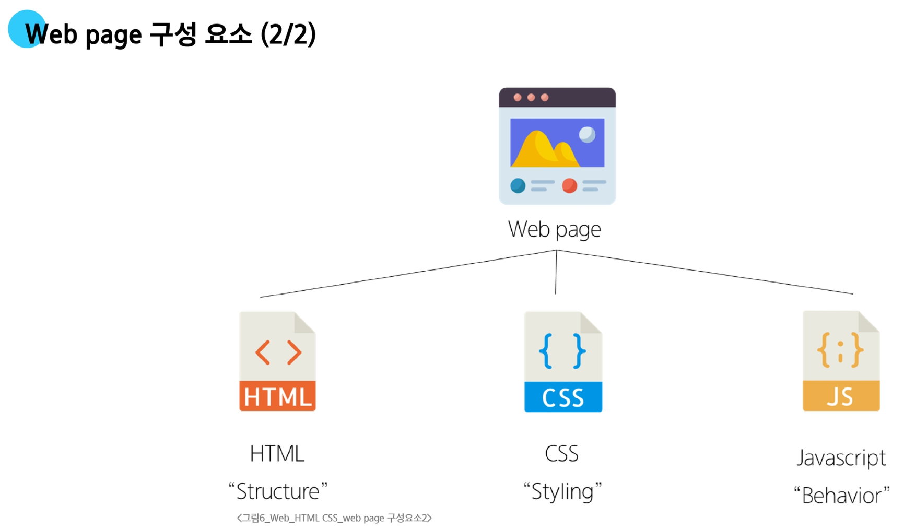
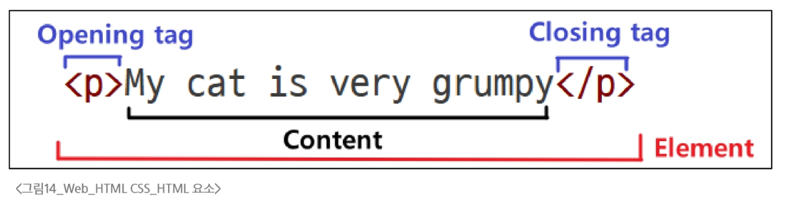

# 웹(Web)

**WWW(World Wide Web)**

- 인터넷을 연결된 컴퓨터들이 정볼르 공유하는 거대한 정보 공간

**Web**

- Web Site, Web application 등을 통해 사용자들이 정보를 검색하고 상호 작용하는 기술

    

### HTML
**HyperText Markup Language**

- 웹 페이지의 의미와 구조를 정의하는 언어

- 하이퍼텍스트(HyperText)
  - 웹 페이지를 다른 페이지로 연결하는 링크

**Markup Language**

- 태그 등을 이용하여 문서나 데이터의 구조를 명시하는 언어

  - 인간이 읽고 쓰기 쉬운 형태이며, 데이터의 구조와 의미를 정의하는 데 집중
  - e.g) HTML, Markdown

### HTML 구조

```HTML
<!DOCTYPE html>
<html lang="en">
<head>
    <meta charset="UTF-8">
    <title>My page</title>
</head>
<body>
    <p>This is my page</p>
</body>
</html>
```

- `<!DOCTYPE html>`

  - 해당 문서가 html로 문서라는 것을 나타냄

- `<html></html>`

  - 전체 페이지의 콘텐츠를 포함

- `<title></title>`

  - 브라우저 탭 및 즐겨찾기 시 표시되는 제목으로 사용

- `<head></head>`

  - HTML 문서에 관련된 설명, 설정 등 컴퓨터가 식별하는 메타데이터를 작성
  - 사용자에게 보이지 않음

- `<body></body>`

  - HTML 문서의 내용을 나타냄
  - 페이지에 표시되는 모든 콘텐츠를 작성
  - 한 문서의 하나의 body 요소만 존재

#### HTML Element(요소)

- 하나의 요소는 여는 태그와 닫는 태그 그리고 그 안의 내용으로 구성됨

- 닫는 태그는 태그 이름 앞에 슬래시가 포함됨

  - 닫는 태그가 없는 태그도 존재
  


#### HTML Attributes(속성)

- **사용자가 원하는 기준에 맞도록 요소를 설정하거나 다양한 방식으로 요소듸 동작을 조절하기 위한 값**

- 목적

  - 나타내고 싶지 않지만 추가적인 기능, 내용을 담고 싶을 때 사용
  - CSS에서 스타일 적용을 위해 해당 요소를 선택하기 위한 값으로 활용됨

- 작성 규칙

## CSS

- **선택자(Selector)**

  - '누구를' 꾸밀지 지정하는 부분

- **선언(Declaration)**

  - '어떻게' 꾸밀지에 대한 구체적인 한 줄의 명령
 
  - 속성과 값이 한 쌍으로 이루어지며, 세미콜론(;)으로 끝남

- **속성(Property)**

  - 바꾸고 싶은 스타일의 종류를 나타냄

- **값(Value)**

  - 속성에 적용할 구체적인 설정을 나타냄