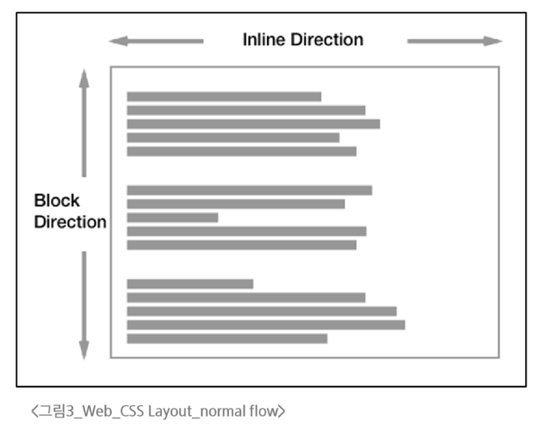

# CSS Box Model

### display 속성(박스의 화면 배치 방식)

- **박스 타입**

  - 박스 타입에 따라 페이지에서 배치 흐름 및 다른 박스와 관련하여 박스가 동작하는 방식이 달라짐

- **박스 타입 종류**

  - Block 타입

  - Inline 타입

#### block 타입

**하나의 독립된 덩어리처럼 동작하는 요소**

- 항상 새로운 행으로 나뉨 (한 줄 전체를 차지, 너비 100%)

- width, height, margin, padding 속성을 모두 사용할 수 있음

- width 속성을 지정하지 않으면 박스는 Inline 방향으로 사용 가능한 공간을 모두 차지함

  - 상위 컨테이너 너비 100%로 채우는 것

- 대표적인 block 타입 태그

  - h1~6, p, div, ul, li

#### block 타입의 대표: "div"

- 다른 HTML 요소들을 그룹화하여 레이아웃을 구성하거나 스타일링을 적용할 수 있음

- 헤더, 푸터, 사이드바 등 웹 페이지의 다양한 섹션을 구조화 하는데 가장 많이 쓰이는 요소
  ```HTML
  <div class="container">
    <h1>제목</h1>
    <p>단락 내용입니다.</p>
  </div>
  <div>
    <p>콘텐츠</p>
  </div>
  ```
#### Inline 타입

**문장 안의 단어처럼 흐름에 따라 자연스럽게 배치되는 요소**

- 줄 바꿈이 일어나지 않음 (콘텐츠의 크기만큼만 영역을 차지)

- width와 height 속성을 사용할 수 없음

- 수직 방향 (상하)

  - padding, margin, border가 적용되지만, 다른 요소를 밀어낼 수는 없음

- 수평 방향 (좌우)
  
  - padding, margin, border가 적용되어 다른 요소를 밀어낼 수 있음

- 대표적인 inline 타입 태그

  - a, img, span, strong

#### Inline 타입의 대표: "span"

- 자체적으로 시각적 변화 없음

  - 스타일을 적용하기 전까지는 특별한 변화 없음

- 텍스트 일부 조작

  - 문장 내 특정 단어나 구문에만 스타일을 적용할 때 유용

- 블록 요소처럼 줄 바꿈을 일으키지 않으므로, 문서의 구조에 큰 변화를 주지 않음

```HTML
<p>이 문장에서 <span style="color: blue;">파란색</span> 단어만 색상이 다릅니다.</p>
<p>이 단어는 <span class="highlight-text">강조</span>되었습니다.</p>
<p>이것은 <span id="changeText">클릭</span>하면 변경됩니다.</p>
```

### Normal flow

**일반적인 흐름 또는 레이아웃을 변경하지 않은 경우 웹 페이지 요소가 배치되는 방식**


### 기타 display 속성

#### inline-block 타입

**inline과 block의 특징을 모두 가진 특별한 display 속성 값**

#### none 타입

**요소를 화면에 표시하지 않고, 공간조차 부여되지 않음**


### CSS Position

- **CSS Layout**

  - 각 요소의 <span style="color: red;">위치</span>와 <span style="color: red;">크기를 조정</span>하여 웹 페이지의 디자인을 결정하는 것

  - 요소들을 상하좌우로 정렬하고, 간격을 맞추고, 전체적인 페이지의 뼈대를 구성

  - 핵심 속성: `display(block, inline, flex, gird, ...)`

- **CSS Position**

  - 요소를 Normal Flow에서 제거하여 <span style="color: red;">다른 위치로 배치</span>하는 것

  - 다른 요소 위에 올리기, 화면의 특정 위치에 고정시키기 등

  - 핵심 속성: `position(static, relative, absolute, fixed, sticky, ...)`

# CSS Flexbox

**요소를 행과 열 형태로 배치하는 1차원 레이아웃 방식**

### Flexbox 구성 요소

- main axis

- cross axis

- flex container

- flex item
