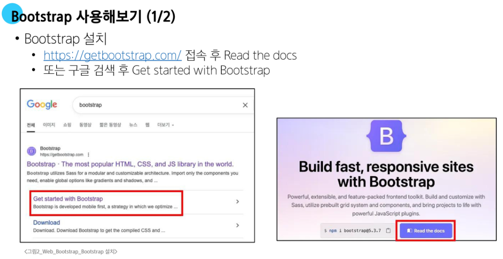
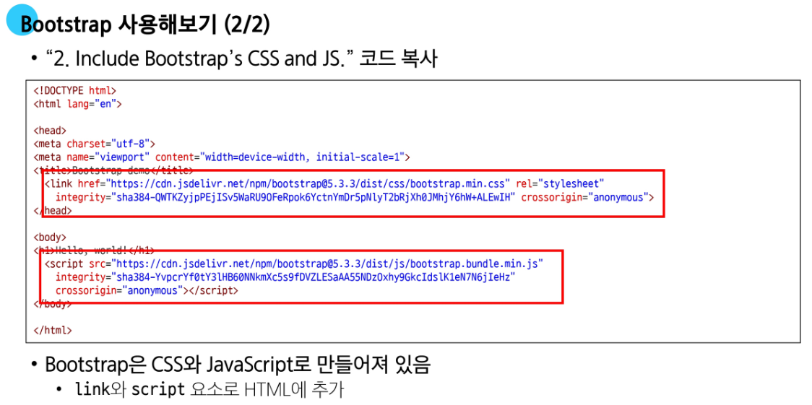
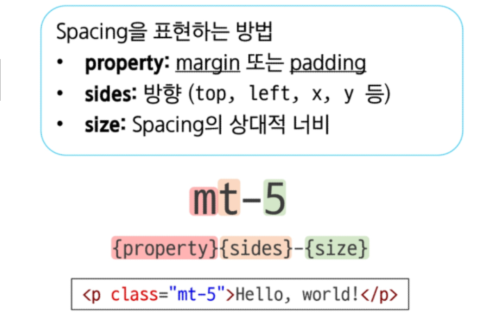
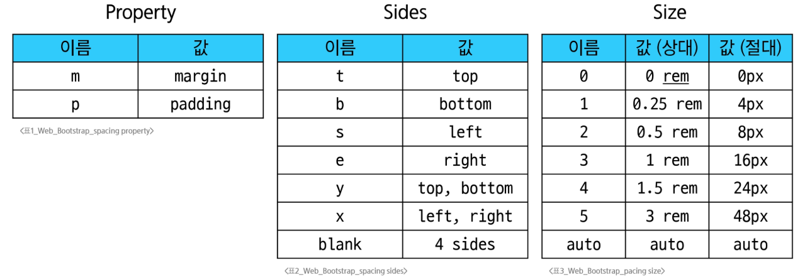
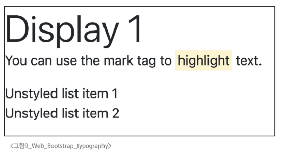

# Bootstrap

**CSS 프론트엔드 프레임워크 (Toolkit)**




---

### Bootstrap 기본 사용법

- Bootstrap에는 특정한 규칙이 있는 클래스 이름으로 스타일 및 레이아웃이 미리 작성되어 있음
  
  

---

### Bootstrap 활용

- **Typography**

  - 제목, 본문 텍스트, 목록 등
  ```HTML
  <div class="display-1">Display 1</div>

  <p>You can use the mark tag to
    <mark>highlight</mark> text.
  </p>

  <ul class="list-unstyled">
    <li>Unstyled list item1</li>
    <li>Unstyled list item2</li>
  </ul>
  ```
  