## Logout

**Logout**
- 로그아웃은 Session을 Delete 하는 과정
- 서버의 세션 데이터를 비우고, 클라이언트의 세션 쿠키를 삭제

**logout(request)**
1. DB에서 현재 요청에 대한 Session Data를 삭제
2. 클라이언트의 쿠키에서도 Session Id를 삭제

#### 로그아웃 기능 구현
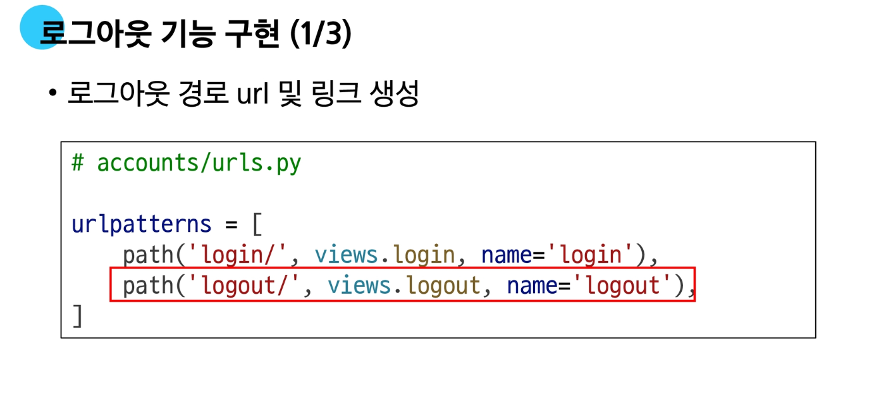
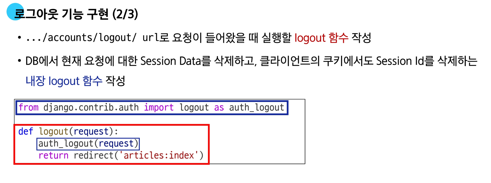
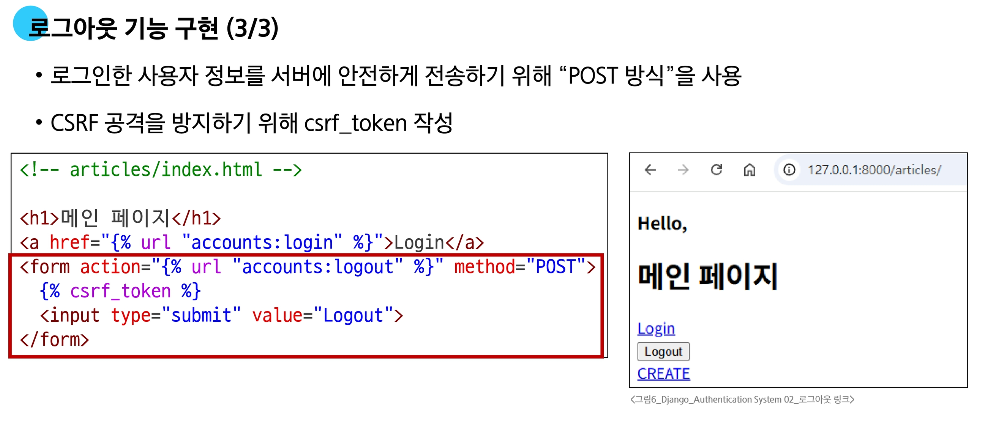

---

## 회원 가입

- User 객체를 Create 하는 과정
- 사용자로부터 아이디, 비밀번호 등의 정보를 입력 받아, DB에 새로운 User 객체를 생성하고 저장

#### 회원가입 기능 구현

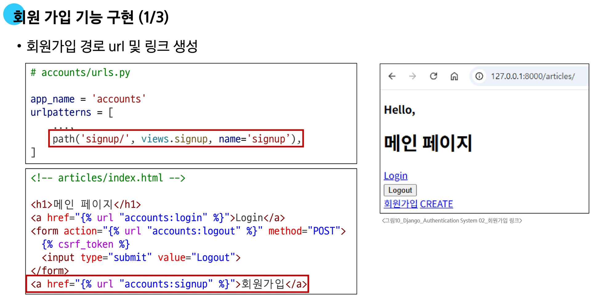
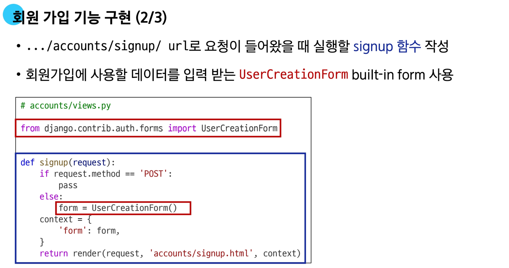
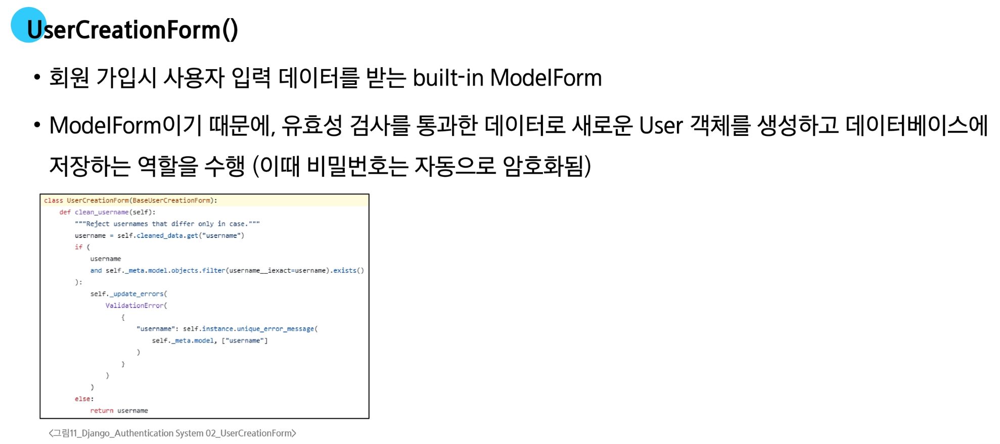
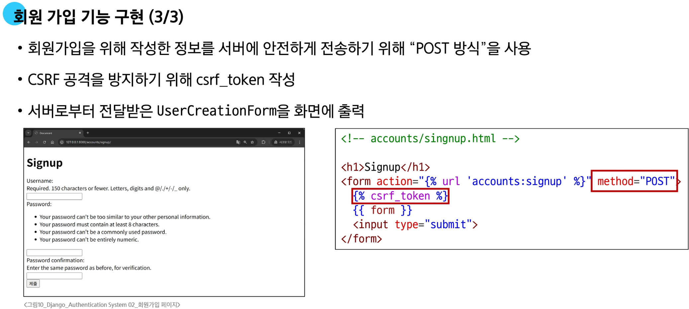

---

#### 에러 발생

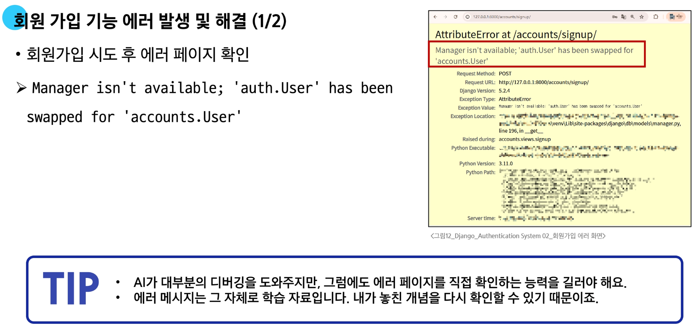
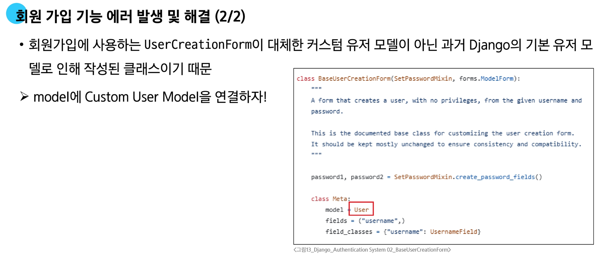

**Form 재작성**

- Custom User model을 사용할 수 있도록 상속 후 일부분만 재작성

```python
# accounts/forms.py

from django.contrib.auth import get_user_model
from django.contrib.auth.forms import UserCreationForm

class CustomUserCreationForm(UserCreationForm):
  class Meta(UserCreationForm.Meta):
    model = get_user_model()
```

**get_user_model()**

- "현재 프로젝트에서 활성화 된 사용자 모델(active user model)"을 반환하는 함수
  
  - 프로젝트 설정(`AUTH_USER_MODEL`)에 따라 기본 `User` 모델일 수도, 우리가 직접 만든 커스텀 `User` 모델일 수도 있기 때문에 올바른 모델을 동적으로 가져오기 위함

  - 모델을 직접 가져오는 대신 `get_user_model()`을 쓰면, `User`모델이 바뀌어도 코드를 수정할 필요가 없어져 재사용성과 유연성이 높아짐
  
**User 모델을 직접 참조하지 않는 이유**

- get_user_model()을 사용해 `User `모델을 참조하면 커스텀 `User` 모델을 자동으로 반환해주기 때문

- Django는 필수적으로 `User` 클래스를 직접 참조하는 대신 `get_user_model()`을 사용해 참조해야 한다고 강조하고 있음

#### 회원가입 로직 완성

- 내장 Form이었던 `UserCreationForm`을 `CustomUserCreationForm`으로 변경
  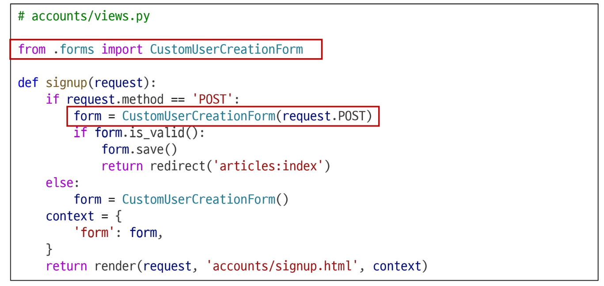

---

## 회원 탈퇴

- `User` 객체를 `Delete` 하는 과정

- <span style='color:darkred'>request.user.delete()</span>를 활용해서 유저 객체 삭제를 진행

#### 회원 탈퇴 로직 작성

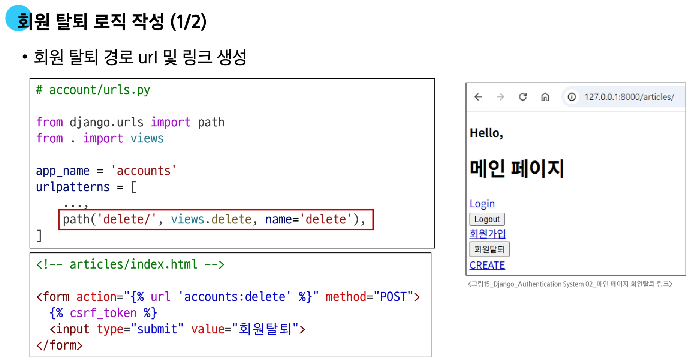
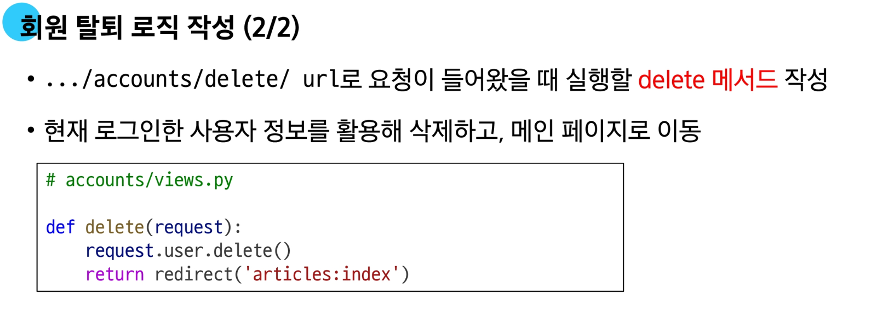 

---

# 인증된 사용자에 대한 접근 제한

**1. `is_authenticated` 속성**

- 사용자가 인증되었는지 여부를 알 수 있는 User model의 읽기 전용 속성

- 인증 사용자에 대해서는 항사 True, 비인증 사용자에 대해서는 항상 False

- 사용되는 경우
  - 사용자의 로그인 상태에 따라 다른 메뉴를 보여줄 때
  - view 함수 내에서 특정 기능을 로그인한 사용자에게만 허용하고 싶을 때

**2. `login_required` 데코레이터**

-인증된 사용자에 대해서만 view 함수를 실행시키는 데코레이터

- 비인증 사용자의 경우 /accounts/login/ 주소로 redirect 시킴

- 사용되는 경우
  - 게시글 작성, 댓글 달기 등 누가 작성했는지 중요한 곳에서 사용