# Auth3

## 회원정보 수정

- User 객체를 Update 하는 과정

- 수정할 대상 User 객체를 가져오고, 입력받은 새로운 정보로 기존 내용을 갱신

#### 회원정보 수정 기능 구현
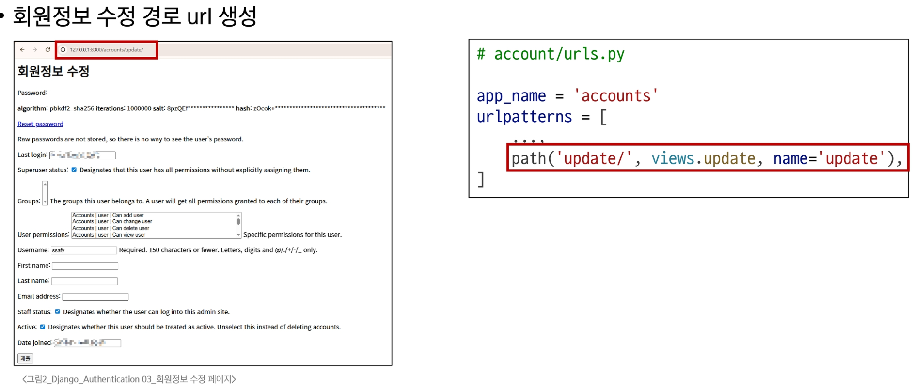
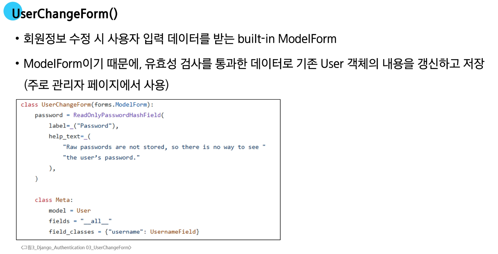
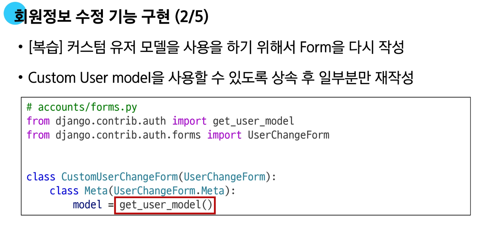
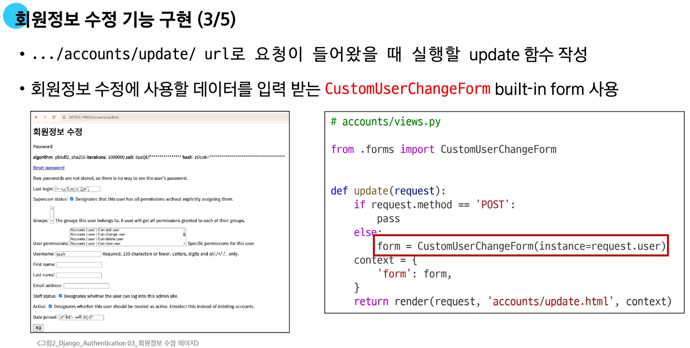
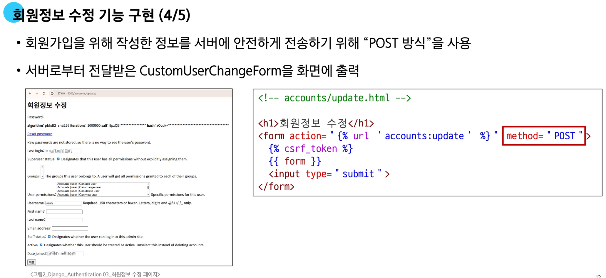
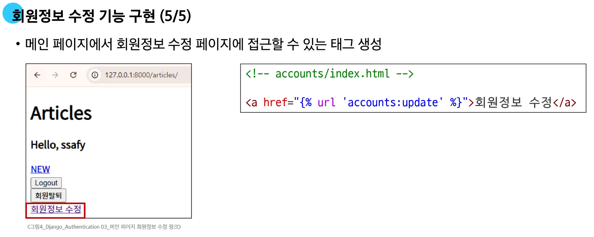
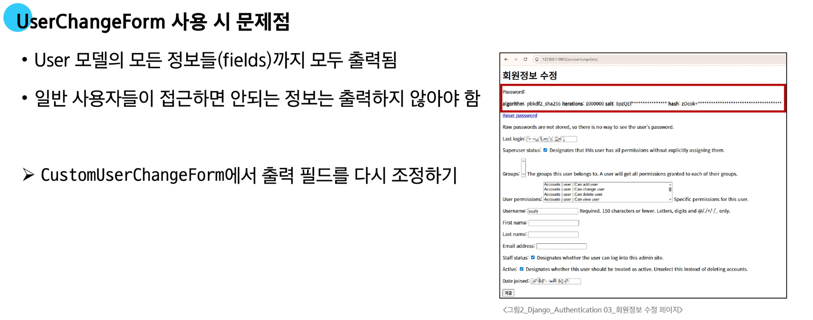
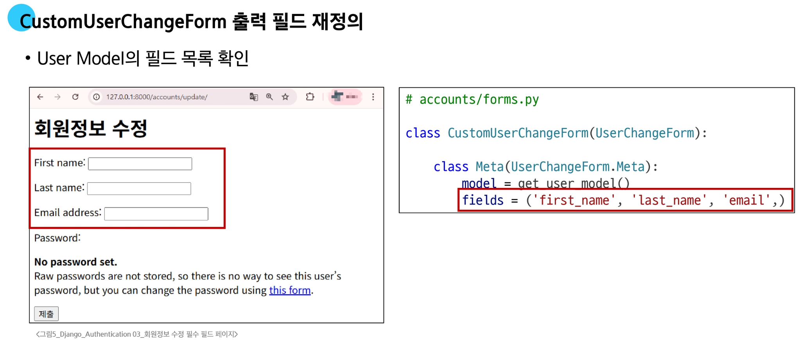
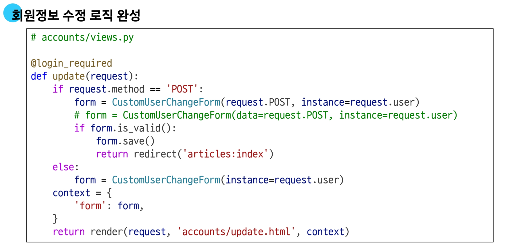

---

## 비밀번호 변경

- 인증된 사용자의 *Session* 데이터를 Update 하는 과정

- 기존 비밀번호를 통해 사용자를 인증하고, 새로운 비밀번호를 암호화하여 갱신

#### 비밀번호 변경 기능 구현

- Django는 비밀번호 변경 페이지를 회원정보 수정 form 하단에서 <span style='color:darkred'>별도 주소</span>로 안내
  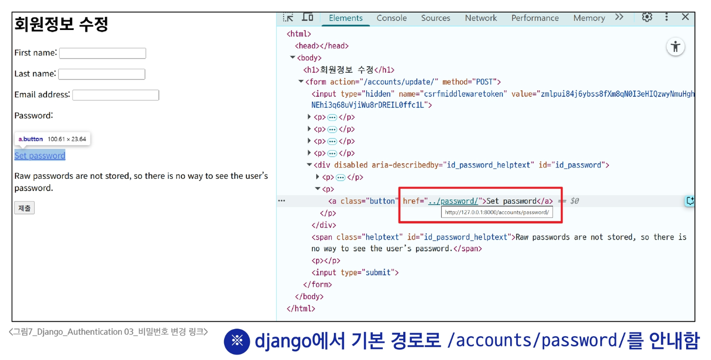
  
**(2/5)**

- Django에서 안내하는 <span style='color:darkred'>비밀번호 변경 URL</span>에 맞춰서 작성
  ```python
  # accounts/urls.py
  
  app_name = 'accounts'
  urlpatterns = [
    path('password/', views.password, name='password'),
  ]
  ```
  
**(3/5)**

- `.../accounts/password/url`로 요청이 들어올 때 실행할 password 함수 작성

- 비밀번호 변경에 사용할 데이터를 입력 받는 <span style='color:darkred'>PasswordChangeForm</span> built-in form 사용
  ```python
  # accounts/views.py
  
  from django.contrib.auth.forms import PasswordchangeForm
  
  def password(request):
      if request.method == 'POST':
          pass
      else:
          form = PasswordChangeForm(request.user)
      context = {
          'form': form,
      }
      return render(request, 'accounts/password.html', context)
  ```
    
**PasswordChangeForm()**

- 비밀번호 변경 시 사용자 입력 데이터를 받는 <span style='color:darkred'>built-in Form</span>

- 일반 'Form'이며, 유효성 검사(기존 비밀번호 확인, 새 비밀번호 일치 여부)를 통과한 데이터로 사용자의 비밀번호를 안전하게 암호화하여 갱신하는 역할을 수행

**(4/5)**

```html
<!-- accounts/change_password.html -->

<h1>비밀번호 변경</h1>
<form action="" method="POST">
  
  {{ form }}
  <input type="submit">
</form>
```
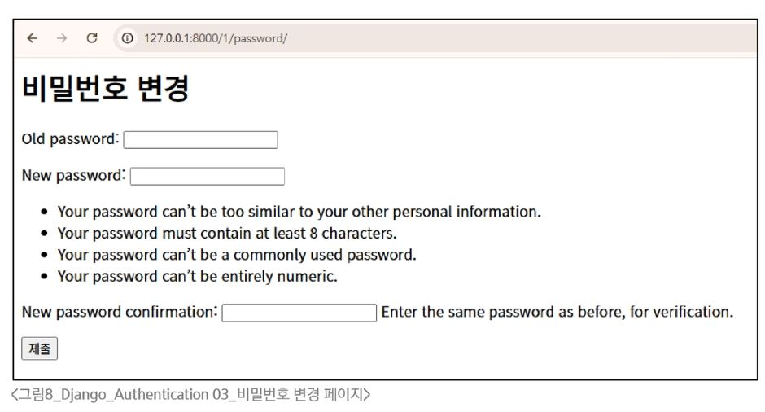

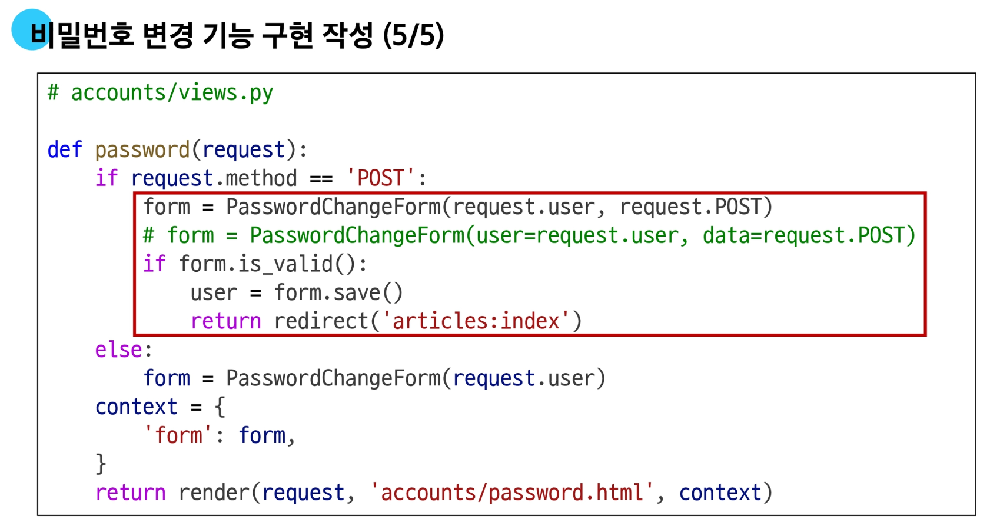

---

## 세션 무효화 방지

**암호 변경 시 세션 무효화**

- 비밀번호가 변경되면 기존 세션과의 회원 인증 정보가 일치하지 않게 되어 로그인 상태가 유지되지 못함

-> 암호 변경 시 세션 무효화를 막는 방법은?

**세션 무효화를 막아주는 함수**
```python
update_session_auth_hash(request, user)
```
- 암호가 변경되면 새로운 password의 Session Data로 기존 session을 자동으로 갱신
- update_session_auth_hash를 password 함수에 적용
  ```python
  # accounts/views.py
  
  from django.contrib.auth import update_session_auth_hash
  
  def password(request):
      if request.method == "POST":
        form.PasswordChangeForm(request.user, request.POST)
        if form.is_valid():
          user = form.save()
          update_session_auth_hash(request, user)  # 바로 여기
          return redirect('articles:index")
  ```
  
---

## 비밀번호 암호화

- 해킹 사태가 발생해 데이터가 유출되더라도 그 내용을 알 수 없도록 하는 암호화는 특히 중요

**우리가 사용하는 비밀번호는 어떻게 저장되고 있을까? (1/3)**

**1. 사용자가 입력한 비밀번호 <span style='color:darkred'>그대로</span> 저장하는 방식 => <span style='color:darkred'>보안에 매우 취약</span>**
  - 데이터베이스가 해킹당하면, 공격자는 아이디와 비밀번호 목록을 그대로 손에 넣게 되고, <br>이를 통해 <span style='color:darkred'>직접 로그인</span>하여 개인정보, 금융 정보, 주소록 등 모든 데이터를 유출하거나 서비스를 악용할 수 있음
  - 악의적인 내부 직원이 데이터베이스에 접근하여 모든 사용자의 비밀번호를 볼 수 있음
  - 대부분의 사람들은 여러 서비스에서 동일한 아이디와 비밀번호를 사용하기에 탈취한 정보를 이용해 다른 사이트에 그대로 대입하여 2차 피해를 발생시킴(Credential Stuffing 공격)

**2. 일정한 규칙에 따라 비밀번호를 알아볼 수 없는 문자로 <span style='color:darkred'>인코딩</span>한 후 저장 => <span style='color:darkred'>보안에 매우 취약</span>**
  - 데이터베이스에 알아볼 수 없는 문자로 저장되어 있다고 하더라도,<br>인코딩은 <u>비밀키</u> 없이도 정해직 규칙에 따라 누구나 <span style='color:darkred'>원래의 값으로 되돌릴 수 있음</span>
  - 공격자는 아주 간단한 디코딩 작업만으로 모든 사용자의 실제 비밀번호를 즉시 알아낼 수 있음
  - 사실상 비밀번호를 평문으로 저장하는 것과 동일한 수준의 위험

**비밀번호를 <span style='color:darkred'>복원이 불가능</span>한 고정된 길이의 문자열로 변환 후 저장 => <span style='color:darkblue'>보안에 필수</span>**
  - 데이터베이스가 유출되어도 공격자는 복잡하게 얽힌 문자열을 보게 되고, 복원이 불가능하기 때문에 실제 비밀번호를 알 수 없음
  - 악의적인 내부 직원이 비밀번호를 보더라도 암호화된 비밀번호를 보게 되므로, 실제 비밀번호를 유추할 수 없음
  -> 비밀번호를 복원이 불가능한 고정된 길이로 바꾸는 과정을 <span style='color:darkred'>"해시(hash)"</span>라고 함
  
  ---
  
### 해시
  
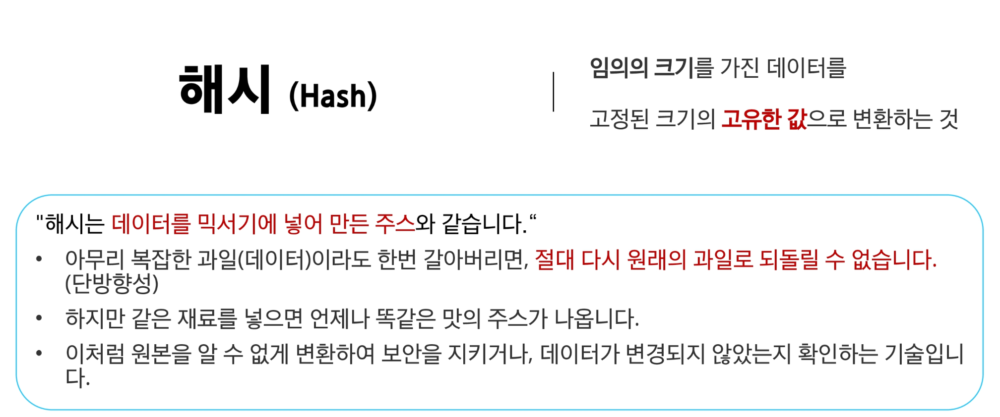
  
### 해시 함수
  
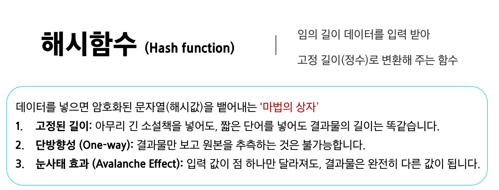
  
**해시(hash)**
  
- 데이터를 고정된 크기의 값으로 변환하는 과정
- 작은 변화에도 해시값이 크게 달라지는 특성으로 인해 변조 여부를 쉽게 확인할 수 있음
- 입력값이 들어오더라도 해시 함수에 의해서 다른 값으로 바뀌며, 동일한 값은 항상 동일한 해시값을 생성
  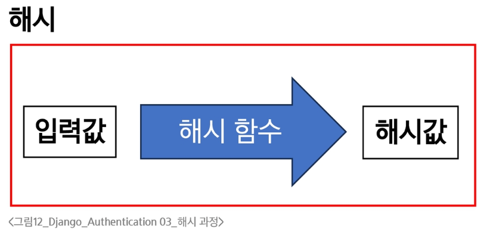
    
**Django는 기본적으로 <span style='color:darkred'>SHA-256</span> 해시 함수를 사용해서 암호화**

- 입력한 비밀번호의 길이와는 상관없는 동일한 길이의 해시 값을 생성
- 1글자만 다르더라도 전혀 다른 해시 값을 생성
- 작성한 비밀번호
  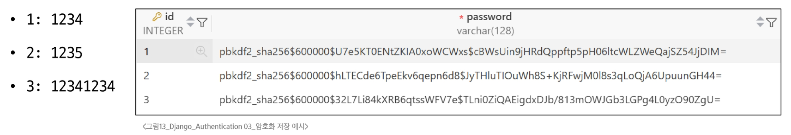
  
### SHA-256

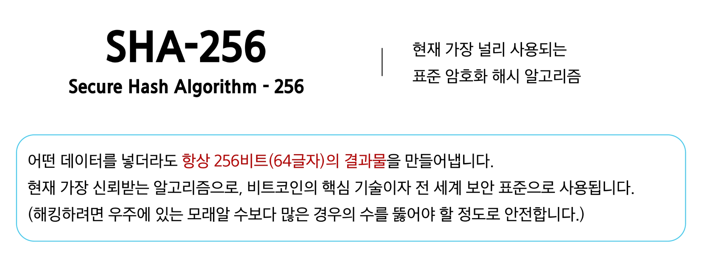

**해시 함수를 활용해 단방향 암호화를 하면 더 이상 문제가 없을까?**

- 비밀번호를 해시 값으로 저장하면 공격자가 유출된 데이터베이스를 봐도 원래 비밀번호를 알 수 없으니 안전해 보일 수 있음
- 하지만 공격자들은 해시 값을 미리 계산해두는 방식으로 공격을 시도
-> 이 방식이 바로 <span style='color:darkred'>'레인보우 테이블'</span> 공격

**레인보우 테이블(Rainbow Table)**

- 공격자가 자주 사용되는 비밀번호들(예: 123456, qwer1234, ...)을 <span style='color:darkred'>미리 수백만, 수식업 개를 해시로 변환</span>해 저장해 둔 거대한 정답지
  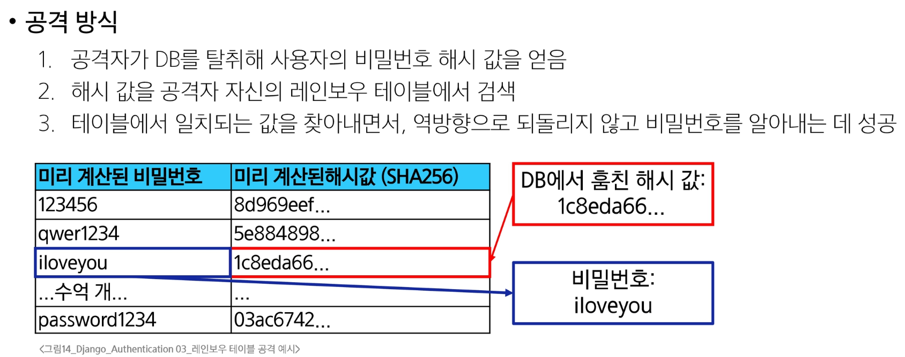
  
**그러면 레인보우 테이블 공격은 어떻게 방어할까?**

- 공격자가 아무리 거대한 레인보우 테이블을 가지고 있더라도, 사용자의 해시 값이 레인보우 테이블에 없도록 해시 값을 만들면 됨

- 해시 값은 입력값이 단 한 글자만 달라져도 해시값은 완전히 달라지는 눈사태 효과가 있음
- 결국 같은 비밀번호라도 사용자마다 <span style='color:darkred'>"임의의 문자열"</span>을 비밀번호에 붙여서 해시 암호화를 진행
  - 임의의 문자열이 추가된 상태로 해시 값을 만들기 때문에 눈사태 효과에 의해 같은 비밀번호도 다른 해시 값이 나옴

-> 여기서 "임의의 문자열" 역할을 하는 것이 바로 <span style='color:darkred'>"솔트(Salt)"</span>
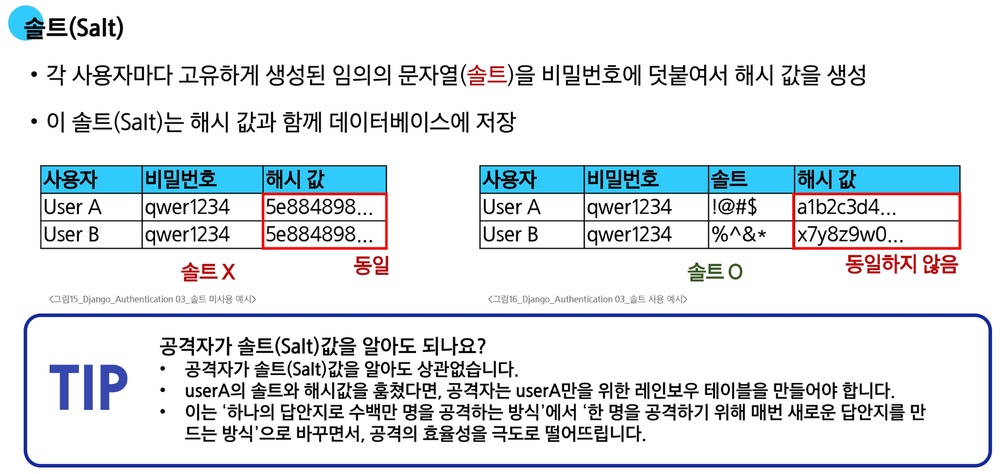

**솔트(Salt)로 레인보우 테이블 공격을 막았으니, 안전할까?**

- 공격자는 이제 미리 만들어 둔 답안지를 쓸 수 없어짐
- 그래서 단순하지만 확실한 방법으로 <span style='color:darkred'>가능한 모든 비밀번호를 하나씩 직접 대입</span> 해보는 방식으로 공격
- 이 방식은 현대 컴퓨터의 연산력 때문에 생각보다 훨씬 위협적
  - 최신 GPU는 초당 약 1,500억 번 이상 추측 가능
  
-> 이 방식이 바로 <span style='color:darkred'>"무차별 대입 공격(Brute-force Attack)"</span>
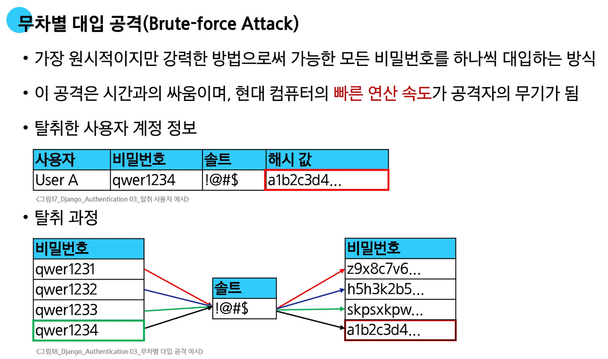

**무차별 대입 공격(Brute-force Attack)은 어떻게 막을까?**

- 공격자는 현대 컴퓨터의 <span style='color:darkred'>빠른 연산 속도</span>를 무기로 공격을 시도하고 있음
- 결국 해결책은 <span style='color:darkred'>"연산 속도를 늦추는 것"</span>이 핵심
- 연산 속도를 늦추기 위해서 의도적으로 비밀번호 검증 과정을 느리게 만듬
  - 느리게 만들기 위해서 의도적으로 해시 연산을 수십만 번 반복시켜 공격을 늦춤
  
-> 이 방식이 바로 <span style='color:darkred'>"키 스트레칭(Key Stretching"</span>
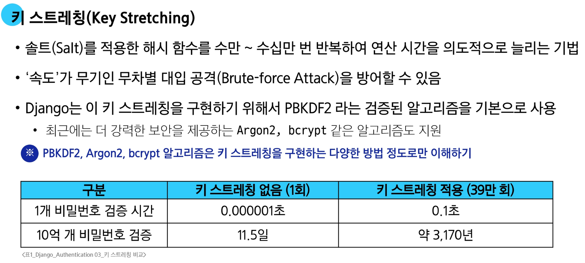