# ORM

- Object-Relational-Mapping
  - 객체 지향 프로그래밍 언어의 객체(Object)와 데이터베이스의 데이터를 매핑(Mapping)하는 기술

- **문제상황**
  
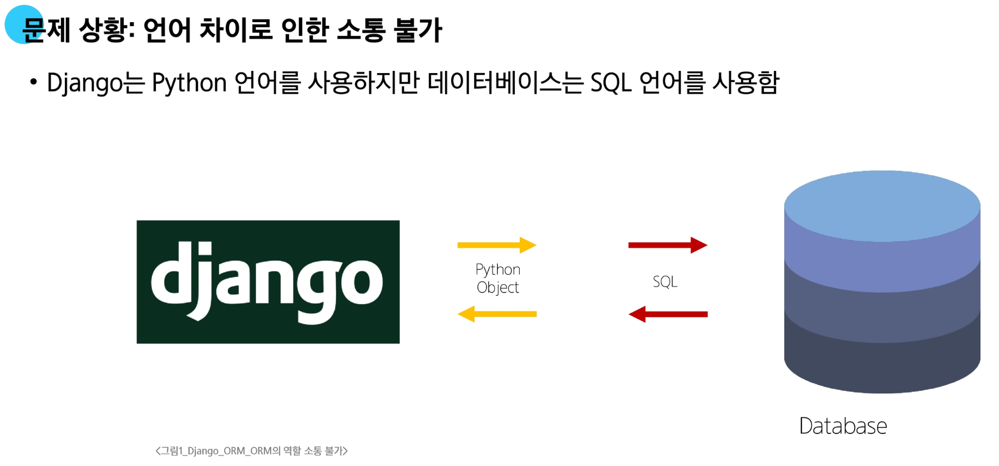

- **ORM의 역할**

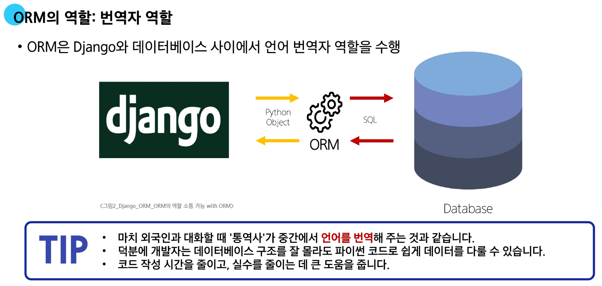

- **Django의 데이터 상호작용: ORM이 일하는 방법**

  - ORM은 Django 개발자를 위해 'QuerySet API'라는 특별한 도구를 제공
    - QuerySet API는 ORM의 기능을 개발자가 Python 코드 안에서 객체 지향적이고 직관적인 방식으로 데이터베이스를 조작할 수 있도록 제공하는 인터페이스

---

# QuerySet API

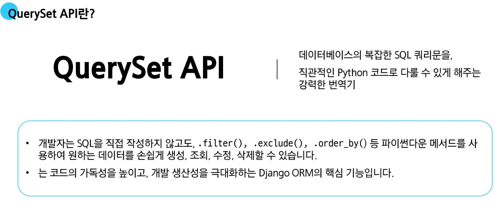

### QuerySet API와 ORM의 동작 방식

1. Django → DB: Django(QuerySet API)에서 ORM을 통해 데이터베이스로 정보를 요청할 때
   - SQL 쿼리로 변환되어 데이터베이스로 전달됨

2. DB → Django: 데이터베이스가 요청에 대한 응답을 보낼 때,
   - ORM은 이 SQL 결과를 다시 파이썬이 이해할 수 있는 Python Object
   - QuerySet 또는 Instance 형태로 변환하여 Django로 반환
   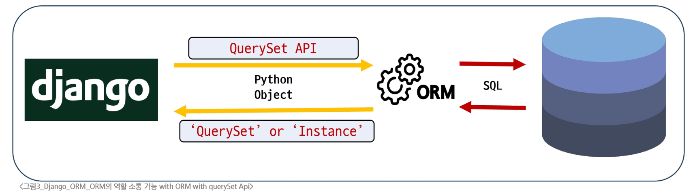
   
### QuerySet API 구문 기본 구조

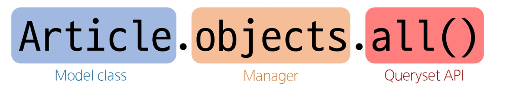

- `Article` (모델 클래스)
  - 역할: 데이터베이스 테이블에 대한 Python 클래스 표현
  - `articles_article` 테이블의 스키마(필드, 데이터 타입 등)을 정의
  - Django ORM이 데이터베이스와 상호작용할 때 사용하는 기본적인 구조체

- `objects` (매니저, manager)
  - 역할: 데이터베이스 조회(Query) 작업을 위한 기본 인터페이스
  - 모델 클래스가 데이터베이스 쿼리 작업을 수행할 수 있도록 하는 진입점
  - Django는 모든 모델에 objects라는 이름의 매니저를 자동으로 추가하며, 이 매니저를 통해 `.all()`, `.filter()` 등의 쿼리 메서드를 호출

- `.all()` (QuerySet API 메서드)
  - 역할: 특정 데이터베이스 작업을 수행하는 명령
  - 매니저를 통해 호출되는 메서드로, 해당 모델과 연결된 테이블의 모든 레코드(rows)를 조회하라는 SQL 쿼리를 생성하고 실행

### Query란?

- **데이터베이스에 특정한 데이터를 보여 달라는 요청**

- **"쿼리문을 작성한다"**

  - "원하는 **데이터**를 얻기 위해 데이터베이스에 요청을 보낼 **코드**를 작성한다."

- **Django에서 Query가 처리되는 과정 정리**
  
  1. 파이썬 코드 → ORM: 개발자의 QuerySet API (파이썬 코드)가 ORM으로 전달
  2. ORM → SQL 변환: ORM이 이를 데이터베이스용 SQL 쿼리로 변환하여 데이터베이스에 전달
  3. DB 응답 → ORM: 데이터베이스가 SQL 쿼리를 처리하고 결과 데이터를 ORM에 반환
  4. ORM → QuerySet 변환: ORM이 데이터베이스의 결과를 QuerySet (파이썬 객체) 형태로 변환하여 우리에게 전달

### QuerySet이란?

- 데이터베이스에서 전달받은 **객체 목록(데이터 모음)**
- 순회 가능한 데이터로 1개 이상 데이터를 불러와 사용 가능함
- Django ORM을 통해 만들어진 자료형
- 단, 데이터베이스가 단일 객체를 반환할 때는 QuerySet이 아닌 모델(Class)의 인스턴스로 반환됨

---

# QuerySet API 실습

## CRUD란?
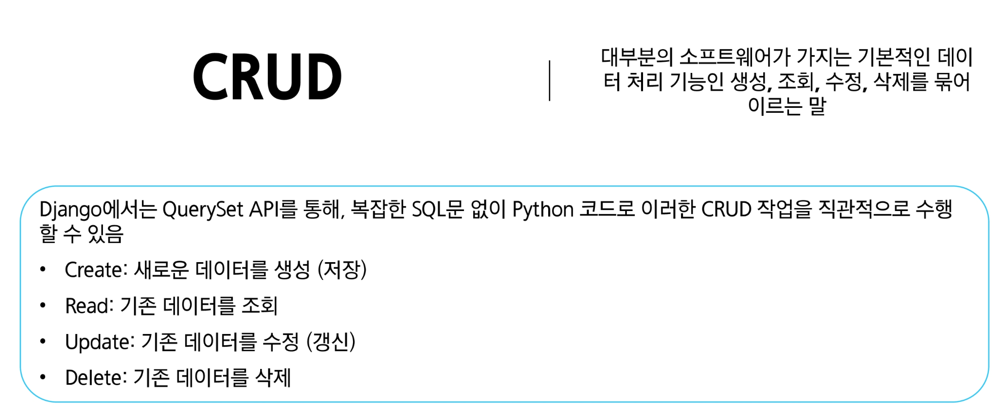


**실습 사전준비**

- **외부 라이브러리 설치 및 의존성 기록**
  - `IPython`은 일반 파이썬 셀(명령창)보다 **자동 완성 등** 편리한 파이썬 **작업 환경**을 만들어주는 도구
    ```bash
    $ pip install ipython
    ```
    ```bash
    $ pip freeze > requirements.txt
    ```
    
- **Django Shell 접속하기: Django Shell이란?**
  - Django 프로젝트의 코드를 명령창에서 바로 실행하고 테스트하는 특별한 파이썬 환경
  - Django 환경 내에서 실행되기 때문에 입력하는 QuerySet API 구문이 Django 프로젝트에 영향을 미침
  - Django Shell 접속하기
     ```bash
     $ python manage.py shell
     ```
     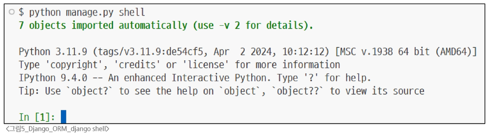
     
  - **`Shell "-v"` 옵션 (기본값: 1)**
    - 출력 상세도(verbosity level) 설정: 일반적인 정보 외에 더 많은 디버깅 정보나 진행 상황 메시지를 보여달라는 요청
    - 아래 예시는 shell 시작 시 **Django 프로젝트에 등록된 model**이 자동으로 import 된 내용이 출력된 것
      ```bash
      $ python manage.py shell -v 2
      ```
      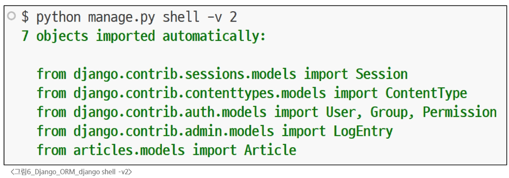
      
## Create
   
### 데이터 객체를 만드는 3가지 방법

1. 빈 객체 생성 후 값 할당 및 저장
2. 초기 값과 함께 객체 생성 및 저장
3. create() 메서드로 한 번에 생성 및 저장

**1. 첫번째 방법: 빈 객체 생성 후 값 할당 및 저장**

1. 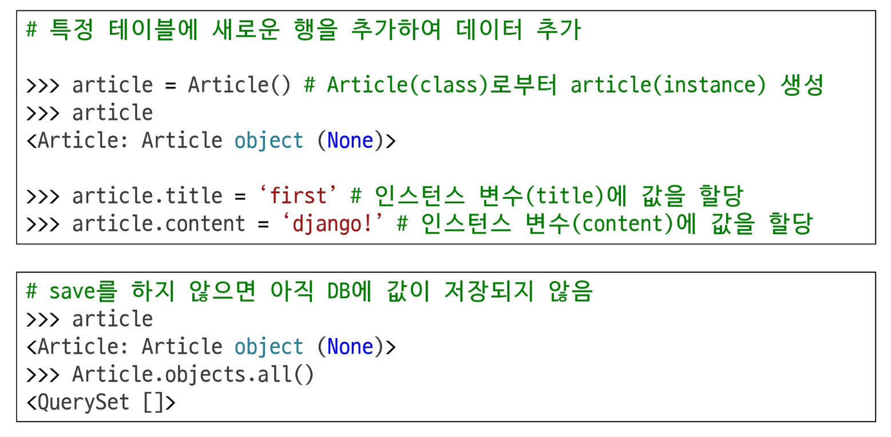
2. 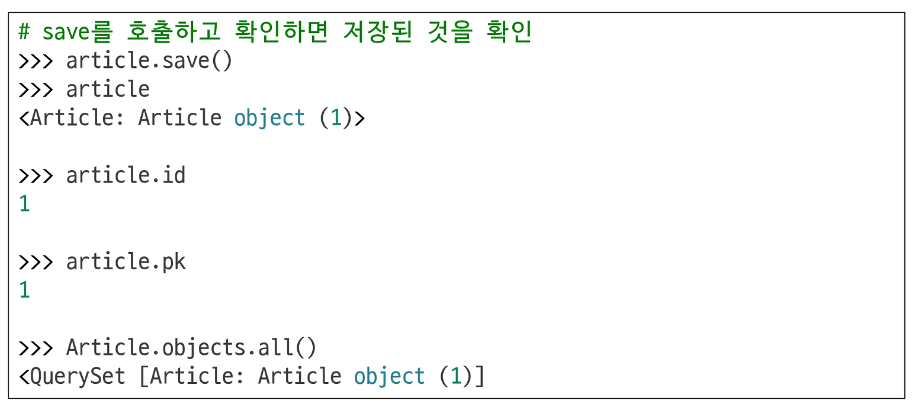
3. 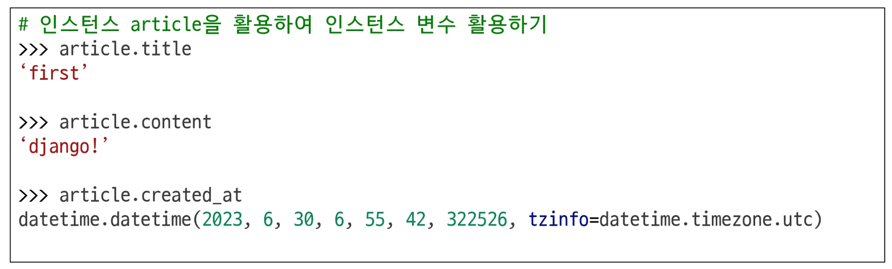

**2. 두번째 방법: 초기 값과 함께 객체 생성 및 저장**

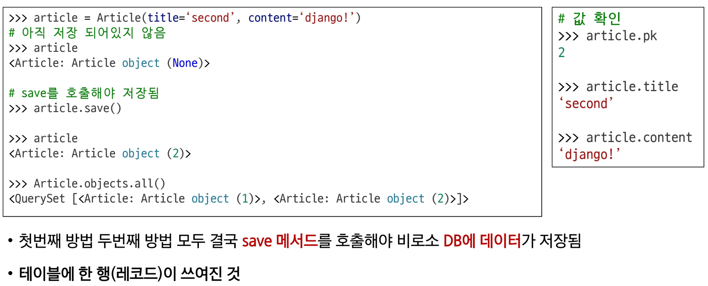

**3. 세번째 방법: create() 메서드로 한 번에 생성 및 저장**

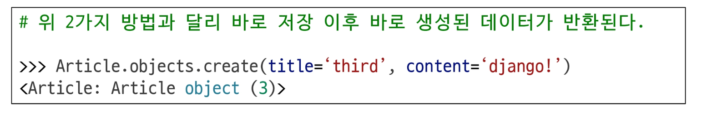

#### save() 메서드란?


## Read

**대표적인 조회 메서드**

- QuerySet 반환 메서드
  - `all()`
  - `filter()`
  
- QuerySet을 반환하지 않는 메서드
  - `get()`

**QuerySet 반환 메서드: `all()`**
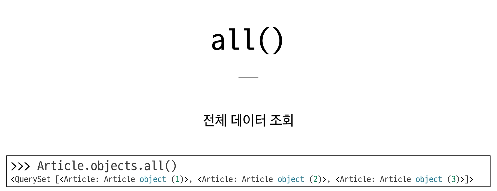

**QuerySet 반환 메서드: `filter()`**
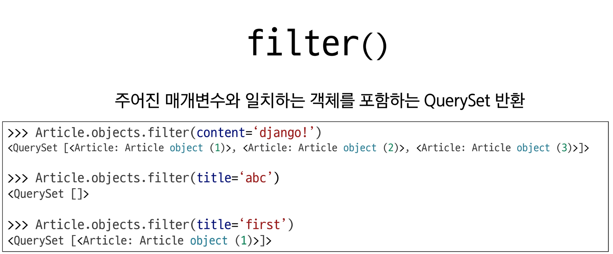

**QuerySet 비반환 메서드: `get()`**
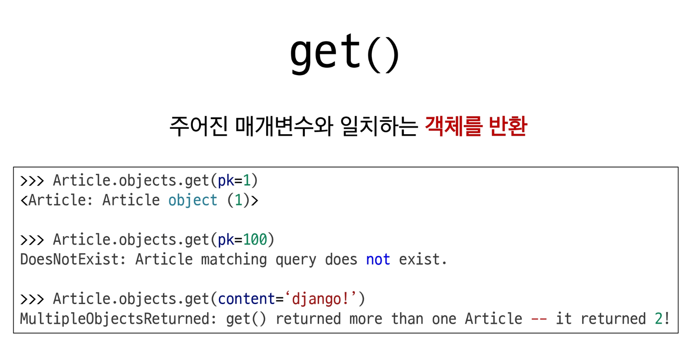

- **get()의 특징**
  - 객체를 찾을 수 없으면 `DoesNotExist` 예외를 발생
  - 둘 이상의 객체를 찾으면 `MiltipleObjectsReturned` 예외 발생
  -  위와 같은 특징 때문에 <span style='color:darkred'>primary key와 같이 고유성(uniqueness)를 보장하는 조회</span>에서 사용해야 함
   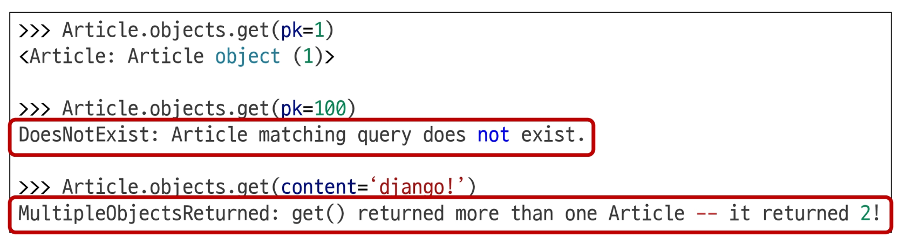
   
## Update

- **인스턴스 변수를 변경 후 save 메서드 호출**
  ```python
  # 수정할 인스턴스 조회
  >>> article = Article.objects.get(pk=1)
  
  # 인스턴스 변수를 변경
  >>> article.title = 'byebye'
  
  # 저장
  >>> article.save()
  ```
  
## Delete

- **삭제하려는 데이터 조회 후 delete 메서드 호출**
  ```python
  # 삭제할 인스턴스 조회
  >>> article = Article.objects.get(pk=1)
  
  # delete 메서드 호출 (삭제 된 객체가 반환)
  >>> article.delete()
  (1, {'articles.Article': 1})
  
  # 삭제한 데이터는 더이상 조회할 수 없음
  >>> Article.objects.get(pk=1)
  DoesNotExits: Article matching query does not exist.
  ```
  
---

# ORM with view
## 전체 게시글 조회
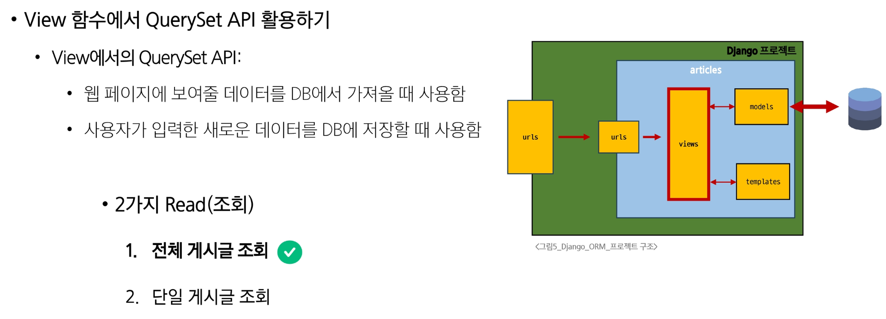
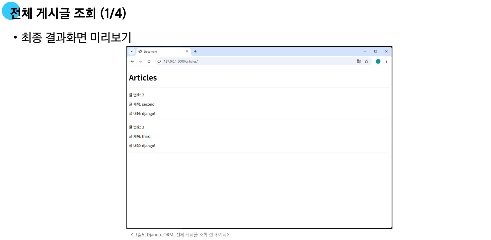
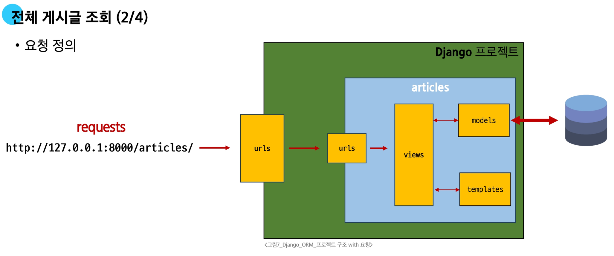
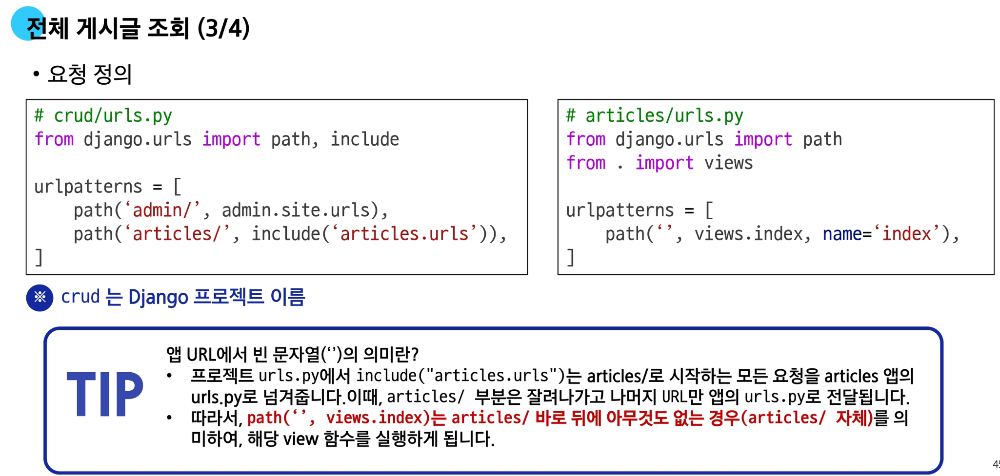
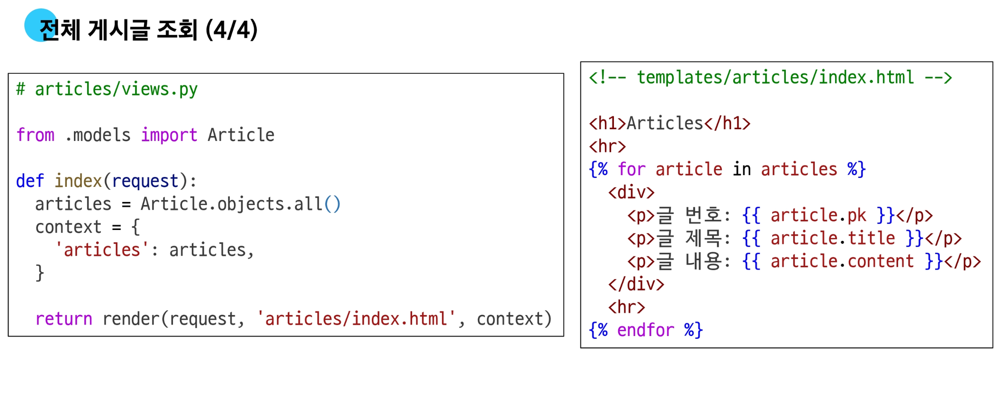


# 참고 - Field Lookup

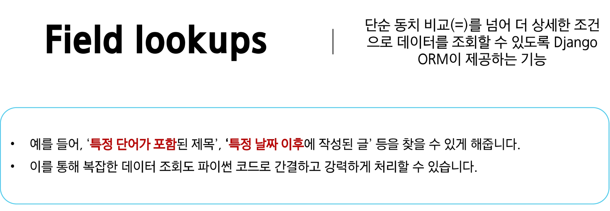

### 간단한 예시

- `title` 필드가 <span style='color:darkred'>'second'</span>으로 시작하는 `Article` 데이터(레코드)를 **모두** 찾고 싶다면?
  

- Field Lookups는 모델의 필드 이름 뒤에 <span style='color:darkred'>이중 밑줄(double underscore, __)</span>을 붙이고, 원하는 조회 유형을 명시하는 방식으로 사용
- `filter()`, `exclude()` 및 `get()`에 대한 키워드 인자로 지정, 손쉽게 필터링 로직을 구성
  ```python
  # Field lookups 예시
  # "내용에 'dja'가 포함된 모든 게시글 조회"
  Article.objects.filter(content__contains='dja')
  
  # "제목이 he로 시작하는 모든 게시글 조회"
  Article.objects.filter(title__startwith='he')
  ```
  
### 다양한 조건의 Field lookups 조회 조건

- `exact` / `iexact`
  - `exact`: 대소문자를 구분하여 정확히 일치하는 값을 찾음
  - `iexact`: 대소문자 구분 없이(대소문자 무시) 정확히 일치하는 값을 찾음
  
- `contains` / `icontains`
  - `contains`: 문자열 내에 특정 값이 **포함**되어 있는지(대소문자 구분)
  - `icontains`: 문자열 포함 여부를 대소문자 구분 없이 확인
  
- 비교 연산자 (`gt, gte, lt, lte`)
  - 숫자 또는 날짜 필드에 대해 **크거나 작음**을 비교


# ORM, QuerySet API를 사용하는 이유

1. **데이터베이스 추상화**
   - 개발자는 특정 데이터베이스 시스템에 종속되지 않고 일관된 방식으로 데이터를 다룰 수 있음

2. **생산성 향상**
   - 복잡한 SQL 쿼리를 직접 작성하는 대신 Python 코드로 데이터베이스 작업을 수행할 수 있음

3. **객체 지향적 접근**
   - 데이터베이스 테이블을 Python 객체로 다룰 수 있어 객체 지향 프로그래밍의 이점을 활용할 수 있음