# ORM With View

### Read

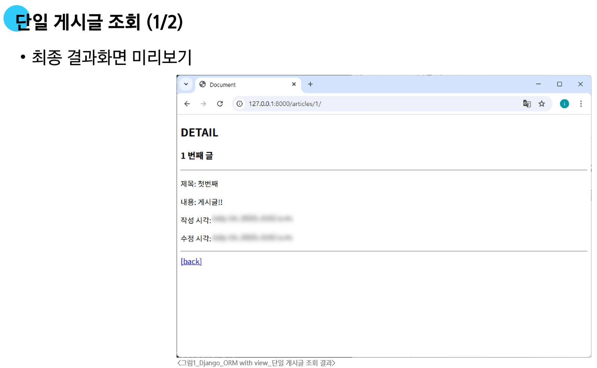
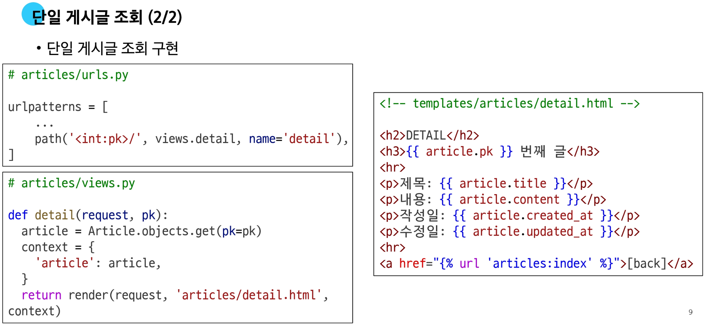

---

#### 단일 게시글 이동 페이지 링크 작성

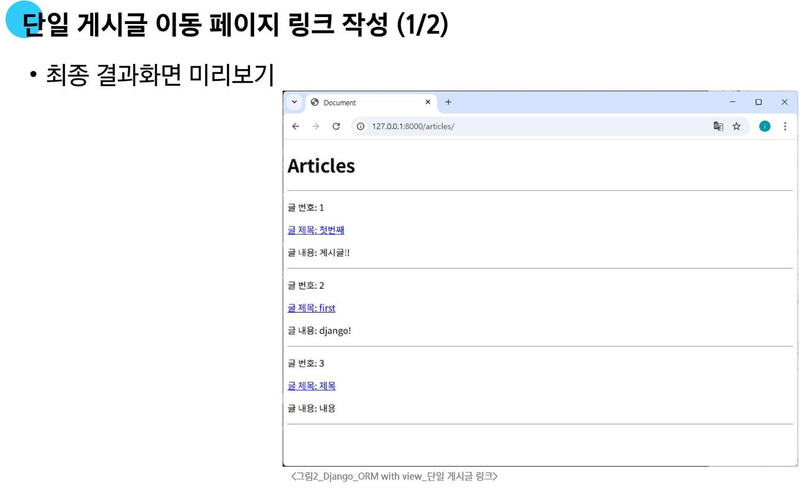
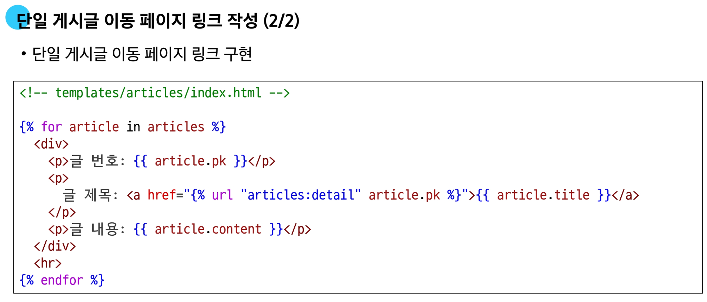

### Create

**Create 로직을 구현하기 위해 필요한 view 함수의 개수는?**

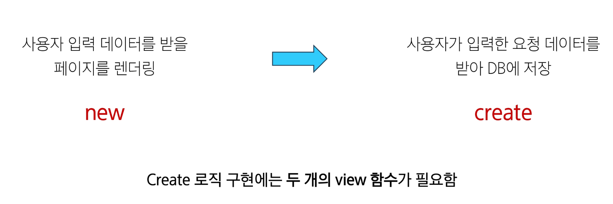

#### Create - 페이지 렌더링 기능 구현

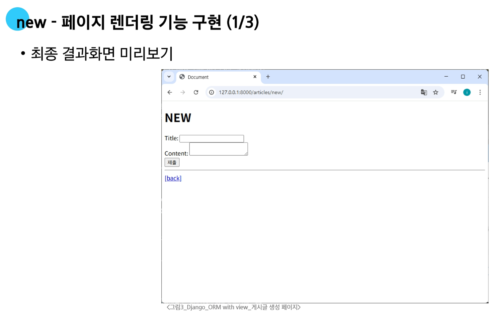
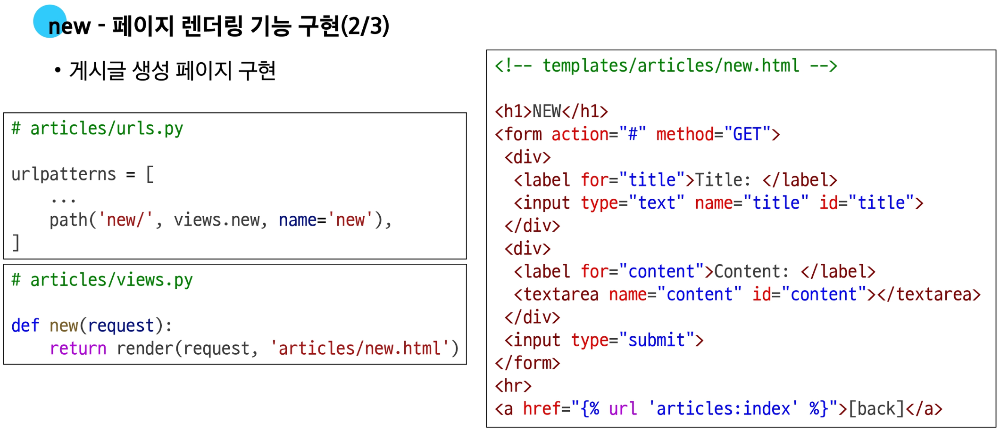
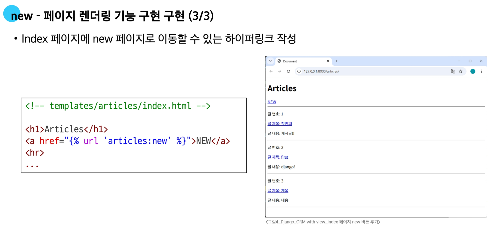

#### Create - 데이터 저장 기능 구현
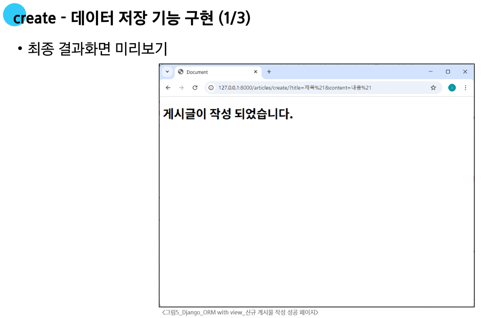
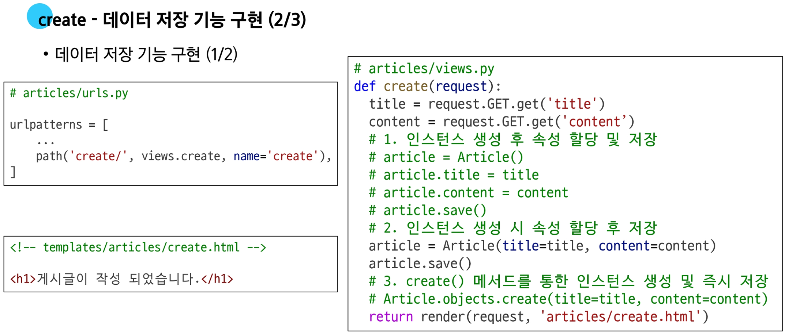
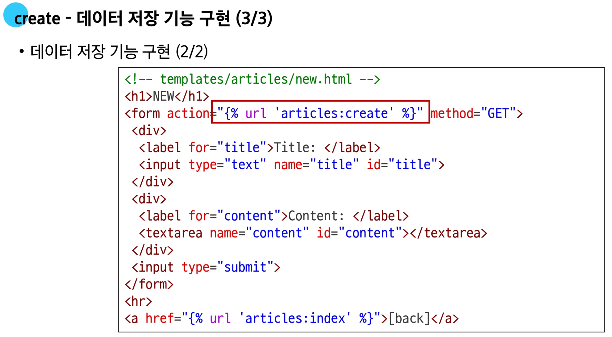

## HTTP request methods

#### HTTP

- 네트워크 상에서 **데이터(리소스)**를 주고받기 위한 약속

#### HTTP request methods란?

- 데이터에 대해 수행을 원하는 작업(행동)을 나타내는 것
  - 서버에게 원하는 작업의 종류를 알려주는 역할

- 대표적인 메서드
  - **GET**
    - 리소스 조회
      - URL에 데이터가 노출됨
      - 캐싱 가능

  - **POST**
    - 데이터 생성/전송
      - 요청 본문에 데이터
      - 데이터 노출 없음

### GET Method
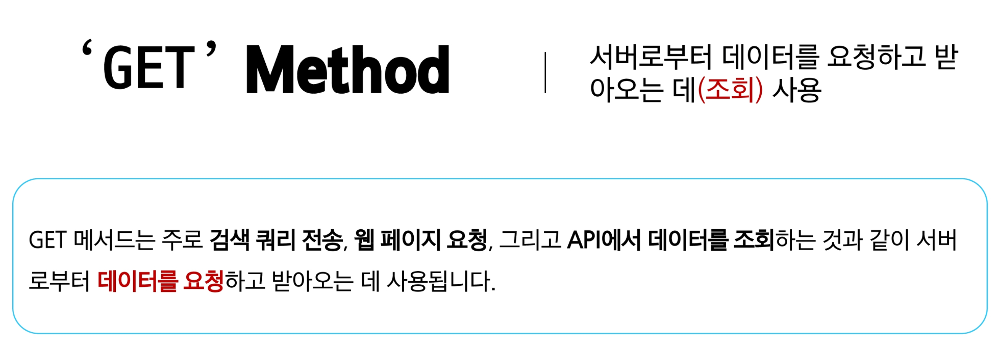

**`GET` 메서드 특징**

1. **데이터 전송**
   - URL의 쿼리 문자열(Query String)을 통해 데이터 전송
   - 127.0.0.1:8000/articles/create/?title=제목&content=내용

2. **데이터 제한**
   - URL 길이에 제한이 있어 대량의 데이터 전송에는 적합하지 않음
   
3. **브라우저 히스토리**
   - 요청 URL이 브라우저 히스토리에 남음

4. **캐싱**
   - 브라우저는 GET 요청의 응답을 로컬에 저장할 수 있음
   - 동일한 URL로 다시 요청할 때, 서버에 접속하지 않고 저장된 결과를 사용
   - 페이지 로딩 시간을 크게 단축

### POST Method
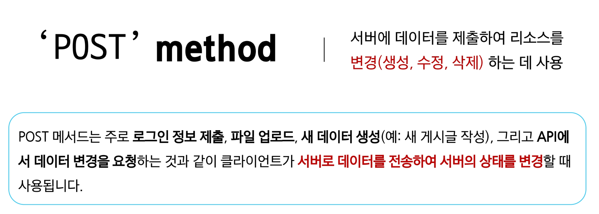

**`POST` 메서드 특징**

1. **데이터 전송**
   - HTTP Body를 통해 데이터 전송

2. **데이터 제한**
   - GET에 비해 더 많은 양의 데이터를 전송할 수 있음
   
3. **브라우저 히스토리**
   - POST 요청은 브라우저 히스토리에 남지 않음

4. **캐싱**
   - POST 요청은 기본적으로 캐시 불가
   - POST 요청이 일반적으로 서버의 상태를 변경하는 작업을 수행하기 때문

### `'GET'` & `'POST'` Method 정리

- **GET과 POST는 각각의 특성에 맞게 적절히 사용해야 함**

- GET
  - 데이터 조회

- POST
  - 데이터 생성이나 수정에 주로 사용

---

# CSRF
- Cross-Site-Request-Forgery
  - 사이트 간 요청 위조

- 사용자가 자신의 의지와는 무관하게 공격자가 의도한 행동(글쓰기, 정보 수정, 송금 등)을 특정 웹사이트에 요청하게 만드는 해킹 방식

### CSRF 공격 방식

1. **신뢰할 수 있는 관계 (로그인)**
   - 사용자는 은행(e.g. bank.com)에 정상적으로 로그인하여, 은행은 사용자를 신뢰하고 있다는 증표(세션 쿠키)를 브라우저에 발급. 이 쿠키가 바로 당신의 '인감도장'

2. **악성 위임장 (악성 링크)**
   - 해커는 "무료 경품 이벤트!"와 같은 미끼 링크를 사용자에게 전송. 이 링크의 실제 내용은 **"내 돈 100만원을 해커에게 송금"** 등으로 당신의 인감도장만 찍으면 되는 **'위조된 위임장'**

3. **나도 모르는 날인 (요청 전송)**
   - 사용자가 미끼 링크를 클릭하는 순간, 당신의 브라우저는 자기도 모르게 bank.com에 위조된 위임장(송금 요청)을 보냄. 이때 브라우저는 bank.com에 보낼 때마다 인감도장(세션 쿠키)를 자동으로 찍어 보냄.

4. **은행의 착각 (공격 성공)**
   - 은행 입장에서는 정상적인 인감도장이 찍힌 위임장이 도착했으므로, 이 요청이 당신의 진짜 의사라고 믿고 송금을 실행