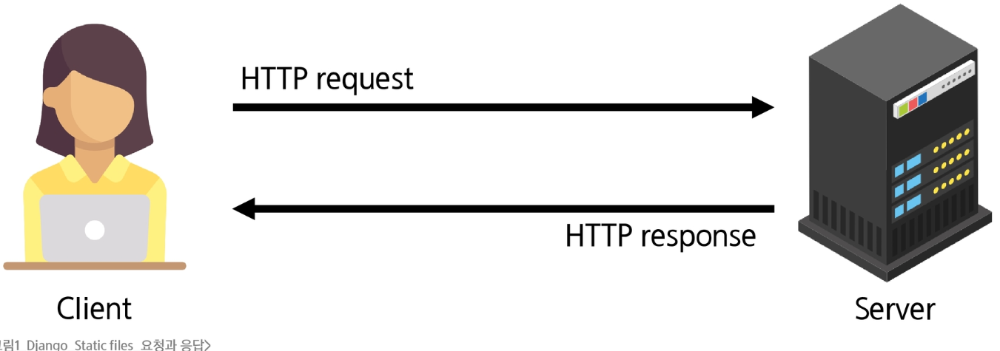
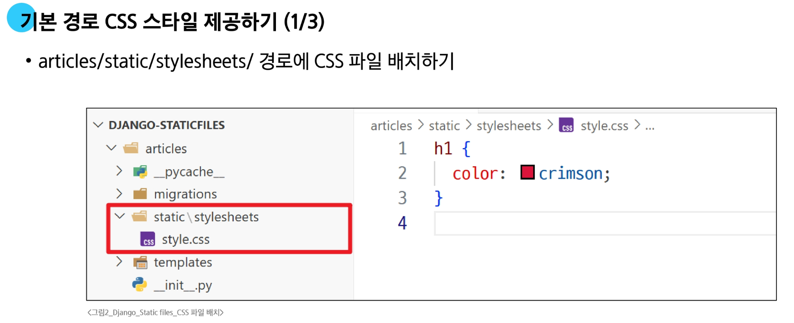
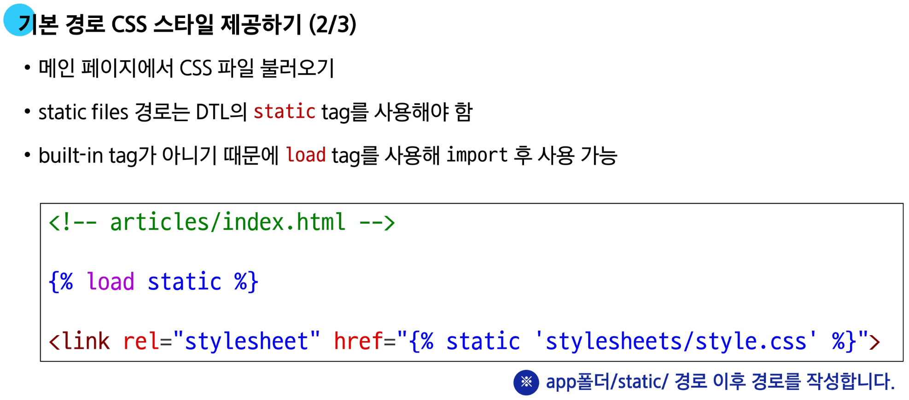
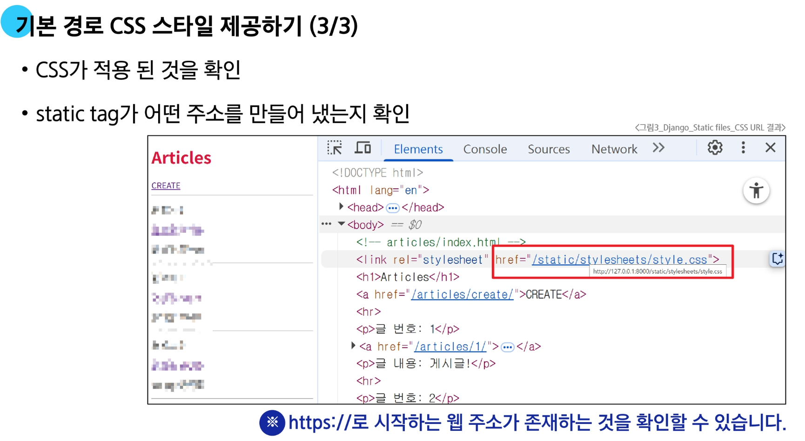
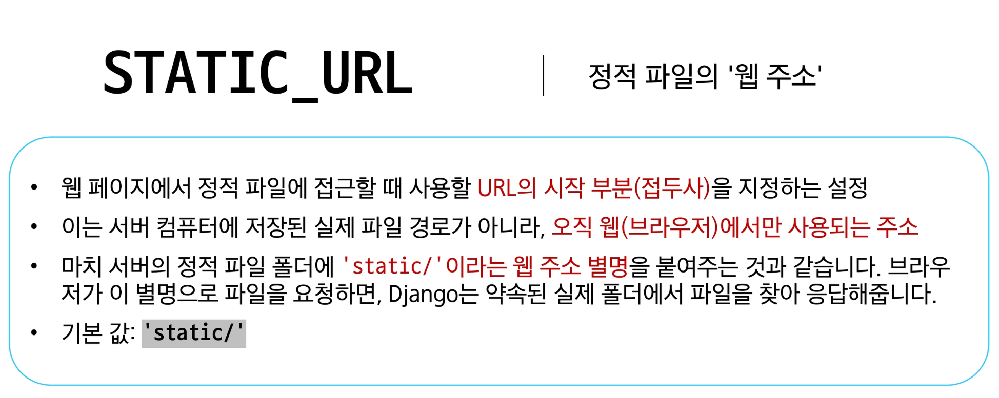
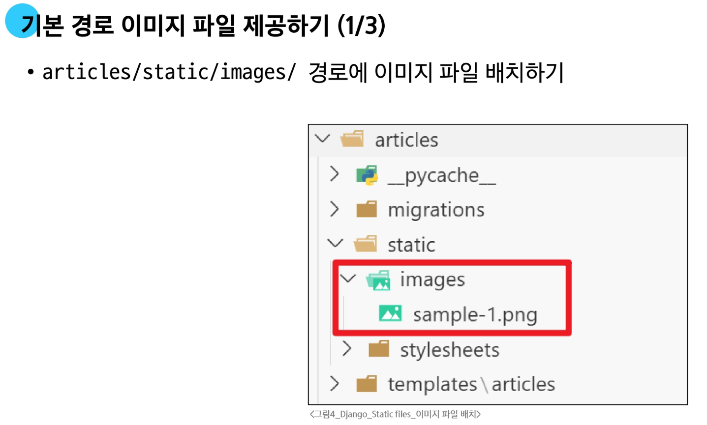
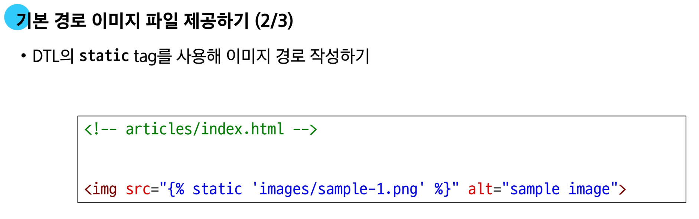
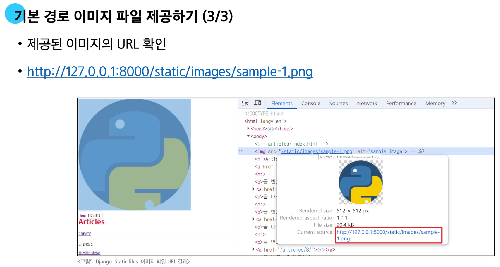
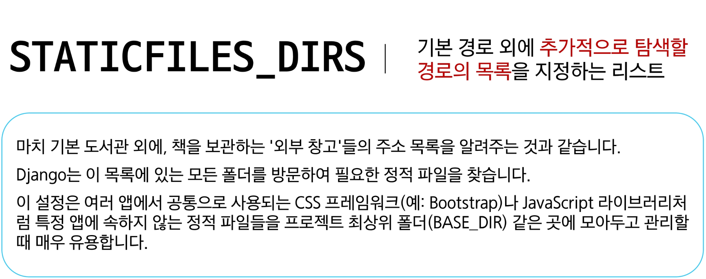
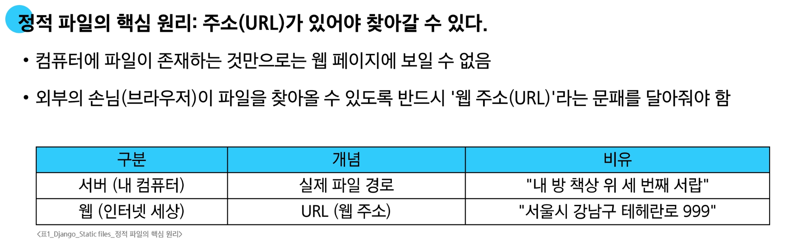

# Static files

**정적 파일**
- 서버 측에서 변경되지 않고 고정적으로 제공되는 파일
  - 대표적인 종류: CSS 파일, JavaScript 파일, 이미지 파일, 폰트 파일
  
## 웹 서버와 정적 파일

**웹 서버의 기본 역할**

- "요청 받은 주소`URL`에 해당하는 자원을 찾아 응답해주는 것"
- 마치 도서관 사서에게 "A-3 구역의 3번째 책을 주세요"라고 요청하면, 사서가 해당 위치로 가서 책을 찾아 우리에게 건네 주는 것과 같음
  - 여기서 `A-3 구역의 3번째`가 바로 <span style='color:darkred'>URL</span>이고, '책'이 <span style='color:darkred'>자원(Resource)</span>에 해당
  
  
**정적 파일과 URL의 관계**

- 웹 서버가 제공하는 가장 기본적인 자원이 바로 <span style='color:darkred'>정적 파일(Static Files)</span>

- 정적 파일 제공
  - 웹 서버는 요청받은 URL을 보고, 서버 컴퓨터의 특정 폴더에 저장된 `CSS`, `JS`, `이미지` 같은 정적 파일을 찾아 제공

- URL의 필요성
  - "정적 파일이 사용자에게 보이려면, 그 파일에 접근할 수 있는 고유한 주소(URL)가 반드시 필요하다."

**처리 과정 요약**

1. **사용자**: 브라우저에 `http://example.com/images/logo.png`라는 주소를 입력하여 이미지를 요청
2. **웹 서버**: `/images/logo.png`라는 URL을 확인하고, 서버에 미리 약속된 폴더에서 logo.png 파일을 찾음
3. **웹 서버**: 찾은 이미지 파일을 HTTP 응답에 담아 사용자에게 전송
4. **사용자**: 브라우저가 응답 받은 이미지 파일을 화면에 보여줌

---

## Static files 기본 경로

**Static files 경로의 종류**

1. 기본 경로
2. 추가 경로


**기본 경로 CSS 스타일 제공하기**





****

- 특정 라이브러리의 태그와 필터를 현재 템플릿에서 사용할 수 있도록 불러오는 역할

- ``은 `` 태그를 사용하기 위해, Django 템플릿 시스템에 '이제부터 static 관련 태그를 사용하겠다'라고 알려주는 <span style='color:darkred'>선언문</span>

****

- `settings.py` 파일의 `STATIC_URL` 값을 기준으로, 해당 정적 파일의 전체 URL 경로를 계산하여 생성

- 예를 들어, `STATIC_URL = 'static/`이고, CSS 파일이 `static/css/style.css`에 위치한다면, 경로가 필요한 위치에 ``로 작성

**STATIC_URL이란?**


---

**기본 경로 이미지 파일 제공하기**





---

## Static files 추가 경로

**<span style='color:darkred'>STATICFILES_DIRS</span>에** 문자열로 추가 경로를 설정

**STATICFILES_DIRS란?**



**STATICFILES_DIRS 설정**

- 이처럼 설정하면, Django는 기본 경로인 각 앱의 static/ 폴더를 모두 확인한 후, 프로젝트의 최상위 폴더에 있는 static/ 폴더도 추가로 탐색하게 됨
  ```python
  # settings.py
  
  STATICFILES_DIRS = [
    BASE_DIR / 'static',
  ]
  ```

