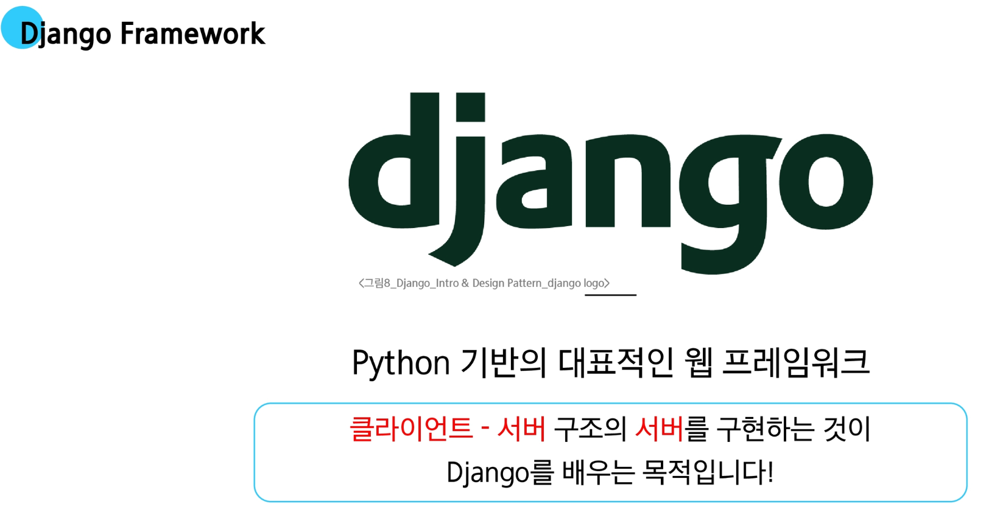

# django


**왜 장고를 사용할까?**

- **다양성**
  - Python 기반으로 웹, 모바일 앱 백엔드, API 서버 및 빅데이터 관리 등 광범위한 서비스 개발에 적합

- **확장성**
  - 대량의 데이터에 대해 빠르고 유연하게 확장할 수 있는 기능을 제공

- **보안**
  - 취약점으로부터 보호하는 보안 기능이 기본적으로 내장되어 있음

- **커뮤니티 지원**
  - 개발자를 위한 지원, 문서 및 업데이트를 제공하는 활성화 된 커뮤니티

## 가상환경

**Virtual Environment**

**가상 환경이 필요한 시나리오 1**

1. 한 개발자가 2개의 프로젝트(A와 B)를 진행해야 하는 상황
2. 프로젝트 A는 requests <u>패키지</u> 버전 1이 필요
3. 프로젝트 b는 requests <u>패키지</u> 버전 2가 필요
4. 하지만 파이썬 환경에서 패키지는 단일 버전만 존재 가능
5. A와 B가 다른 패키지 버전을 사용하기 위한 <span style="color:red">독립적인 개발 환경</span>이 필요
   
**가상 환경이 필요한 시나리오 2**

1. 한 개발자가 2개의 프로젝트(A와 B)를 진행해야 하는 상황
2. 프로젝트 A는 water <u>패키지</u>가 필요
3. 프로젝트 b는 fire <u>패키지</u>가 필요
4. 하지만 파이썬 환경에서 두 패키지는 함께 설치하면 충돌 발생
5. A와 B의 패키지 충돌을 피하기 위한 <span style="color:red">독립적인 개발 환경</span>이 필요

### 가상 환경 생성 및 활성화

**1. 가상 환경 생성**

```ps
$ python -m venv venv
```

- 현재 디렉토리 안에 venv라는 폴더가 생성됨
- venv 폴더 안에는 파이썬 실행 파일, 라이브러리 등을 담을 공간이 마련됨
- venv 라는 이름의 가상환경을 생성한것
  - <span style="color:darkblue">이름은 임의 생성 가능하지만 관례적으로 venv 사용</span>

**2. 가상 환경 활성화**

```ps
$ source venv/Scripts/activate
```
- 활성화 후, 프롬프트 앞에 (venv)와 같이 표시된다면 성공

  - <span style="color:darkblue">Mac/Linux에서는 명령어가 다름</span>
    ```bash
    $ source venv/bin/activate
    ```
    
**3. 가상 환경 종료**

```ps
$ deactivate
```
- 활성화한 상태에서 deactivate 명령을 입력하면, 다시 Python Global 환경으로 돌아옴

### 의존성 패키지

**의존성 (Dependencies)**

- 하나의 소프트웨어가 동작하기 위해 필요로 하는 다른 소프트웨어나 라이브러리

**패키지 목록 확인**

```ps
$ pip list
```

- 현재 가상 환경에 설치된 라이브러리 목록을 확인하는 명령어

- 갓 생성된 가상 환경은 추가 설치된 패키지가 없음

### 의존성 관리: 환경의 일치

**1. 의존성 기록(내보내기)**
```ps
$ pip freeze > requirements.txt
```

- 현재 가상환경에 설치된 모든 패키지와 버전을 파일로 저장

**2. 의존성 설치(가져오기)**
```ps
$ pip install -r requirements.txt
```

- requirements.txt에 명시된 라이브러리를 한 번에 설치

### 가상 환경 주의사항

1. 가상 환경에 "들어가고 나오는"것이 아니라 사용할 Python 환경을 <span style="color:red">On/Off</span>로 전환하는 개념
  - 가상 환경 활성화는 <span style="color:red">현재 터미널 환경</span>에만 영향을 끼침
  - 새 터미널 창을 열면 <span style="color:red">다시 활성화</span>해야 함
2. 프로젝트마다 <span style="color:red">별도의 가상 환경</span>을 사용
3. 일반적으로 가상 환경 폴더 venv는 <span style="color:red">관련된 프로젝트와 동일한 경로에 위치</span>시킴
4. 폴더 venv는 .gitignore파일에 작성되어 <span style="color:red">원격 저장소에 공유하지 않음</span>
   - 저장소 크기를 줄여 효율적인 협업과 배포
   - OS 별 차이점으로 인한 문제 방지
   - 대신 requirements.txt를 공유하여 각자의 가상 환경을 구성

# 요약

1. **가상 환경 생성**
    ```ps
    python -m venv venv
    ```
2. **가상 환경 활성화**
    ```ps
    source venv/Scripts/activate
    ```
3. **필요한 의존성 패키지 설치**
    ```ps
    pip install
    ```
4. **현재 환경의 패키지 목록을 `pip freeze > requirements.txt`로 저장하여 의존성을 관리**
5. **다른 컴퓨터나 팀원도 같은 환경이 필요하다면, `pip install -r requirements.txt`로 동일한 버전의 라이브러리를 설치**
6. **작업이 끝나면 `deactivate`로 가상 환경을 비활성화**

---

## Django 프로젝트

### 프로젝트 생성

**1. Django 설치**
```ps
$ pip install django
```
- 현재 환경에 Django 패키지를 설치
  
**2. 프로젝트 생성**
```ps
$ django-admin startproject firstpjt .
```
- `firstpjt`라는 이름의 django 프로젝트 생성

**3. 서버 실행**
```ps
$ python manage.py runserver
```