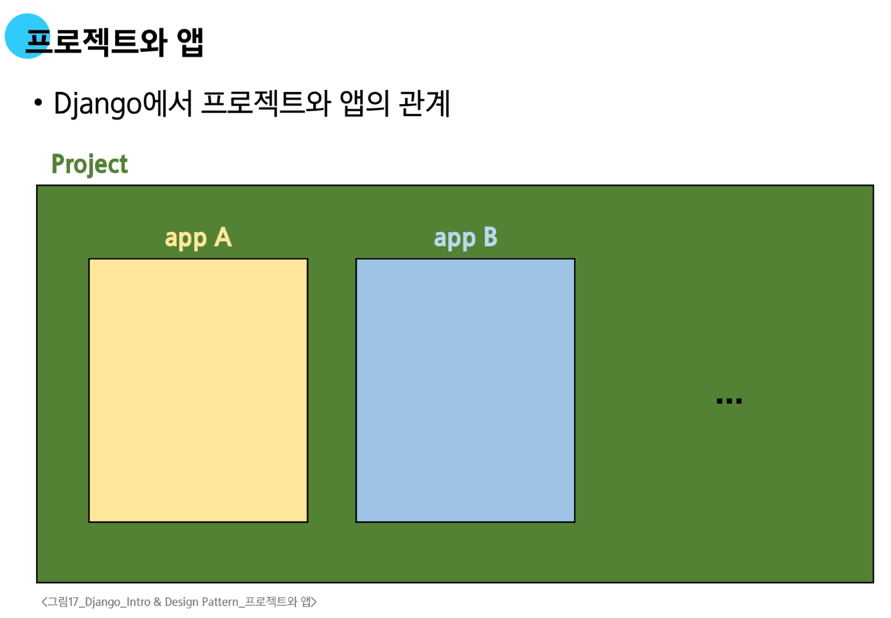
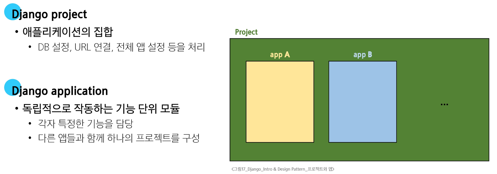
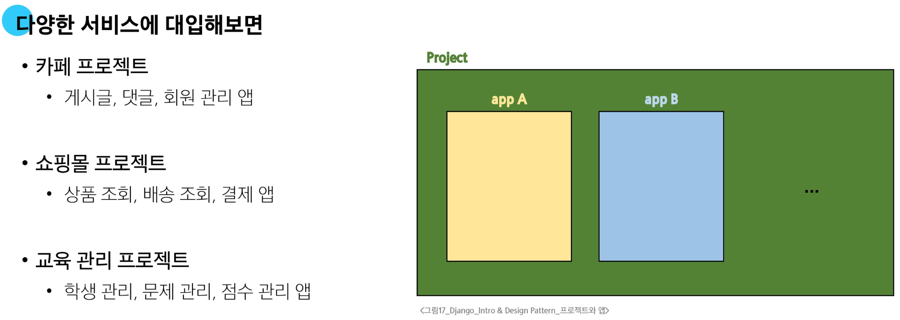
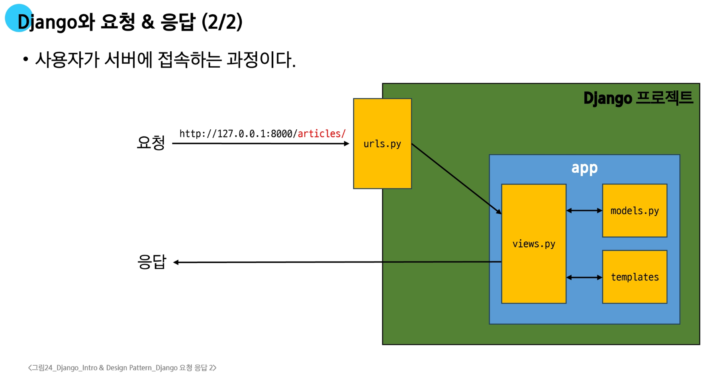
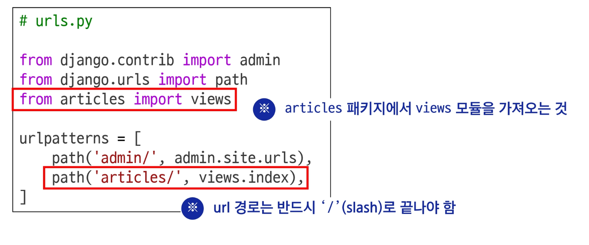
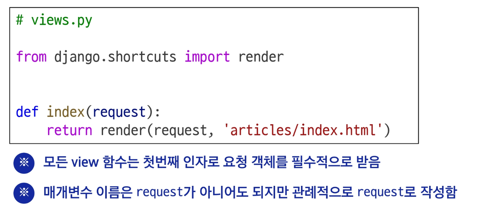
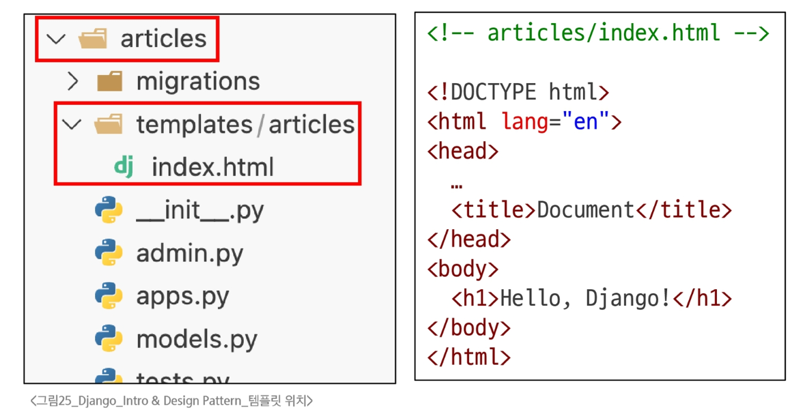
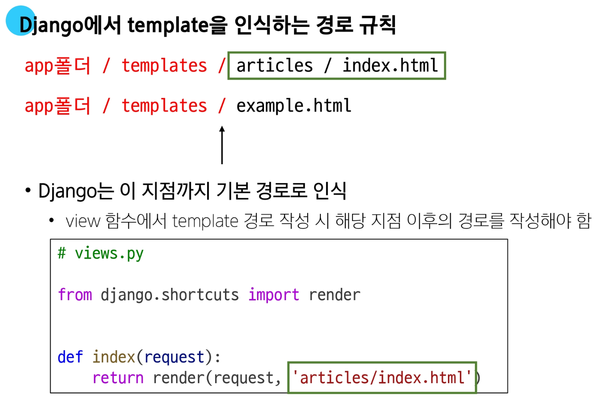
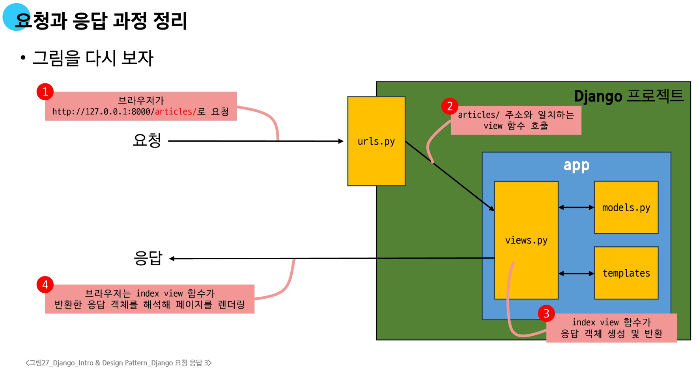

# Django Design Pattern

## 디자인 패턴

**소프트웨어 설계에서 반복적으로 발생하는 문제에 대한, 검증되고 재사용 가능한 일반적인 해결책**

### MVC 디자인 패턴

- **하나의 애플리케이션을 구조화하는 대표적인 구조적 디자인 패턴**

- Model
  - 데이터 및 비즈니스 로직을 처리

- View
  - 사용자에게 보이는 화면을 담당

- Controller
  - 사용자의 입력을 받아 Model과 View를 제어

- **시각적 요소와 뒤에서 실행되는 로직을 서로 영향 없이, 독립적이고 쉽게 유지보수할 수 있는 애플리케이션을 만들기 위함**

---

### MTV 디자인 패턴 (Model, Template, View)

**Django에서 애플리케이션을 구조화하는 디자인 패턴**





**1. 앱 생성**

```ps
$ python manage.py startapp articles
```
- `articles`라는 폴더와 내부에 여러 파일이 새로 생성됨

**앱 등록**

- 반드시 <span style="color:red">앱을 생성(1)한 후에 등록(2)</span>해야 함

## 프로젝트 및 앱 구조

**프로젝트 구조**

- `settings.py`
  - 프로젝트의 모든 설정을 관리

- `urls.py`
  - 요청 들어오는 URL에 따라 이에 해당하는 적절한 views를 연결

- `__init__.py`
  - 해당 폴더를 패키지로 인식하도록 설정하는 파일

- `asgi.py`
  - 비동기식 웹 서버와의 연결 관련 설정

- `wsgi.py`
  - 웹 서버와의 연결 관련 설정

- `manage.py`
  - Django 프로젝트와 다양한 방법으로 상호작용하는 커맨드라인 유틸리티
  
---

**앱 구조**

- `admin.py`
  - 관리자용 페이지 설정

- `models.py`
  - DB와 관련된 Model을 정의
  - MTV 패턴의 M

- `views.py`
  - HTTP 요청을 처리하고 해당 요청에 대한 응답을 반환
    - url, model, template과 연동
  - MTV 패턴의 V

- `apps.py`
  - 앱의 정보가 작성된 곳

- `tests.py`
  - 프로젝트 테스트 코드를 작성하는 곳

---
# 요청과 응답




**1. URLs**

- http://127.0.0.1:8000/<span style="color:red">articles/</span>로 요청이 왔을 때
  - `request` 객체를 `view` 모듈의 `index view` 함수에 전달하며 호출
  
  
**2. View**

- `view` 함수가 정의되는 곳
  - 특정 경로에 있는 `templates`과 `request` 객체를 결합해 응답 객체를 반환
  
  
**3. Template**

  1. `articles` 앱 폴더 안에 `templates` 폴더 생성
  2. `templates` 폴더 안에 `articles` 폴더 생성
  3. `articles` 폴더 안에 템플릿 파일 생성
   
   
---


