# Django Form

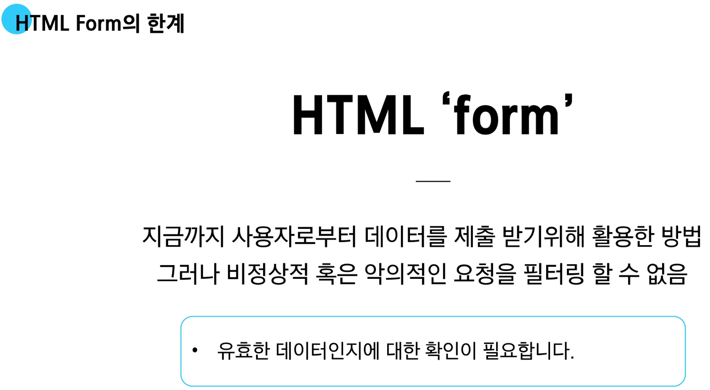

### 유효성 검사란?

수집한 데이터가 정확하고 유효한지 확인하는 과정

- Django Form의 유효성 검사는 사용자가 입력한 데이터가 올바른 형식인지 자동으로 점검하는 기능을 제공
- 예를 들어, 필수 입력 값이 비어 있거나 잘못된 이메일 형식을 입력하면 오류를 알려줌
- 이 과정을 통해 서버에 잘못된 데이터가 저장되지 않도록 보호 가능

### 유효성 검사 구현의 어려움

- 유효성 검사를 구현하기 위해서는 입력 값, 형식, 중복, 범위, 보안 등 많은 것들을 고려해야 함
- 이런 과정과 기능을 직접 개발하는 것이 아닌 Django가 제공하는 Form을 사용

---

## Form Class

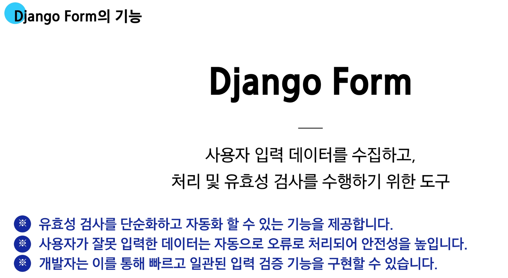

### Form Class 정의

- Form Class를 상속받아 내용과 제목에 대한 사용자 입력을 받는 ArticleForm을 정의하는 방법
  ```python
  # articles/forms.py
  
  from django import forms
  
  class ArticleForm(forms.Form):
    title = forms.CharField(max_length=10)
    content = forms.CharField()
  ```
  
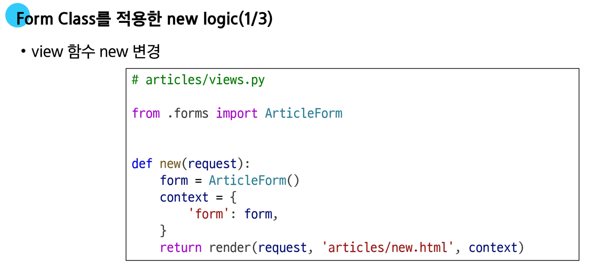
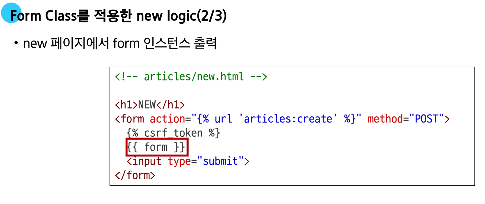
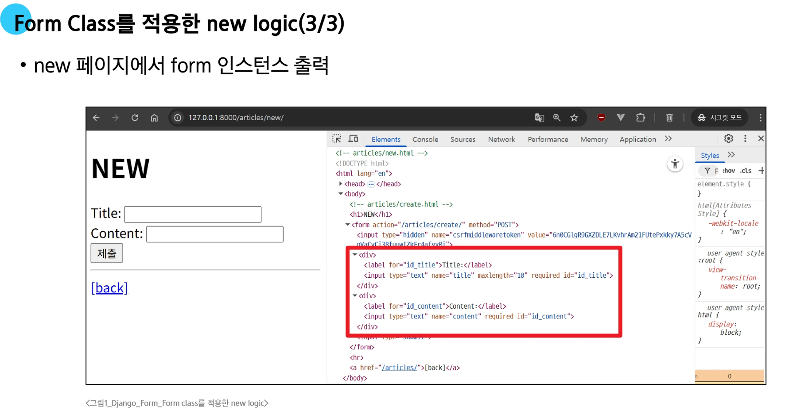

---

## Widgets

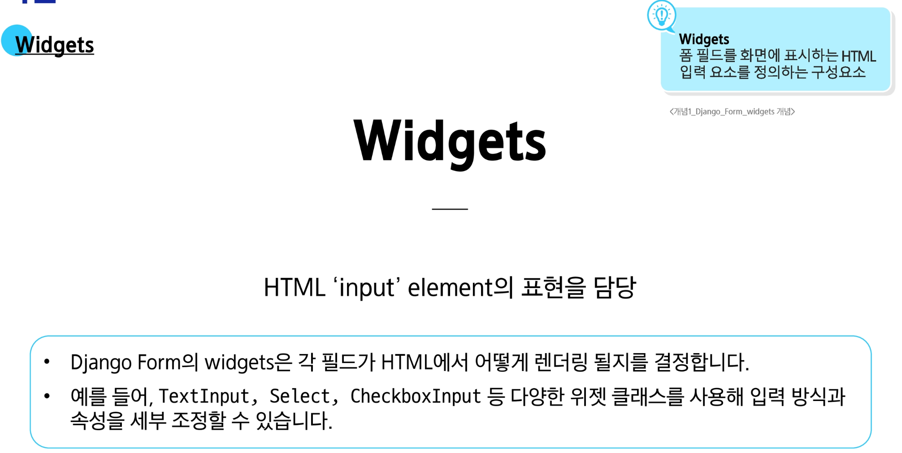

### Widget 적용

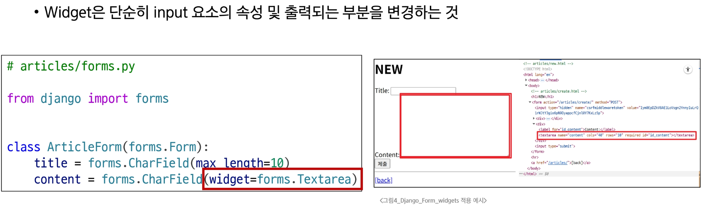

---

## Django ModelForm

Form vs ModelForm

- **Form**
  - 사용자 입력 데이터를 DB에 저장하지 않을 때 (e.g. 검색, 로그인)

- **ModelForm**
  - 사용자 입력 데이터를 DB에 저장해야 할 때 (e.g. 게시글 작성, 회원가입)

### ModelForm 기능

- Model과 연결된 Form을 자동으로 생성해주는 기능을 제공
  - ModelForm은 Form 클래스와 Model 클래스를 결합한 형태로, 모델 필드를 기반으로 입력 폼을 자동으로 생성
  - 데이터 수집과 저장 과정을 동시에 처리할 수 있도록 도와줌

#### ModelForm class 정의

- 기존 ArticleForm 클래스 수정
  ```python
  # articles/forms.py
  
  from django import forms
  from .models import Article
  
  class ArticleForm(forms.ModelForm):
    class Meta:
      model = Article
      fields = '__all__'
  ```
  
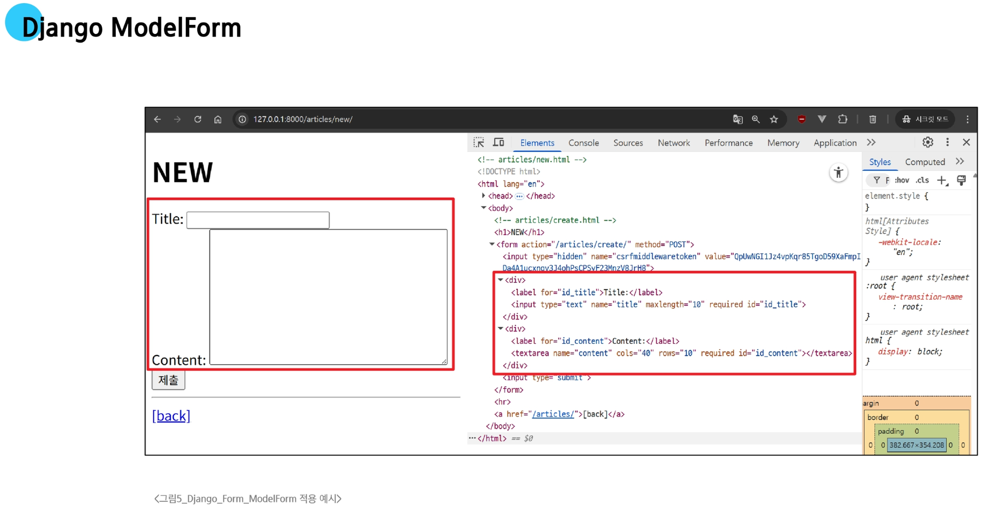
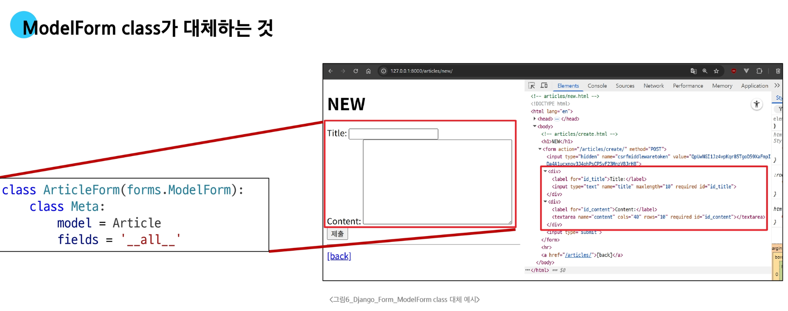

---

## Meta class

ModelForm의 정보를 작성하는 곳
  - Meta Class는 ModelForm 내부에서 어떤 모델과 연결할지, 어떤 필드를 사용할지 등을 정의하는 설정 공간
  - 폼의 동작 방식을 제어하는 핵심 역할

#### `'fields'` 및 `'exclude'` 속성

- exclude 속성을 사용하여 모델에서 포함하지 않도록 필드를 지정할 수도 있음
  ```python
  # articles/forms.py
  # fields
  class ArticleForm(forms.ModelForm):
    class Meta:
      model = Article
      fields = ('title',)
  ```
  ```python
  # articles/forms.py
  # exclude
  class ArticleForm(forms.ModelForm):
    class Meta:
      model = Article
      exclude = ('title',)
  ```
  
#### Meta class 주의사항

- Django에서 `ModeForm`에 대한 추가 정보나 속성을 작성하는 클래스 구조를 `Meta`클래스로 작성했을 뿐
- 파이썬의 `inner class`와 같은 문법적 관점으로 접근하면 안 됨

---

## ModelForm 적용

#### ModelForm을 적용한 create 로직 (1/2)

```python
# articles/views.py

from .forms import ArticleForm

def create(request):
  form = ArticleForm(request.POST)
  if form.is_valid():
    article = form.save()
    return redirect('articles:detail', article.pk)
  context = {
    'form': form,
  }
  returm render(request, 'articles/new.html', context)
```

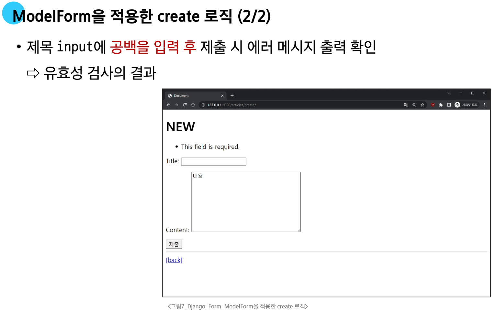

#### `is_valid()` 활용

**is_valid()**

- 여러 유효성 검사를 실행하고, 데이터가 유효한지 `Boolean`로 반환
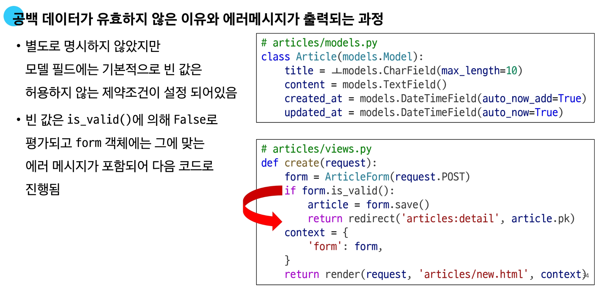

#### ModelForm 적용 edit 로직

```python
# articles/views.py

def edit(request, pk):
  article = Article.objects.get(pk=pk)
  form = Articleform(instance=article)
  context = {
    'article': article,
    'form': form,
  }
  return render(request, 'articles/edit.html', context)
```
```html
<!-- articles/edit.html -->
 
 <h1>EDIT</h1>
 <form action="" method="POST">
  
  {{ form }}
  <input type="submit">
</form>
```

#### ModelForm을 적용한 update 로직

```python
# articles/views.py

def ypdate(request, pk):
  article = Article.objects.get(pk=pk)
  form = ArticleForm(request.POST, instance=article)
  if form.is_valid():
    form.save()
    return
```

---

## save 메서드

save()
- 데이터베이스 객체를 만들고 저장하는 ModelForm의 인스턴스 메서드

  - 폼 데이터가 유효한 경우, save() 메서드를 호출하면 모델 인스턴스를 생성하고 데이터베이스에 저장된다.
  - instance 인자를 통해 새 객체 생성과 기존 객체 수정도 구분할 수 있다.
  - 이 과정을 통해 코드 없이 손쉽게 DB 연동 가능

#### `save()` 메서드가 생성과 수정을 구분하는 법

- 키워드 인자 <span style="color:darkred">instance</span> 여부를 통해 생성할지, 수정할지를 결정

  ```python
  # CREATE

  form = ArticleForm(request.POST)
  form.save()
  ```
  ```python
  # UPDATE

  form = ArticleForm(request.POST, instance=article)
  form.save()
  ```
  
### Django Form 정리

- "사용자로부터 데이터를 수집하고 처리하기 위한 강력하고 유연한 도구"
- HTML form의 생성, 데이터 유효성 검사 및 처리를 쉽게 할 수 있도록 도움

---

## HTTP 요청 다루기
### View 함수 구조 변화

#### new & create view 함수간 공통점과 차이점

공통점
- "데이터 생성을 구현하기 위함"

차이점
- "new는 GET method 요청만을, create는 POST method 요청만을 처리"

**view 함수 구조화의 목적**

- HTTP request method 차이점을 활용해 동일한 목적을 가지는 2개의 view 함수를 <span style="color:darkred">하나로</span> 구조화

---

## new & create 함수 결합

(1/2)
```python
def new(request):  # GET method일때
    form = ArticleForm()
    context = {
      'form': form,
    }
    return render(request, 'article/new.html', context)
```
```python
def create(request):  # POST method일때
    form = ArticleForm(request.POST)
    if form.is_valid():
        article = form.save()
        return redirect('articles:detail', article.pk)
    context = {
    'form': form,
    }
    return render(request, 'articles/new.html', context)
```
두 함수는 HTTP request method가 GET/POST인지만 다르고 나머지 동작은 동일

(2/2)

- new와 create view 함수의 공통점과 차이점을 기반으로 하나의 함수로 결합
```python
def create(request):
    if request.method == 'POST':
        form = ArticleForm(request.POST)
        if form.is_valid():
            article = form.save()
        return redirect('articles:detail', article.pk)
    else:
        form = ArticleForm()
        context = {
          'form': form,
        }
        return render(request, 'articles/new.html', context)
```

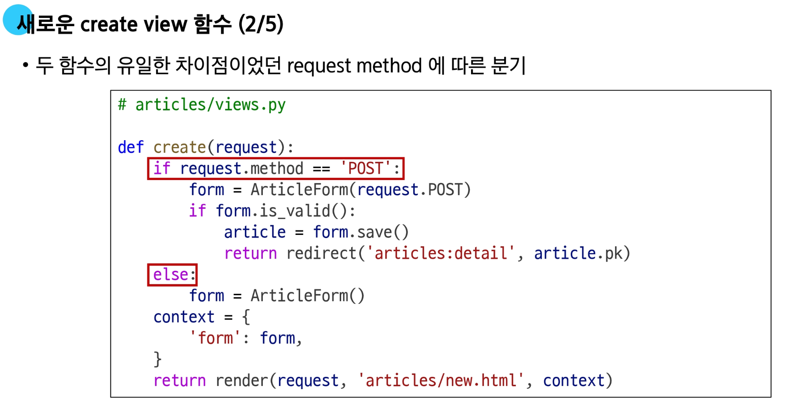
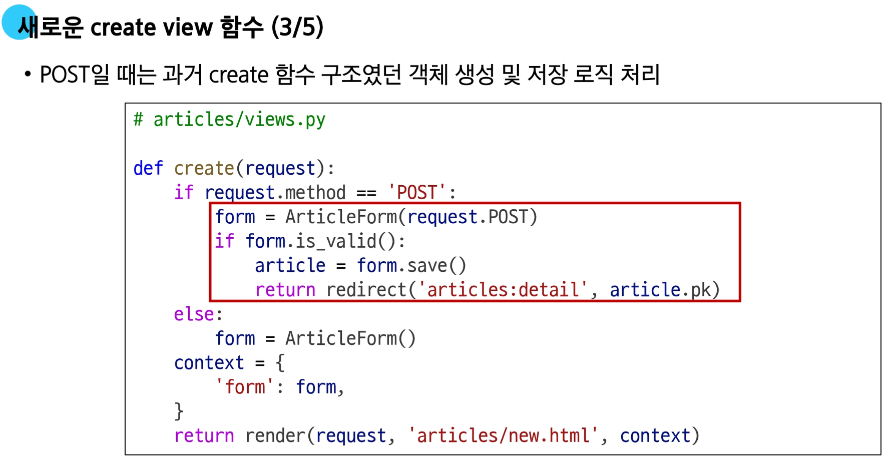
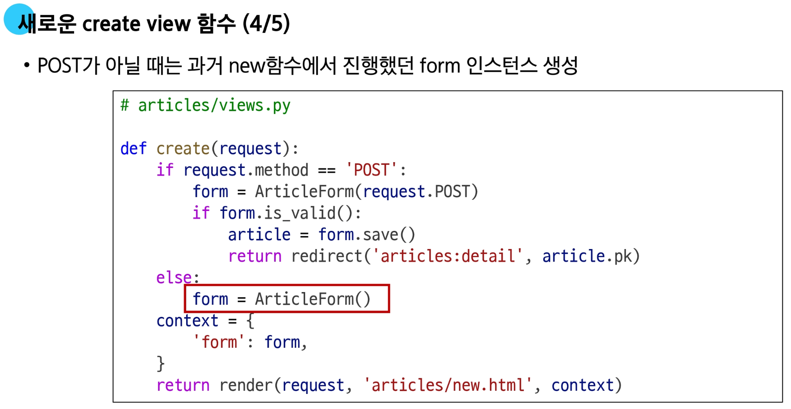
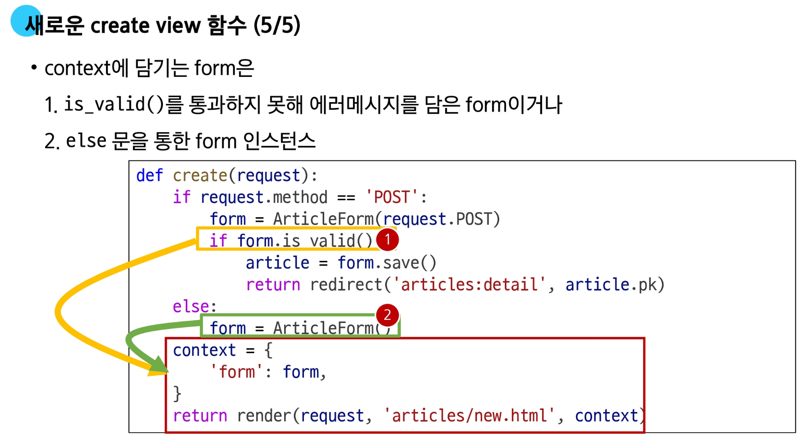

#### 기존 new 관련 코드 수정
(1/3)
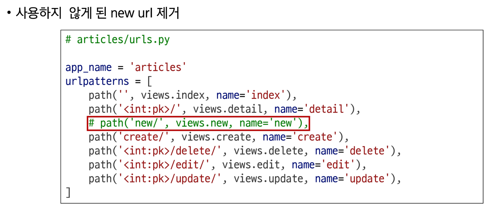
(2/3)
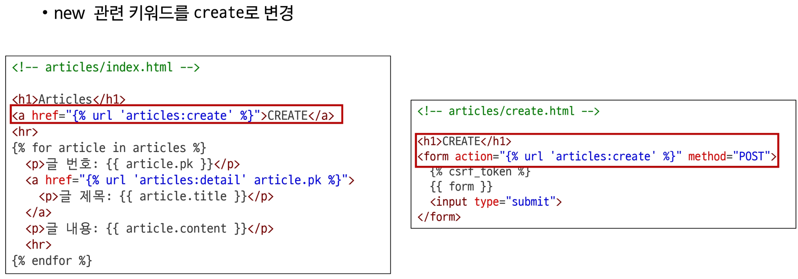
(3/3)
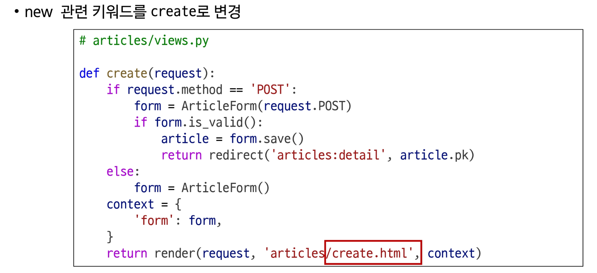

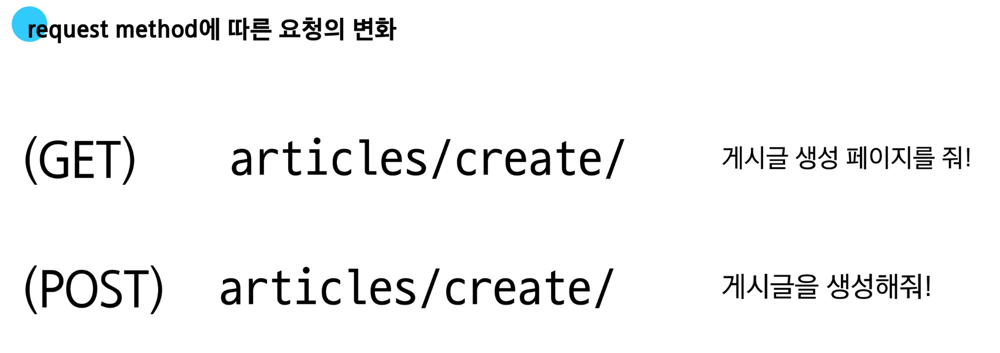

---

## edit & update 함수 결합

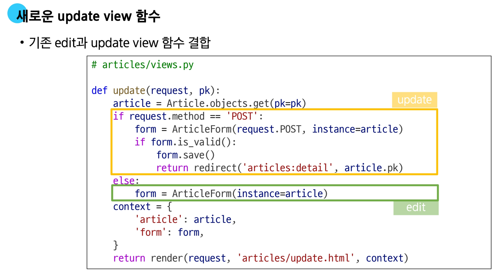

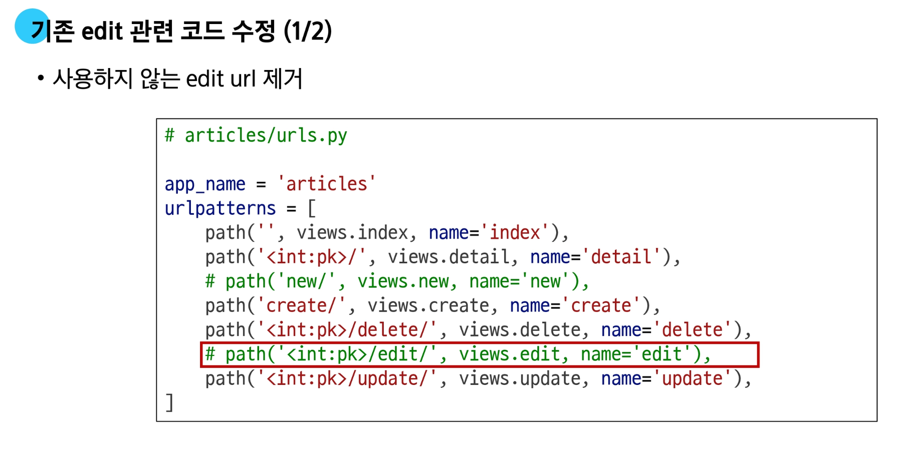

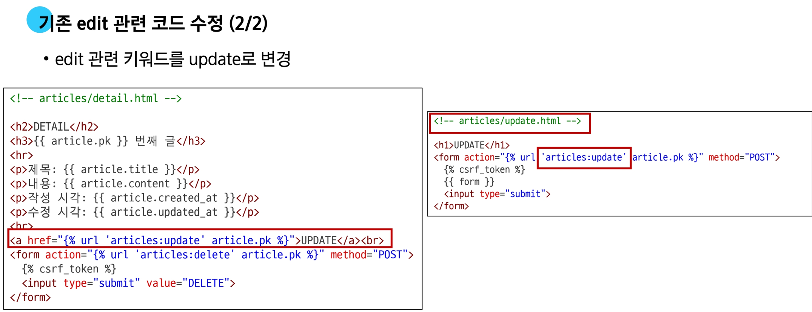