# Model

**데이터베이스와 Python 클래스(객체)로 추상화된 형태로 상호작용**

## Model을 통한 DB(데이터베이스) 관리
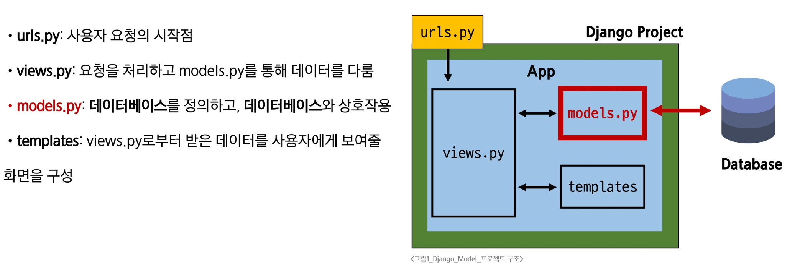

# Model Class 예시

1. 모델 클래스 작성
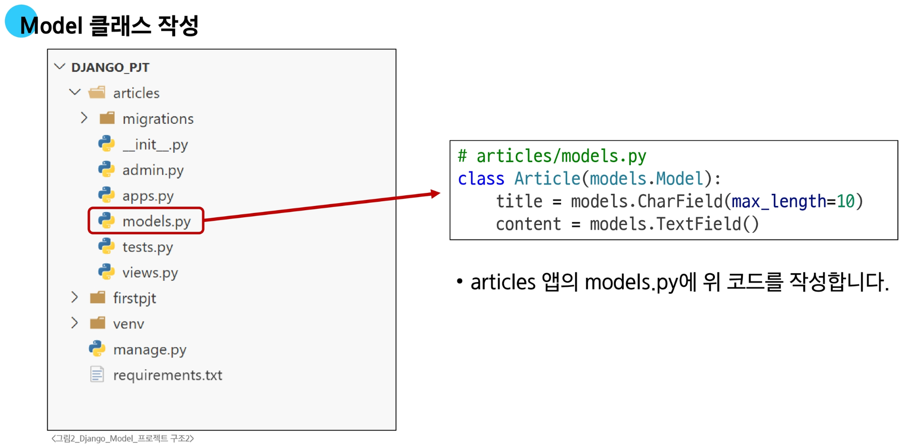

  - 모델 클래스 살펴보기(1/4)
    - 작성한 모델 클래스는 최종적으로 DB에 다음과 같은 테이블 구조를 만듦
    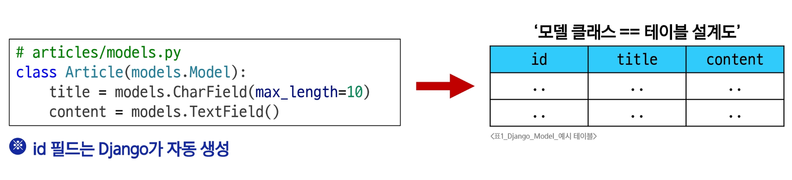
    
  - 모델 클래스 살펴보기(2/4)
    - `django.db.models` 모듈의 `Model`이라는 부모 클래스를 상속받음
      - `Model`은 model에 관련된 모든 코드가 이미 작성되어 있는 `Class`
        - 개발자는 가장 중요한 테이블 구조를 어떻게 설계할지에 대한 코드만 작성하도록 하기 위한 것
        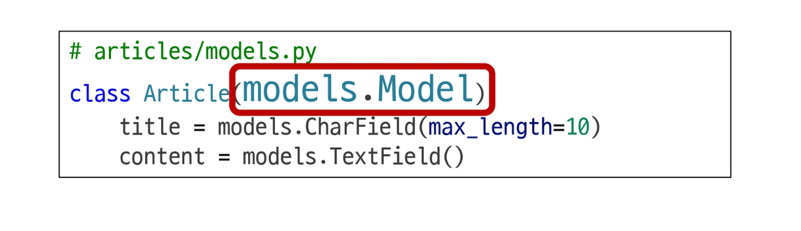
  
  - 모델 클래스 살펴보기(3/4)
    - **클래스 변수명**
      - 테이블의 각 "필드(열) 이름"
      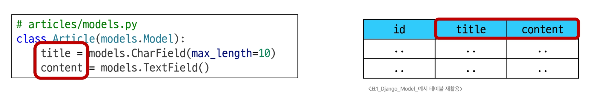
      
  - 모델 클래스 살펴보기(4/4)
    - **Model Field**
      - 데이터베이스 테이블의 열(column)을 나타내는 중요한 구성 요소
      - "데이터의 유형"과 "제약 조건"을 정의
      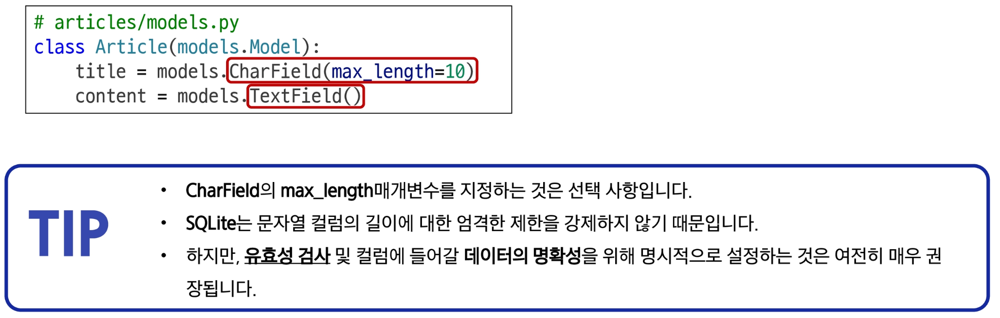
      
## Model Field

**DB 테이블의 필드(열) 정의**

**데이터 타입 및 제약 조건 명시**
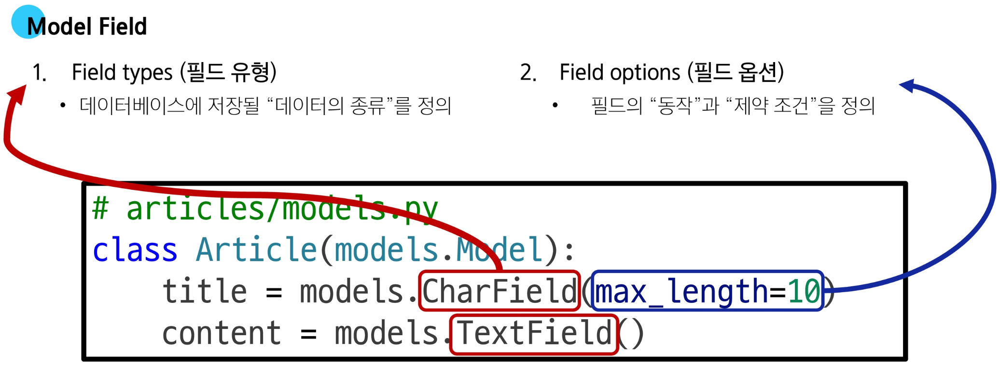

## Field types

**데이터베이스에 저장될 ""데이터의 종류"를 정의 (models 모듈의 클래스로 정의되어 있음)**

- `CharField()`
  - 제한된 길이의 문자열을 저장
  - 필드의 최대 길이를 결정하는 max_length는 **선택 옵션**)

- `TextField()`
  - 길이 제한이 없는 대용량 텍스트를 저장
  - (무한대는 아니며 사용하는 시스템에 따라 달라짐)

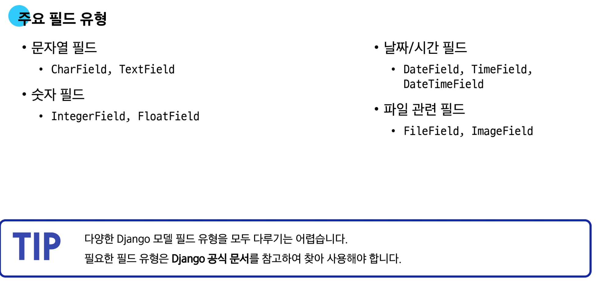

## Field options

**필드의 "동작"과 "제약 조건"을 정의**

### 제약 조건(Constraint)

**특정 규칙을 강제하기 위해 테이블의 열이나 행에 적용되는 규칙이나 제한사항**

  - **숫자만 저장**되도록 제한을 두거나, **문자가 100자**까지만 저장되도록 하는 등의 제한 조건을 의미

#### 주요 필드 옵션

- `null`
  - 데이터베이스에서 `NULL` 값을 허용할지 여부를 결정 (기본값: `False`)
  
- `blank`
  - `form`에서 빈 값을 허용할지 여부를 결정 (기본값: `False`)

- `default`
  - 필드의 기본값을 설정

## Migrations

**model 클래스의 변경사항(필드 생성, 수정, 삭제 등)을 DB에 최종 반영하는 방법**
  - 모든 변경 사항이 코드로 관리
  - 협엽 시 모델 변경 내역에 대한 추적과 공유 수월

- **Django 모델 클래스와 Migration 과정 (1/2)**
  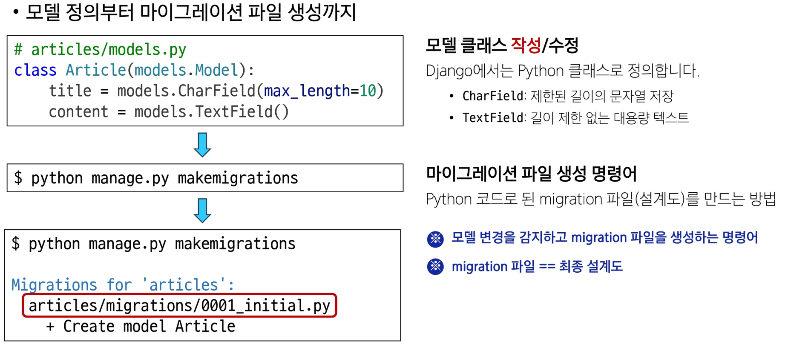
  
- **Migration 과정 (2/2)**
  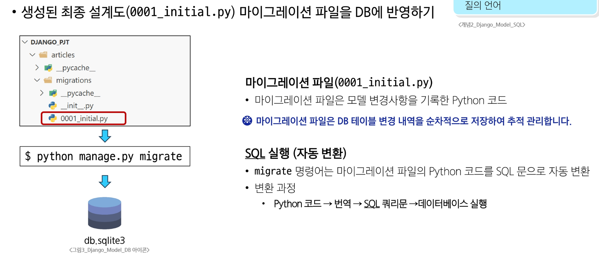

- **Mirgraions 과정 핵심 정리**
  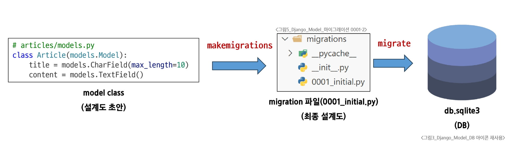
  
- **Migrations 핵심 명령어 2가지**
  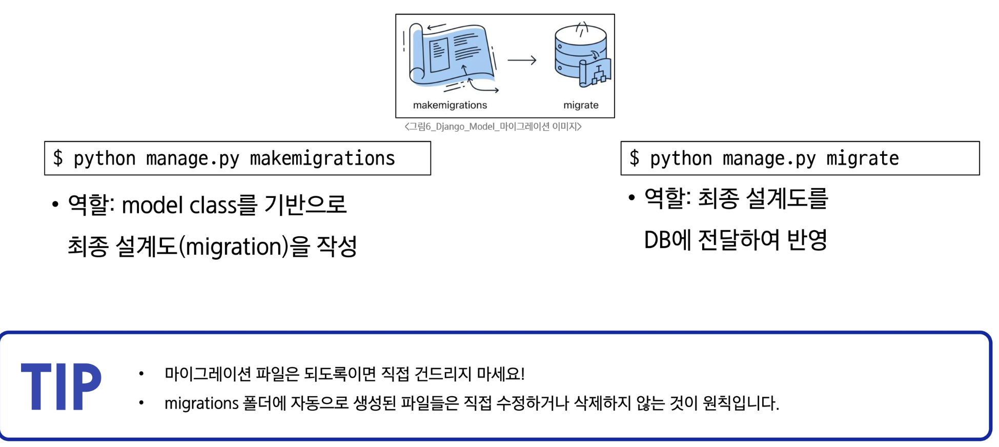
  
## Migrations Advanced

- **이미 생성된 테이블에 필드를 추가해야 한다면?**
  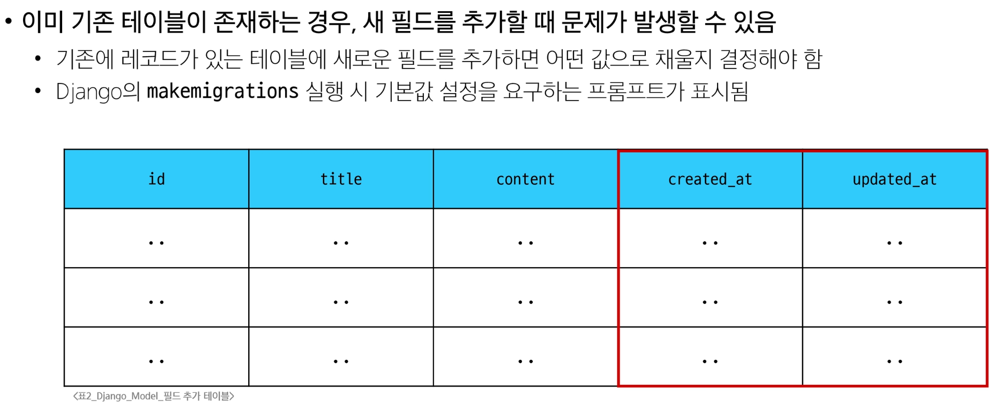

- **Migration 과정 - 추가 모델 필드 작성 (1/5)**
  
  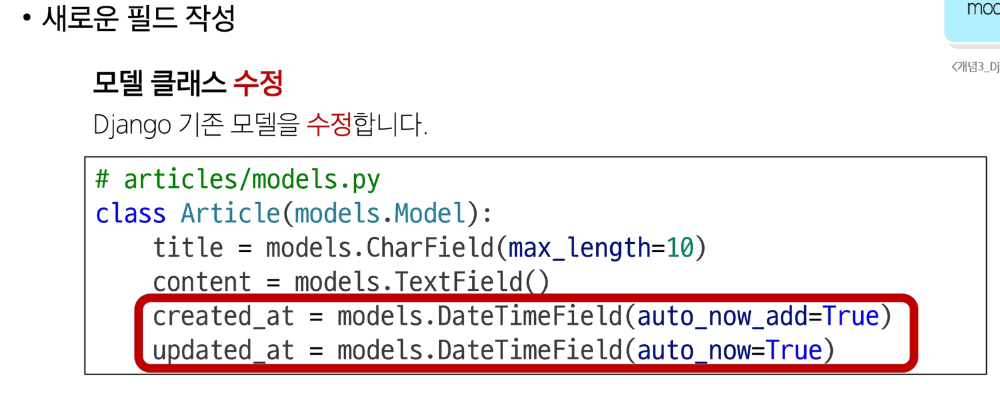
  
  
---
  
- **Migration 과정 - 추가 모델 필드 작성 (2/5)**
  
  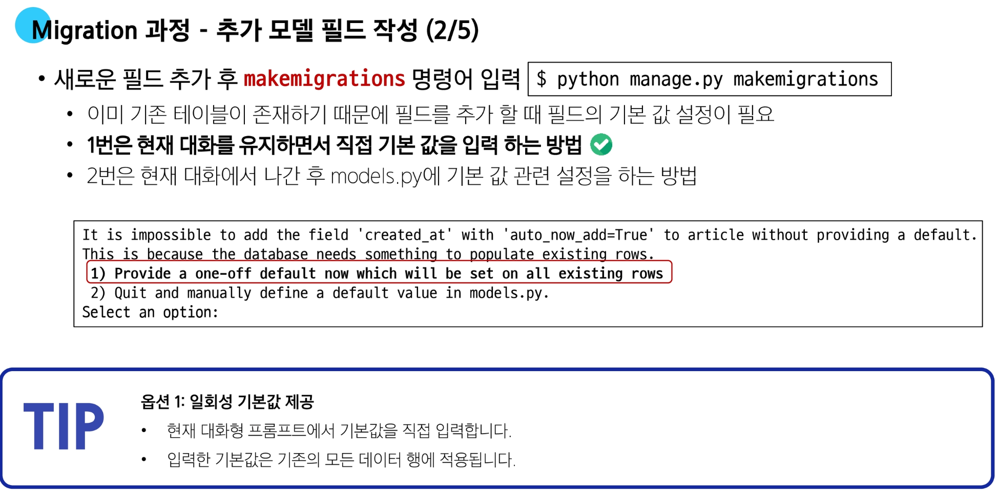

---

- **Migration 과정 - 추가 모델 필드 작성 (3/5)**
  
  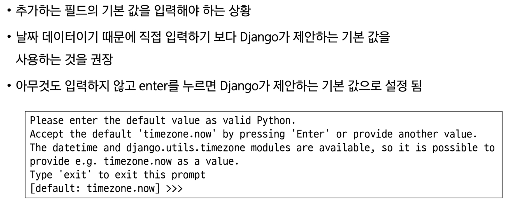
  
---

- **Migration 과정 - 추가 모델 필드 작성 (4/5)**
  
  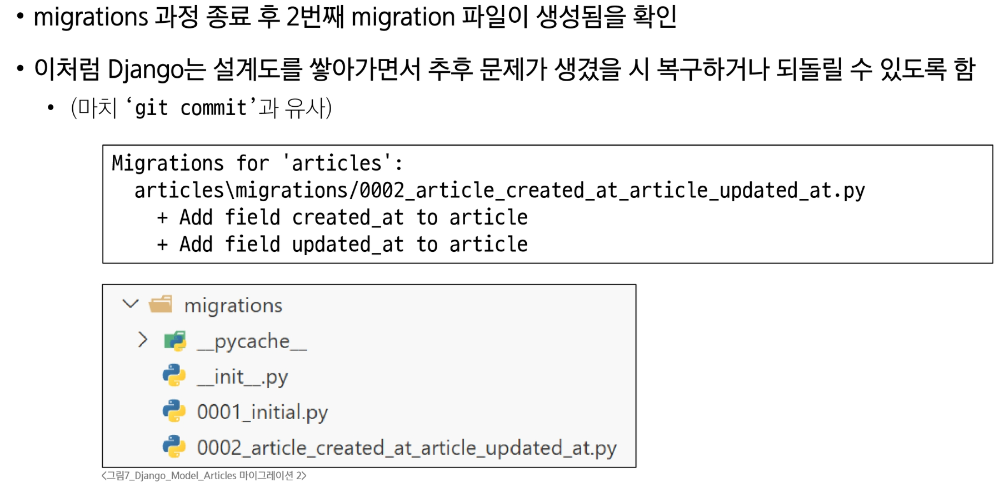

---
  
- **Migration 과정 - 추가 모델 필드 작성 (5/5)**
  
  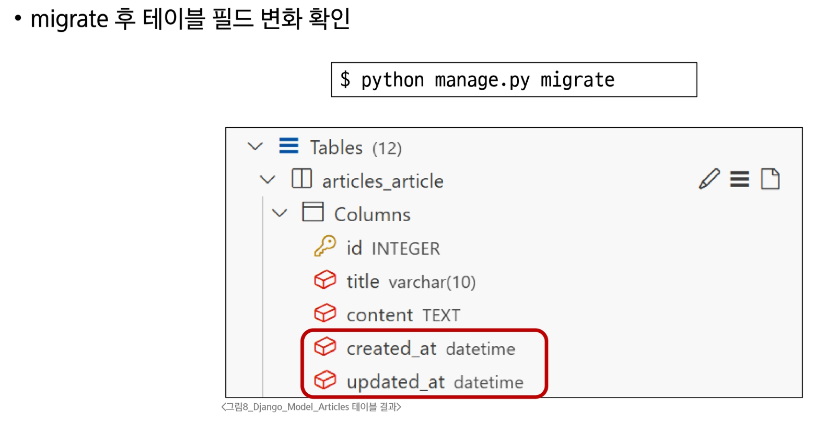
  
  
### 언제 Migration이 필요할까?

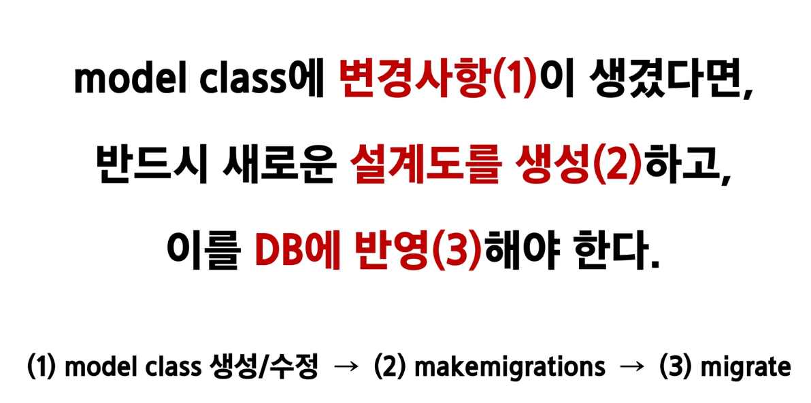