# Django Template System

**<span style="color:red">파이썬 데이터(context)를 HTML 문서(Template)와 결합</span>하여,<span style="color:red">로직과 표현을 분리</span>한 채 동적인 웹페이지를 생성하는 도구**
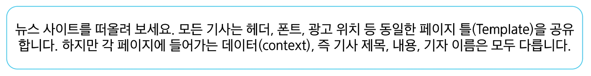

### HTML 콘텐츠를 변수 값에 따라 변경(1/2)

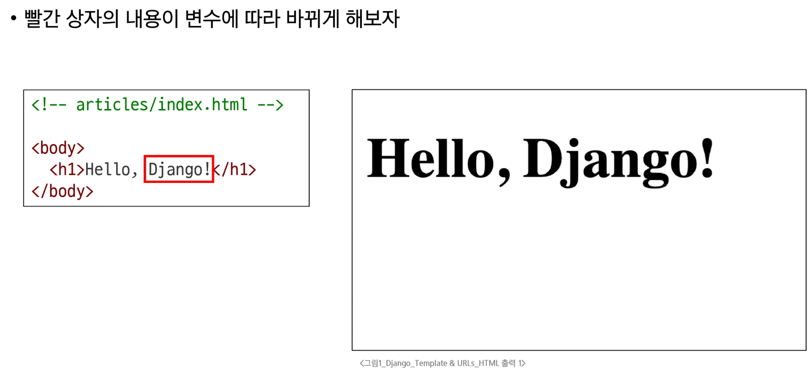

### (2/2)
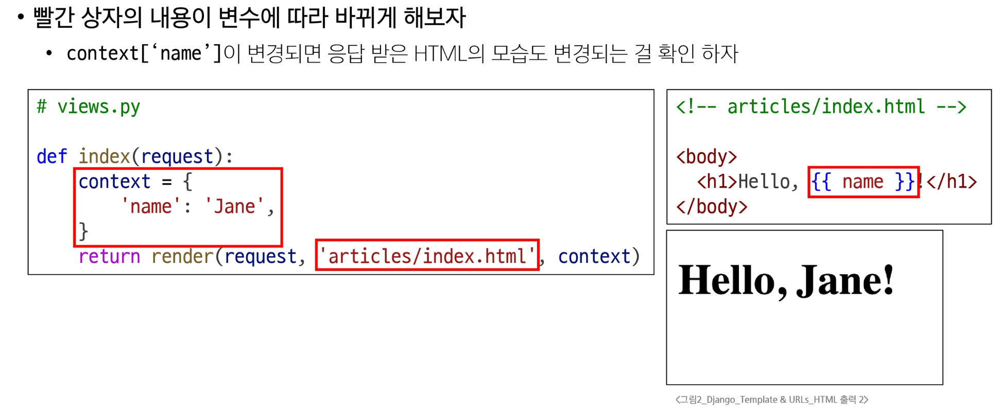

### Django Template system의 목적

  - <span style="color:red">'페이지 틀'에 '데이터'를 동적으로 결합</span>하여 수많은 페이지를 효율적으로 만들어 내기 위해

---

# Django Template Language (DTL)

**Template에서 조건, 반복, 변수 등의 프로그래밍적 기능을 제공하는 시스템**

**DTL Syntax**
1. Variable
2. Filters
3. Tags
4. Comments


### 1. Variable

  - Django Template에서의 변수
  
  - `render` 함수의 세번째 인자로 딕셔너리 타입으로 전달됨
  
  - 해당 딕셔너리 `key`에 해당하는 문자열이 `template`에서 사용 가능한 변수명
  
  - `dot('.')`을 사용하여 변수 속성에 접근할 수 있음
    ```
    {{ variable }}
    {{ variable.attribute }}
    ```
    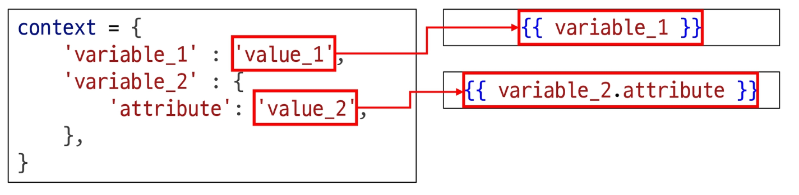
    
### 2. Filters

  - 표시할 변수를 수정할 때 사용 (변수 + '|' + 필터)
  
  - chained(연결)이 가능하며 일부 필터는 인자를 받기도 함
  
  - 약 60개의 built-in template filters를 제공
    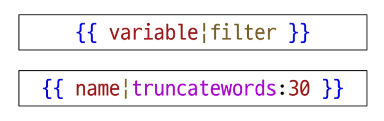
    
### 3. Tags

  - 반복 또는 논리를 수행하여 제어 흐름을 만듦

  - 일부 태그는 시작과 종료 태그가 필요

  - 약 24개의 built-in template tags를 제공
    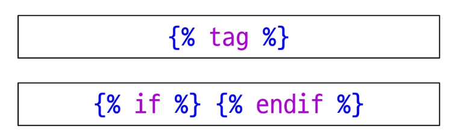
    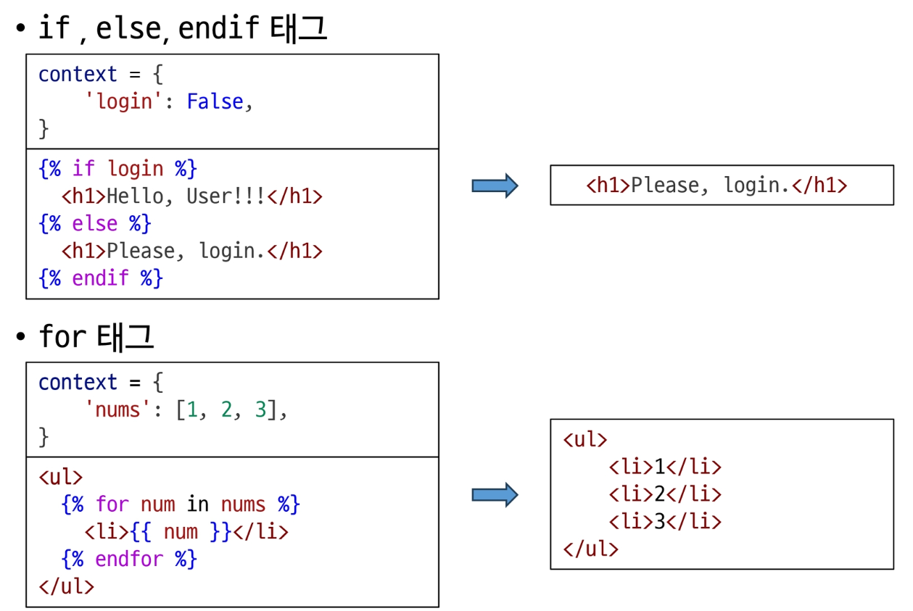

### 4. Comments

  - **주석**
    - inline
      ```html
      <h1> Hello, {# name #}</h1>
      ```
    - multiline
      ```html
      { % comment % }
        ...
      { % endcomment % }
      ```

---


# 템플릿 상속 (Template inheritance)

**1. 페이지의 <span style="color:red">공통요소를 포함</span>**

**2. <span style="color:red">하위 템플릿이 재정의 할 수 있는 공간</span>을 정의**

**▶ 여러 템플릿이 <span style="color:red">공통요소를 공유할 수 있게</span> 해주는 기능**

### 상속 구조 만들기 (1/3)

- **skeleton 코드 역할을 하게 되는 상위 템플릿(base.html) 작성**

  - 모든 템플릿이 공유했으면 하는 공통요소 작성
  - 템플릿별로 재정의할 부분은 `block` 태그를 활용
  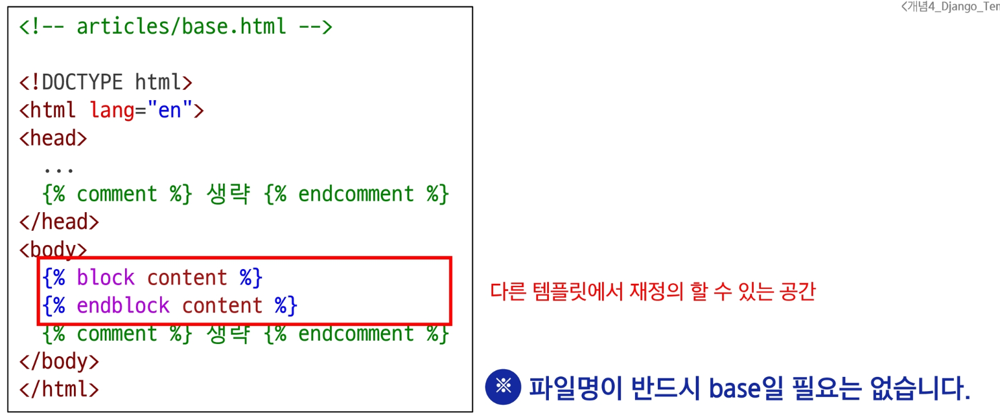
  
- **기존 하위 템플릿들이 상위 템플릿을 상속받도록 변경**
  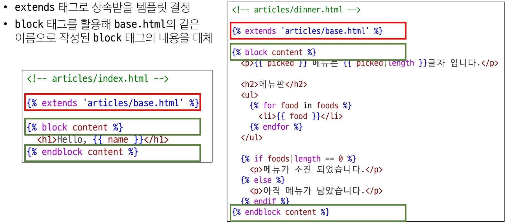
  
- **최종 형태**
  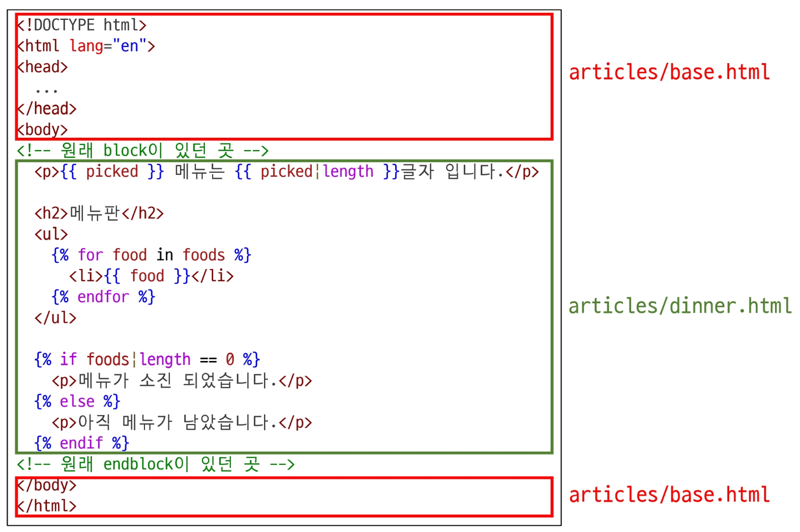


### 상속 관련 DTL 태그
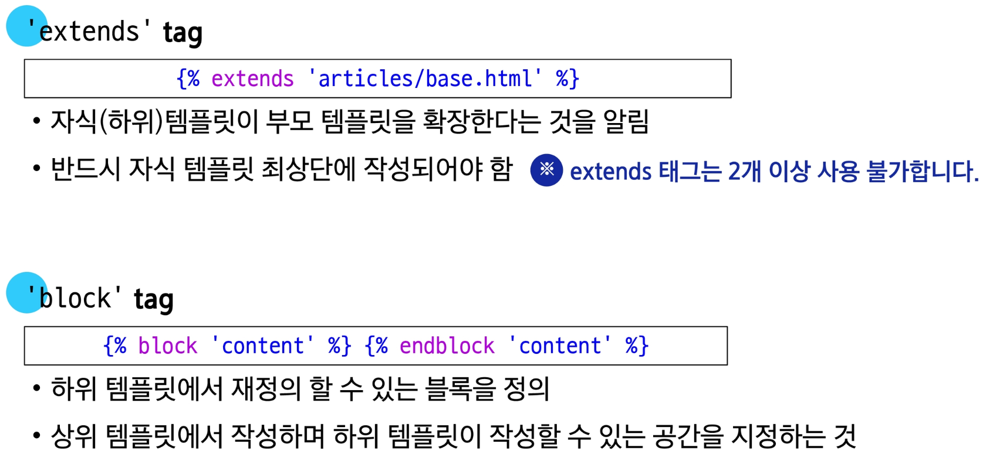


# HTML form

**데이터를 보내고 가져오기**
- HTML <span style="color:red">'form'</span> element를 통해 사용자와 애플리케이션 간의 상호작용 이해하기
  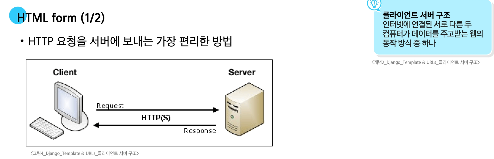
  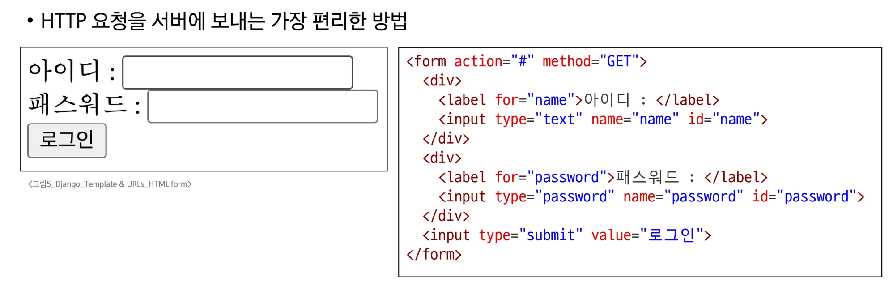
  
### `'form'` element

**사용자로부터 할당된 데이터를 서버로 전송하는 HTML 요소**

### fake naver 실습

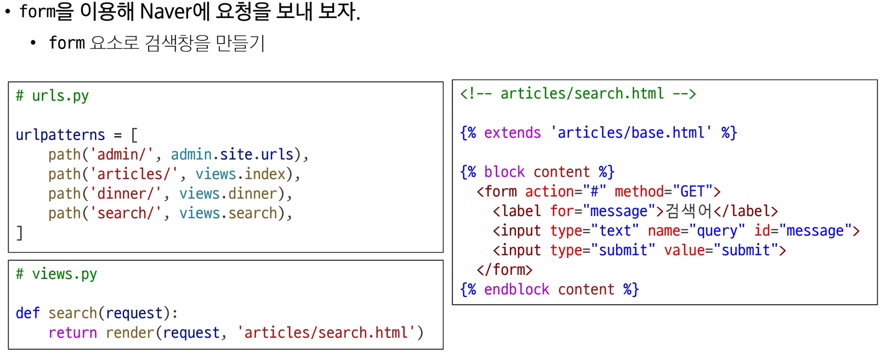
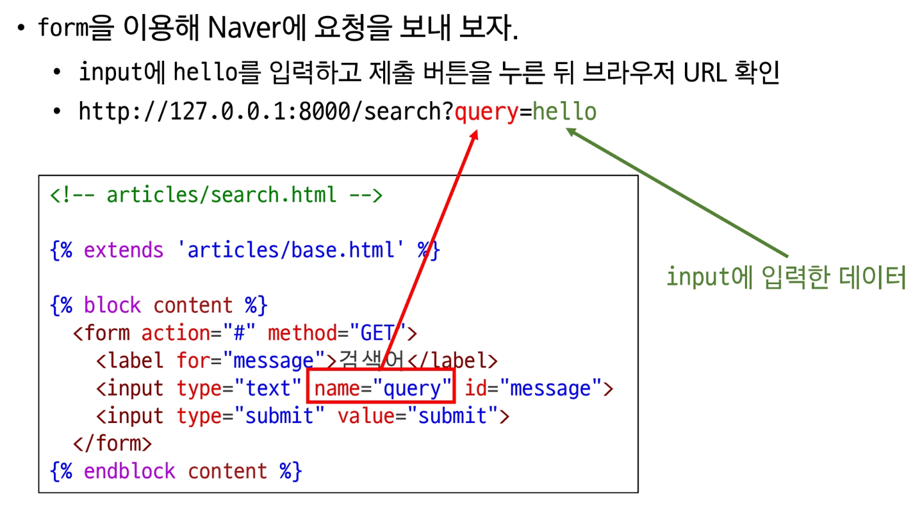
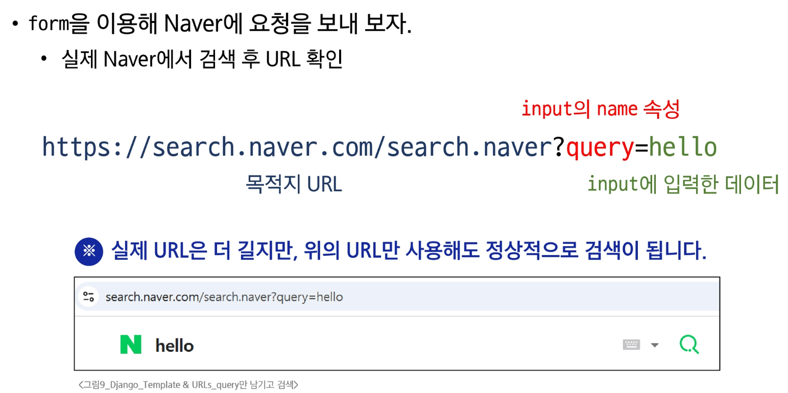
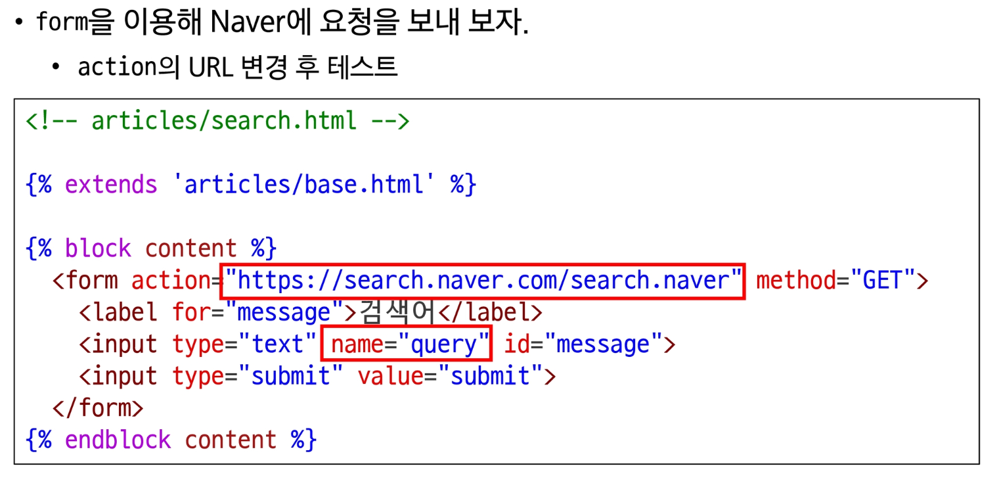