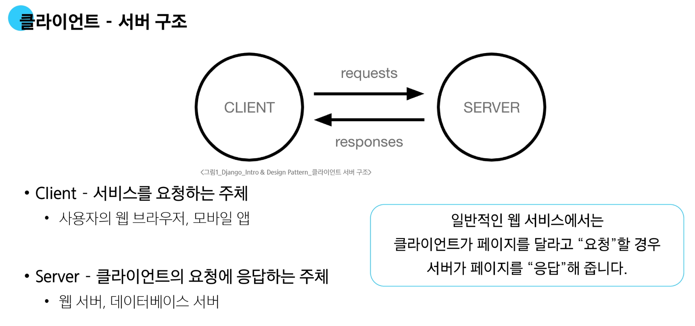

# Web application

**Web application (web service) 개발**

- 인터넷을 통해 사용자에게 제공되는 소프트웨어 프로그램을 구축하는 과정

- 다양한 디바이스(모바일, 태블릿, PC 등)에서 웹 브라우저를 통해 접근하고 사용할 수 있음

## 클라이언트와 서버

**우리가 웹 페이지를 보게 되는 과정**

1. 웹 브라우저(클라이언트)에서 'google.com을 입력 후 Enter
2. 웹 브라우저는 인터넷에 연결된 전세계 어딘가에 있는 서버에게 '메인 홈페이지.html파일을 달라고 요청
3. 요청을 받은 서버는 데이터베이스에서 html 파일을 찾아 응답
4. 웹 브라우저는 전달받은 html 파일을 사람이 볼 수 있도록 해석 후 사용자가 메인 페이지를 보게 됨

## Frontend & Backend

**Frontend(프론트엔드)**

- 사용자 인터페이스(UI)를 구성하고, 사용자가 애플리케이션과 상호작용할 수 있도록 함
- <u>HTML</u>, <u>CSS</u>, JavaScript, 프론트엔드 프레임워크 등

**Backend(백엔드)**

- 서버 측에서 동작하며, 클라이언트 요청에 대한 처리와 데이터베이스와의 상호작용 등을 담당

- 서버 언어(Python, Java 등) 및 백엔드 프레임워크, 데이터베이스, API, 보안 등

## Web Framework

**웹 어플리케이션을 빠르게 개발할 수 있도록 도와주는 도구**

- 개발에 필요한 기본 구조, 규칙, 라이브러리 등을 제공 (로그인/로그아웃, 회원관리, 데이터베이스, 보안 등)